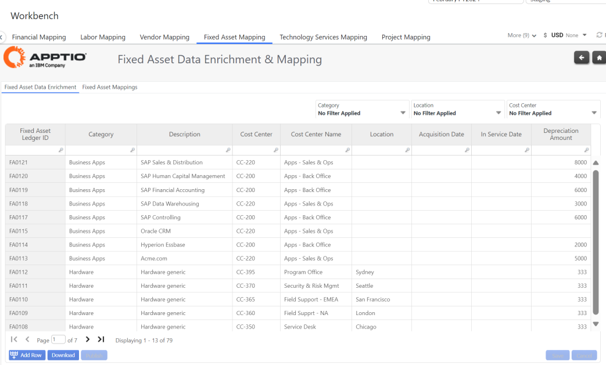
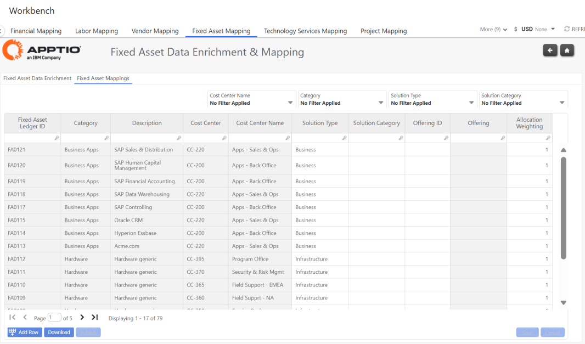

# Cartografía de activos fijos

## Enriquecimiento de datos sobre activos fijos

Utilice este ET para actualizar sus metadatos de Activos Fijos (si es necesario) :

- Categoría
- Descripción
- Centro de costes
- Ubicación
- Fecha de adquisición
- Fecha de entrada en servicio
- Importe de la amortización

## Cartografía de activos fijos

Utilice este ET para asignar sus IDs de Activo Fijo a :

- Tipo de solución
- Categoría de la solución
- Identificación de la oferta
- Ponderación

