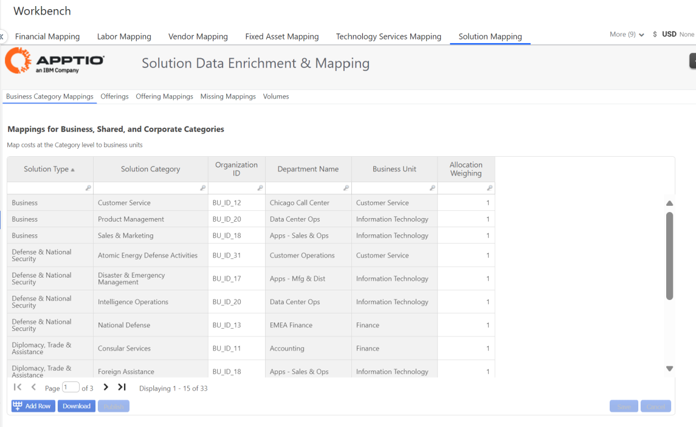
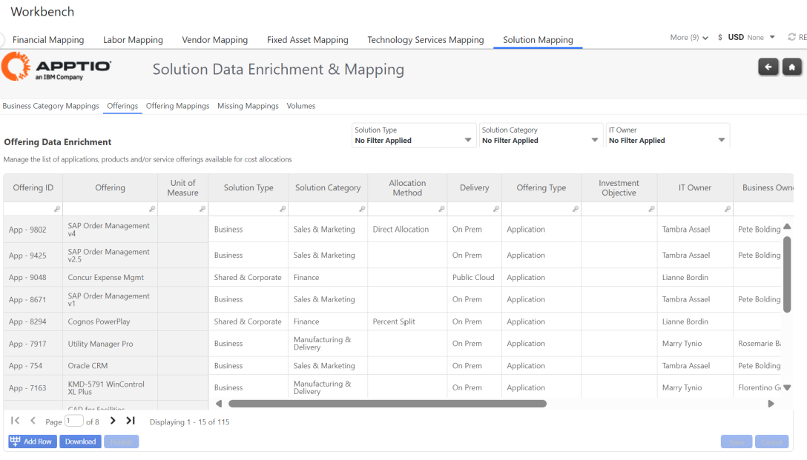
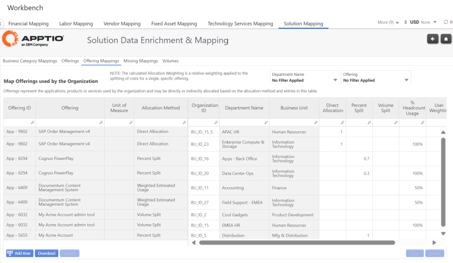
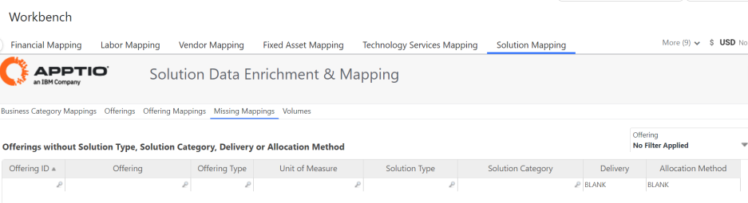
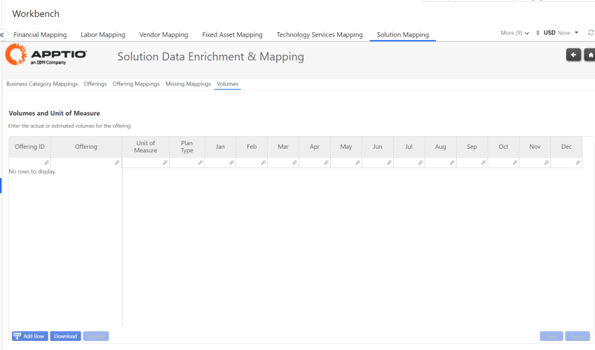

# Mapa de soluciones

Utilice las tablas editables en la asignación de soluciones para dirigir las asignaciones de las unidades de negocio de costes de OpEx/CapEx.

## Asignaciones de categorías de empresas

Proporciona la capacidad de definir las asignaciones de costes de Servicio a los Consumidores de Negocio, a nivel de Tipos de Solución y Categorías de Solución.

- Las ofertas de servicios infantiles dentro de cada combinación de tipo de solución + categoría de solución se asignarán a las organizaciones destinatarias especificadas en función de la ponderación definida
- El Id. de organización representa el Id. único de cada empresa consumidora
- El consumidor empresarial representará
- Una unidad de negocio o
- Un Departamento con una Unidad de Negocio
- Ponderación
- Tal vez una asignación del 100% (insertar "1"), o repartida entre varios Consumidores (Unidades de Negocio/Departamentos)

## Ofertas

Permite gestionar la lista de aplicaciones, productos y/u ofertas de servicios disponibles en su catálogo de servicios, para su posterior imputación de costes.

Los usuarios de IDP deben verificar/actualizar los metadatos clave de sus ofertas de servicios, incluyendo: Método de asignación, Entrega, Uso estimado de infra, Tipo de oferta, Objetivo de inversión, Propietario de TI, Propietario de negocio, Unidad de negocio principal, Coste medio unitario objetivo y Finalidad.

El uso estimado de infraestructura de la oferta se utilizará para definir la división porcentual entre infraestructura y plataforma. Cada fila de la oferta sólo debe incluir el uso estimado de infraestructura para definir el porcentaje (%) destinado a infraestructura. El uso estimado de la plataforma se derivará del uso estimado de la infraestructura.

Por ejemplo: Si el uso estimado de la infraestructura se ha definido como 0.6 (60%) para la oferta Acme.com, el uso estimado de la plataforma se definirá como 0.4 (40%) con la diferencia entre el uso estimado de la infraestructura 0.6 (60%) y el total 1 (100%)

## Métodos de asignación

- El método de Asignación Directa habilita la columna Asignación Directa que será 1 por defecto y sólo debe tener una fila.
- El método Dividir por porcentaje activa la columna Dividir por porcentaje y debe tener 2 o más filas con ponderación relativa asignada.
- El método Volume Split activa la columna Volume Split y debe tener 2 o más filas con volúmenes asignados.
- El método de uso estimado ponderado habilita las columnas % de uso de recuento y ponderación de usuarios y debe tener 2 o más filas.

## Asignaciones de ofertas

Las ofertas representan las aplicaciones, productos o servicios utilizados por la organización y pueden asignarse directa o indirectamente según el método de asignación y las entradas de esta tabla. Asigne cada fila de Oferta de solución a uno o varios ID de organización y establezca el método de asignación.

## Asignaciones omitidas

Utilice esta tabla para comprobar si falta alguna línea de oferta asignada a Soluciones. Alternativamente, seleccione (En blanco) en el cortador Nombre del centro de coste en la pestaña Asignaciones de soluciones.

## Volúmenes

Ofrece la posibilidad de especificar los volúmenes estimados o reales de cada ID de oferta (si procede), basándose en la información disponible (consumo).

Un ejemplo de utilización de esta tabla podría ser para sus ofertas de soluciones para dispositivos de usuario final, donde introduciría la unidad de medida (p. ej.: portátil) y establecería el número esperado en cada periodo. A partir de los costes del modelo, podrá obtener un coste unitario y comparar el volumen previsto con el volumen real.

