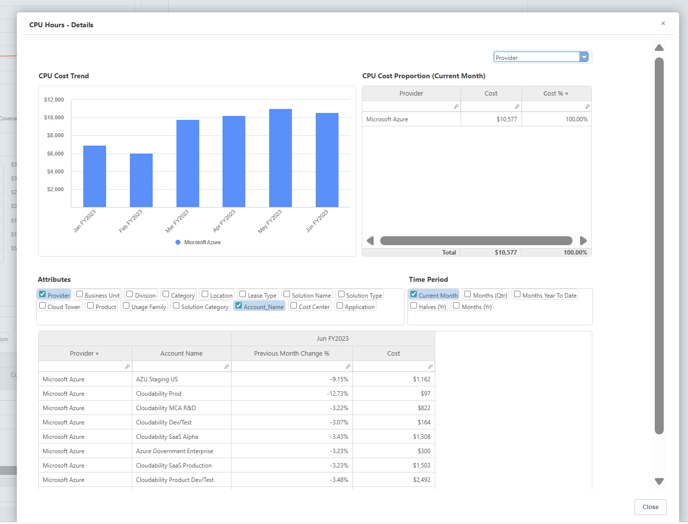

# Informes sobre el coste total de propiedad de la nube pública

IBM Apptio Public Cloud Los informes de TCO ofrecen a los miembros del equipo financiero información sobre el gasto mensual en la nube, los factores de coste y las prácticas de FinOps en AWS y Azure.

| Elemento clave Descripción |
| --- |
| 1. Resumen financiero y operativo de Cloud for Cost YTD, incluidos los créditos aplicables |
| 2. Los metadatos adicionales lo hacen autointuitivo, alinean la taxonomía y facilitan su comprensión. |
| 3. La tendencia de los costes en los diferentes servicios en nube ( AWS & Microsoft Azure ). |
| 4. La evolución de los costes por atributos empresariales como proveedor, centro de costes, nombre de cuenta, etc. |

| Descripción |
| --- |
| 1. El Informe realza los servicios que impulsan la dirección de los costes. |
| 2. La eficacia del modelo de compra en nube y su comparación con las referencias Best-in-Class. |
| 3. La tendencia de la tarifa unitaria en relación con los cambios en el consumo. |
| 4. Desglose detallado de costes, consumo y tarifas unitarias entre proveedores de servicios |

## Informes de profundización

Profundice aún más para comprender los impulsores empresariales y técnicos de cada uno de los informes.

- Los factores que determinan el coste del servicio, incluida la cuenta responsable y el importe correspondiente.
- El servicio empresarial/aplicación que impulsó el cambio.

**Coste de la nube - Detalles**

**Horas CPU - Detalles**

**Almacenamiento - Detalles**

