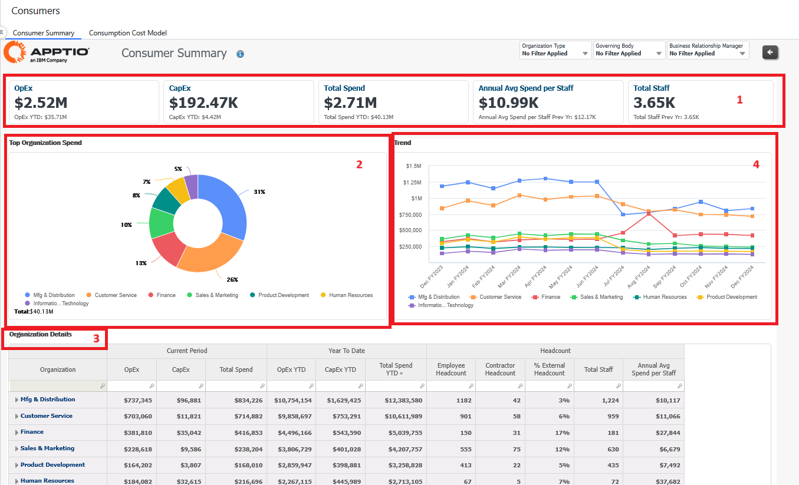
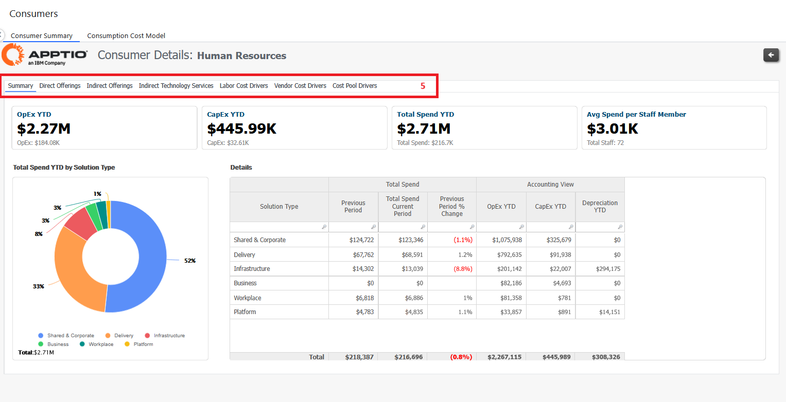

# Avaliação do consumidor

Este relatório analisa o consumo da unidade de negócios de sua organização, discriminado pelos principais fatores de gastos. Ele também analisa os tipos e as categorias de despesas que suas unidades de negócios estão consumindo.

## Casos de uso

Esse relatório resolve os seguintes casos de uso:

- Revisar e analisar os gastos com tecnologia para unidades de negócios ou agências individuais
- Administrar os custos e estoques relacionados aos dispositivos do usuário final
- Explicar os métodos e os resultados da alocação de gastos com tecnologia
- Analisar e comparar os gastos com tecnologia e os gastos por funcionário em toda a organização

## Personagens

Este relatório foi desenvolvido para ser usado pelas seguintes funções:

- Proprietário do aplicativo/plataforma
- Gerente de relacionamento comercial
- Finanças de TI
- Líder sênior de TI

## Perguntas respondidas

- Quais unidades de negócios estão custando mais caro para minha organização?
- Quais são os principais motivadores de seus gastos?
- Qual é a tendência desse gasto ao longo do tempo?

## Visualizações

O relatório Resumo do consumidor inclui as seguintes visualizações:

| Elementos-chave | Descrição |
| --- | --- |
| (1) KPIs | Os KPIs fornecem uma visão de alto nível do seguinte:  - OpEx YTD: esse KPI mostra suas despesas OpEx YTD para o ano atual, em comparação com o ano anterior.  - CapEx YTD: esse KPI mostra suas despesas CapEx YTD para o ano atual, em comparação com o ano anterior.  - Total Spend YTD Esse KPI mostra seu gasto total ( OpEx e CapEx ) YTD no ano atual, em comparação com o ano anterior.  - Média anual de despesas por equipe: Este KPI mostra a média anual de despesas de cada equipe no ano atual, em comparação com o ano anterior.  - Total de funcionários: Esse KPI mostra a contagem do total de funcionários no ano atual, em comparação com o ano anterior. |
| (2) Despesas das principais unidades de negócios | Use esse gráfico e essa tendência para analisar os principais gastos da unidade de negócios e os detalhes dos gastos por departamento. Você também pode encontrar respostas para as seguintes perguntas analisando este relatório:  - Como os gastos com TI se comparam entre as BUs? Entre as BUs que geram receita e as que não geram receita?  - Qual é o gasto médio de TI por funcionário em cada BU?  - Qual é a tendência dos gastos com TI ao longo do tempo?  - Qual é o número total de funcionários? |
| (3) Detalhes da unidade de negócios | Use essa tabela para analisar detalhadamente os gastos da unidade de negócios, os investimentos e os gastos diretos e indiretos. Você também pode encontrar respostas para as seguintes perguntas:  - Como os gastos com TI se comparam entre as BUs? Entre as BUs que geram receita e as que não geram receita?  - Qual é o gasto médio de TI por funcionário em cada BU?  - Qual é o detalhamento de Direto vs. Indireto? |
| (4) Tendência dos detalhes das despesas comerciais | Use essa tendência para revisar os detalhes e as tendências do projeto. Você também pode encontrar respostas para as seguintes perguntas:  - Quais são as tendências dos projetos? Há algum caso atípico?  - Quem é o patrocinador comercial de cada projeto e ele está no caminho certo?  - Qual é o investimento atual no acumulado do ano em comparação com o orçamento aprovado? |

## Detalhamento da unidade de negócios por aplicativos e projetos

O usuário pode detalhar ainda mais os relatórios de cada aplicativo e projeto e visualizar os detalhes, conforme mostrado.

| Elementos-chave | Descrição |
| --- | --- |
| Análise individual da unidade de negócios | Você pode revisar esta seção para entender o seguinte:  - Os detalhes individuais da BU  - Qual é o detalhamento de Run vs. Change?  - Quais são os aplicativos que estão contribuindo para essa BU e quais são as tendências?  - Em quais projetos essa unidade de negócios está investindo? |

Você também pode rolar até as diferentes guias (5) para ver os detalhes sobre ofertas diretas, ofertas indiretas, serviços de tecnologia indireta, direcionadores de custos do fornecedor e direcionadores do pool de custos.
