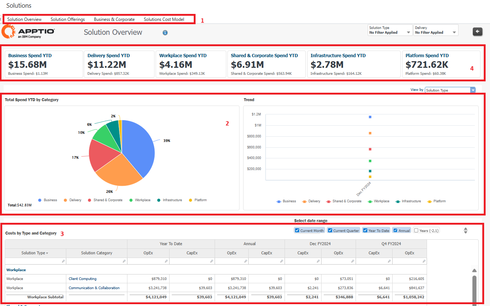
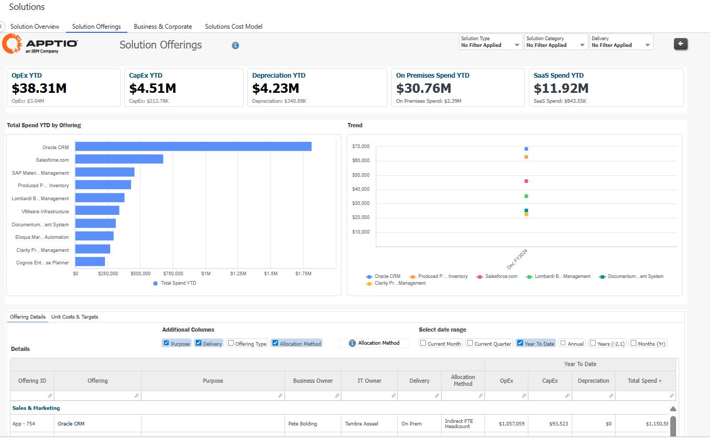
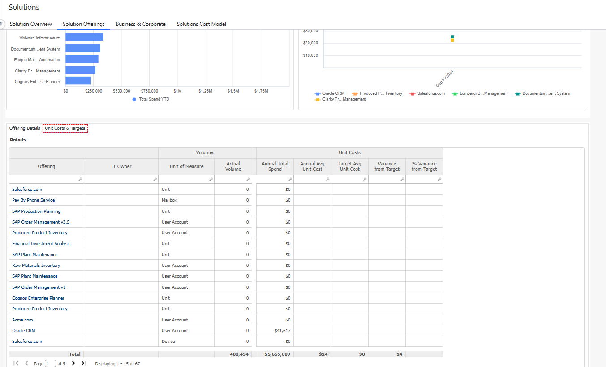
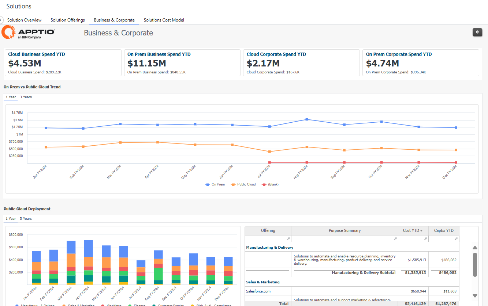
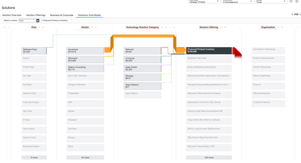

# Revisão de soluções

Esse relatório analisa os principais gastos com aplicativos e serviços (amplamente categorizados como Soluções) e permite que as organizações visualizem quais aplicativos e/ou serviços (e tipos de serviços) estão consumindo mais gastos.

## Casos de uso

Este relatório resolve os seguintes casos de uso:

- Analise as despesas do fornecedor diretamente associadas a uma oferta de tecnologia específica ou a uma categoria de nível superior para identificar fornecedores redundantes e/ou sobrepostos.
- Analisar os gastos com investimentos em projetos ou produtos diretamente associados a uma oferta de tecnologia específica ou a uma categoria de nível superior.
- Analisar os custos de mão de obra interna e externa e o tipo de atividade por função e por local para ofertas de tecnologia específicas.
- Entenda os principais geradores de custos diretos em todo o portfólio de ofertas de tecnologia, divididos por mão de obra, produtos e serviços de fornecedores e investimentos em projetos ou produtos.
- Alocar os gastos com ofertas de tecnologia para as organizações consumidoras usando métodos prescritivos diretos e indiretos

## Personagens

- Proprietário do aplicativo/plataforma
- Finanças de TI

## Perguntas respondidas

O relatório responde às seguintes perguntas:

- Quais aplicativos e serviços representam a maior parte dos gastos em minha organização?
- Quanto do meu gasto com aplicativos/serviços está dividido em várias categorias e tipos?

## Visualização

| Elemento-chave | Descrição |
| --- | --- |
| (1) Coleta de relatórios | Essa coleção de relatórios fornece os seguintes detalhes da solução:  - Visão geral das soluções (visualização padrão) - Ofertas de soluções - Negócios e corporativo - Infraestrutura e nuvem - Resumo da nuvem |
| (2) Total de despesas acumuladas até a data por categoria | Analise o gráfico de despesas totais e o relatório de tendências do ano fiscal por tipo de solução ou categoria de solução. |
| (3) Custos por tipo e categoria | Veja os custos por tipo de solução e categoria de solução. Selecione o período de tempo para personalizar a tabela com as métricas que você deseja ver. |
| (4) KPIs | Os KPIs fornecem uma visão de alto nível dos gastos totais no ano fiscal para diferentes soluções, como negócios, local de trabalho, entrega, infraestrutura, plataforma e compartilhada e corporativa. |

## Ofertas de soluções

Esse relatório exibe o seguinte:

- Total de despesas acumuladas até a data por ofertas, OnPrem/SaaS solutions, and Trends
- KPIs para OpEx YTD, CapEx YTD, Deprication YTD
- Detalhes da oferta por ID da oferta, custos unitários e metas, etc.

## Negócios e corporativo

Esse relatório exibe os gastos comerciais e corporativos para o seguinte:

- Gráficos de tendências anuais e resumo das implementações On Prem e Public Cloud
- KPIs para soluções corporativas em nuvem/no local/em nuvem corporativa/no local corporativa

## Modelo de custo da solução

