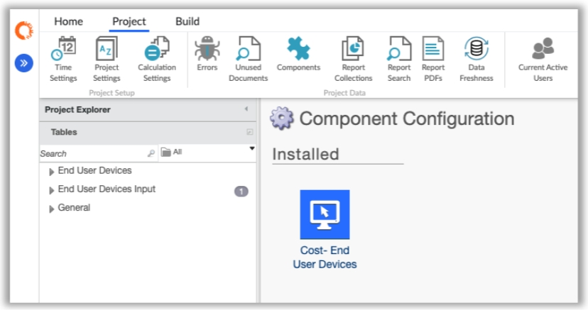
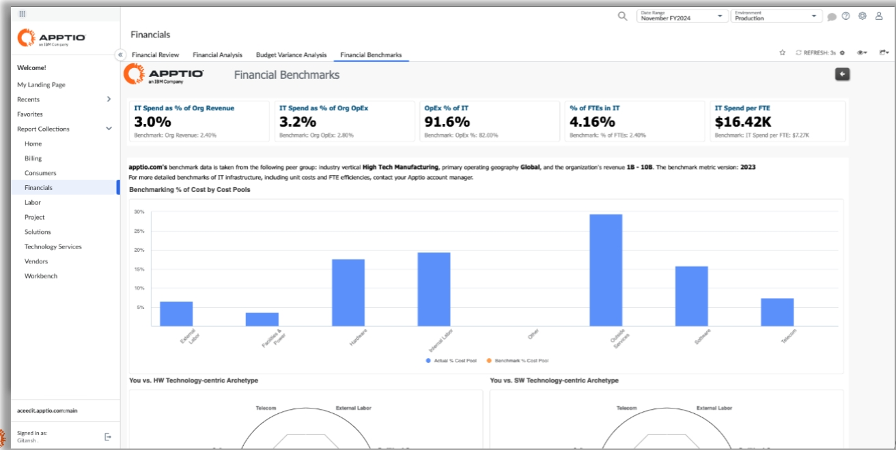
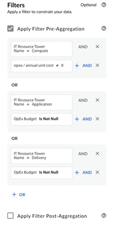

# Notas de lançamento de 2024

## Costing Essentials melhorias ( v200 ) - 22 de novembro de 2024

Os dois novos componentes a seguir foram introduzidos nesta versão.

- Componentes de dispositivos do usuário final (GA) : Um novo componente de dispositivos do usuário final está disponível no modelo v200. Ele fornece insights para que o gerente de ativos de TI/gerente de suporte técnico tome decisões baseadas em dados sobre otimização e consolidação da frota, a fim de ajudar a determinar o tamanho geral da frota e os custos associados. Também auxiliará no planejamento e na previsão dos custos estimados de atualização para dispositivos em fim de vida útil e não compatíveis.

  

  

  Para saber mais, consulte [Dispositivos do usuário final](../getting_started/eud-intro.htm "(Abre em uma nova guia ou janela)").
- Componente Cost Pool Benchmark (BETA) : O Cost Pool Benchmark fornece insights para a liderança de TI e finanças de TI, apoiando decisões estratégicas de investimento relacionadas ao papel da TI nos negócios, ao modelo operacional atual de TI e às estratégias de sourcing. Os benchmarks podem ser usados para compreender a estrutura de custos da estratégia atual e para justificar ou ajustar as abordagens atuais de investimento e sourcing. Compare os gastos com TI com os padrões do setor (por exemplo, gastos com TI como porcentagem da receita)

  

  

  Para saber mais, consulte [Referências de custos compartilhados](../admin/setup-be.html).

## Apptio Transição da comunidade para IBM TechXchange - 1º de novembro de 2024

Hoje, a comunidade Apptio fez a transição completa para IBM TechXchange

## ApptioCosting Essentials Agora disponível em japonês - 16 de agosto de 2024

O aplicativo Costing Essentials (ACE) agora está totalmente localizado em japonês, melhorando a usabilidade para usuários que falam japonês. Todas as strings utilizadas no ACE foram traduzidas para japonês e integradas em nosso sistema. O conteúdo foi redimensionado e realinhado dentro do aplicativo para melhorar o ajuste e o acabamento geral. Essas mudanças garantem uma experiência de usuário mais refinada e visualmente atraente.

## IBMCosting Essentials Apptio GA - 5 de julho de 2024

IBMCosting Essentials Apptio lançou o Template v200, que foi projetado para otimizar e simplificar as soluções de cálculo de custos para nossos usuários. É uma solução de cálculo de custos prescritiva criada em R12, adaptada para clientes menores e menos complexos. É implementado por meio do CS Delivery para a configuração inicial e do TAS para o suporte contínuo. Ele utiliza componentes padrão para facilitar o uso e garantir a consistência entre as implementações.

Os administradores podem criar novos projetos usando o Tipo de Projeto “Costing
Essentials”. Esses projetos consistem em componentes criados diretamente no R12. É uma estrutura atualizável que suporta componentes futuros, ampliando a funcionalidade para Costing Standard. Ele utiliza tabelas editáveis para entrada e manutenção de dados, incluindo mapeamentos que orientam métodos de alocação predefinidos.

## Costing Essentials lançamento 12.11.4 - 1º de março de 2024

Aprimoramentos de filtragem para clientes do Costing Essentials que utilizam o Apptio BI

A partir de hoje, os usuários podem filtrar dados de forma rápida e fácil para obter as informações mais importantes. Antes deste lançamento, Costing Essentials os usuários não conseguiam filtrar as informações de maneira tão eficaz.

Aprimoramentos

- Filtros no nível do relatório,
- Filtragem composta com opções de pré e pós-agregação,
- Filtragem de valores nulos.

Recurso 1: Filtros no nível do relatório

Esta melhoria permite aos usuários configurar filtros no nível do relatório e aplicá-los a todas as visualizações pertencentes a esse relatório. Depois de criados, os filtros de nível do relatório ficam visíveis na parte superior do relatório.

Etapas para criar um filtro no nível do relatório:

1. No canto superior direito de um relatório, selecione e vá para Gerenciar filtros do relatório.
2. Na lista Fonte de dados, selecione a fonte de dados necessária.
3. Selecione Adicionar dimensões e, em seguida, selecione a dimensão na qual deseja basear o filtro.
4. Selecione Aplicar.

Para obter mais informações, consulte [Filtros no nível do relatório](../../apptio_bi/self-service-reporting_user_guide/bi-create-and-manage-report-filters.htm "(Abre em uma nova guia ou janela)").

Recurso 2: Filtragem composta com opções de pré e pós-agregação

Esta melhoria permite aos usuários criar consultas complexas para filtrar as informações mais importantes. Está disponível no modo de edição e permite aos usuários definir instruções com várias operações AND e OR que podem ser aplicadas antes ou depois da agregação. A pré-agregação aplicará o filtro a cada linha individual do conjunto de dados, enquanto a pós-agregação aplicará o filtro após os dados terem sido agregados.

Etapas para criar um filtro no nível do relatório:

No modo de edição, role para baixo pelo painel de navegação do lado esquerdo até chegar a Filtros.

1. Selecione se o filtro deve ser aplicado antes ou depois da agregação.
2. Defina a consulta que deseja processar selecionando as medidas, os operadores e os valores apropriados.
3. Combine as consultas usando as junções AND e OR, se necessário.

Recurso 3: Filtragem de valores nulos

Esta melhoria permite aos usuários filtrar facilmente valores nulos e se concentrar nas informações mais relevantes.

Etapas para aplicar a filtragem de valores nulos:

No modo de edição, role para baixo pelo painel de navegação do lado esquerdo até chegar a Filtros.

1. Selecione se o filtro deve ser aplicado antes ou depois da agregação.
2. Escolha a medida que deseja filtrar.
3. Como operador, selecione: “é nulo” ou “não é nulo”, dependendo das informações que deseja ver.
4. Selecione OK.

