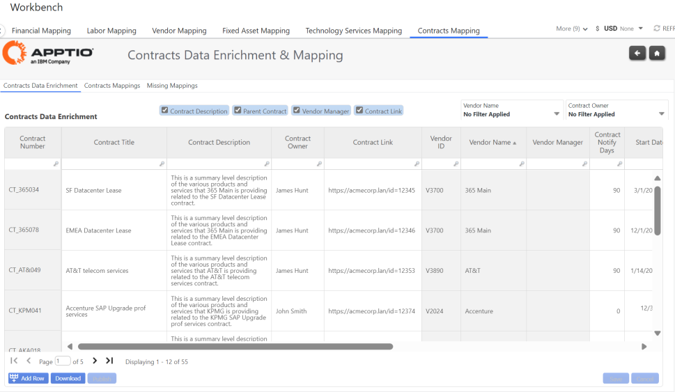
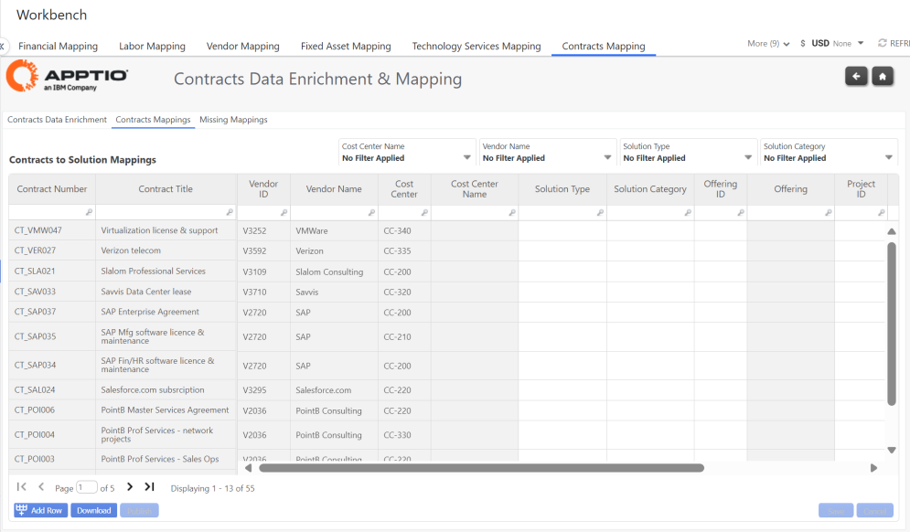
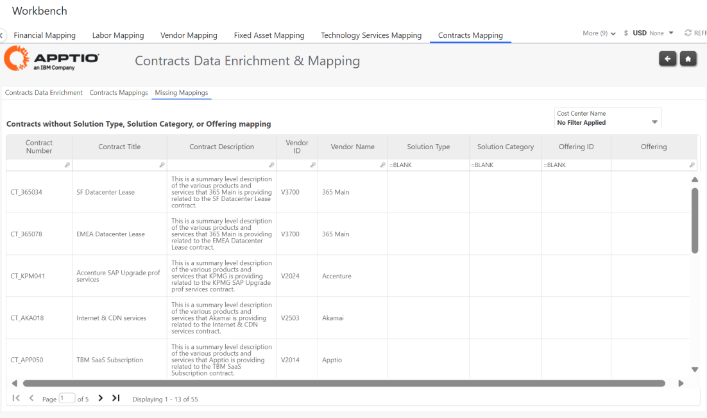

# Mapeamento de contratos

## Enriquecimento de dados de contratos

Oferece a capacidade de completar o enriquecimento de dados para seus contratos de fornecedores de TI. Você pode especificar metadados como:

- Título e descrição do contrato
- Proprietário do contrato
- Link do contrato - insira um link para seu sistema de contratos
- Centro de custo
- Datas de início e término
- Planos de renovação
- Termos
- Estado
- Despesas anuais comprometidas e valor do contrato

## Mapeamentos de contratos

Oferece a capacidade de definir as alocações de contratos para a solução, no nível da oferta de serviços. Os usuários podem determinar o mapeamento de contratos para:

- Tipo de solução
- Categoria de solução
- ID da oferta
- ID de Projeto

## Mapeamentos ausentes

Use esta tabela para identificar quaisquer Contratos que ainda não tenham sido mapeados para um Tipo/Categoria de Solução e Oferta.

