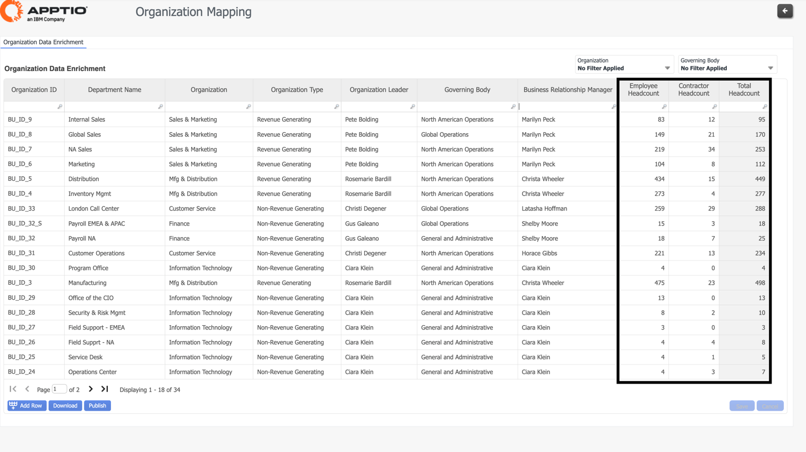

# Mapeamento da organização

Oferece a capacidade de completar o enriquecimento de dados para suas organizações de TI (unidades de negócios).

## Enriquecimento de dados da organização

Use essa ET para atualizar suas organizações de TI (unidades de negócios):

- Nome do departamento
- Unidade de negócios
- Tipo de unidade de negócios
- Líder da unidade de negócios
- Conselho de Administração
- Gerente de relacionamento comercial
- Número de funcionários internos
- Número de funcionários externos

