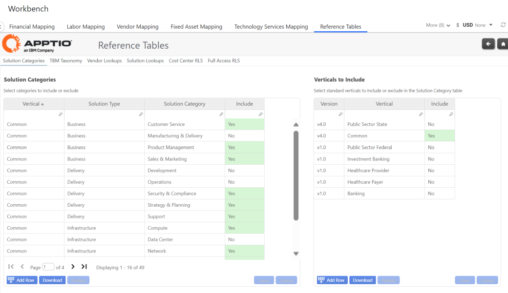
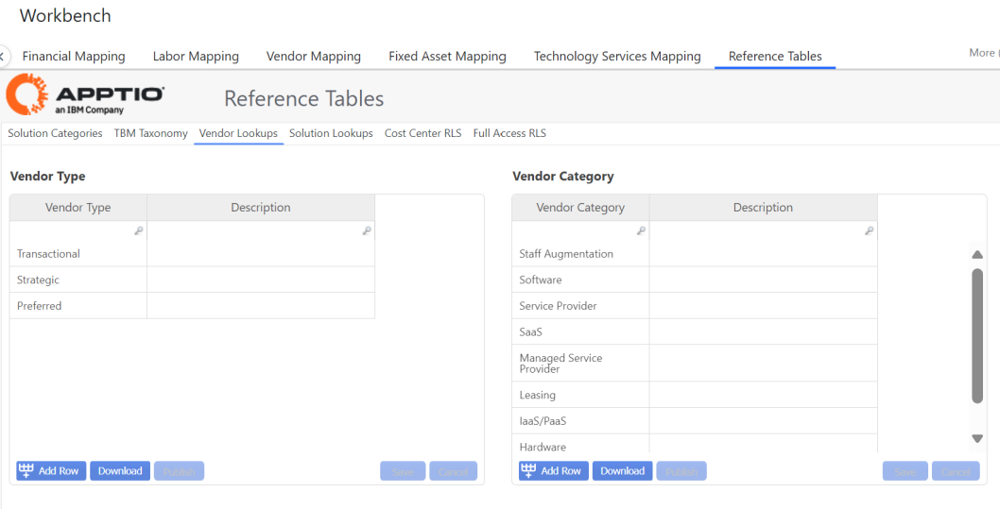
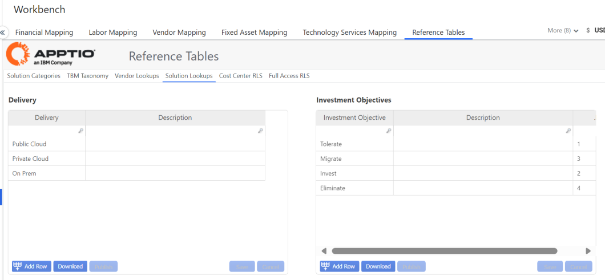
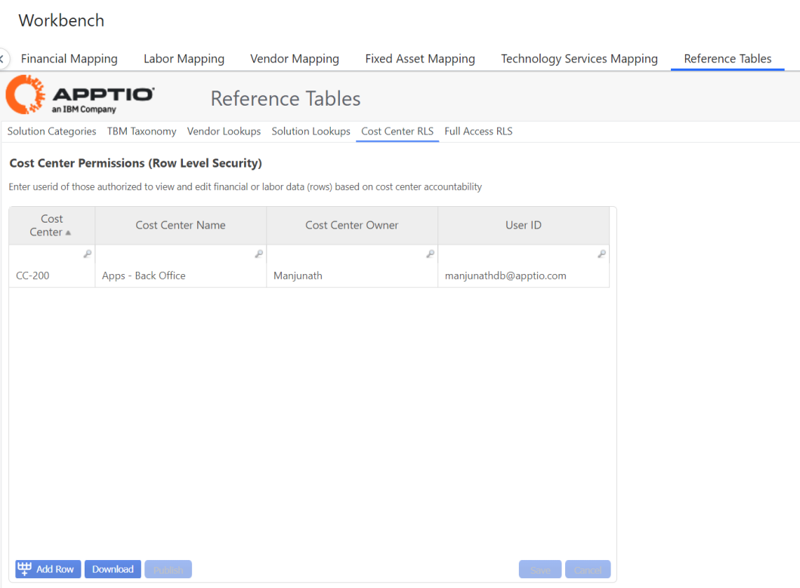
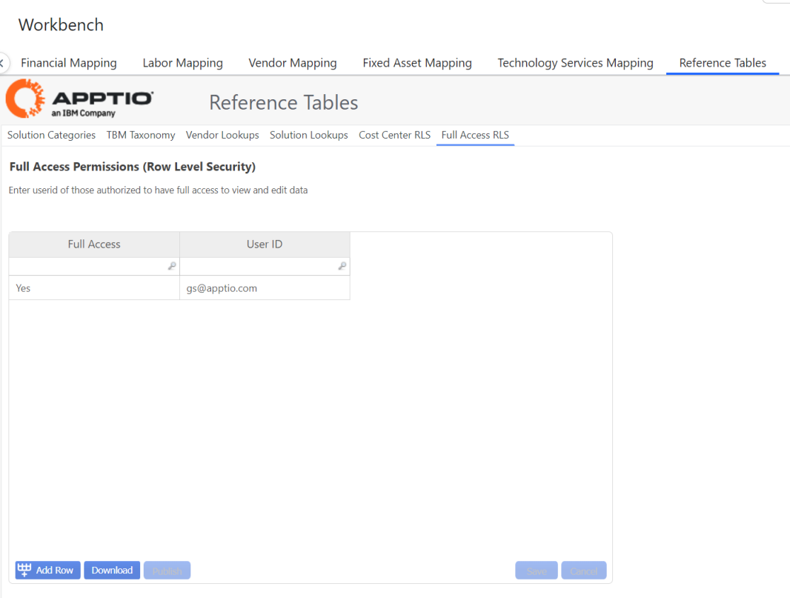

# Tabelas de referência

Esta seção do Workbench tem como objetivo oferecer ao cliente a capacidade de gerenciar os dados de referência da linha de base a serem utilizados no Apptio Cost Management.

## Categorias de soluções

Uma vertical é considerada a distinção dos tipos e categorias de solução usados no modelo ACM. O cliente pode escolher a Vertical "Comum", que é baseada na Taxonomia da TBM v4;, ou pode criar sua própria Vertical exclusiva.

**O tipo de solução** deve estar alinhado com a taxonomia da TBM. (Consulte a Tabela de Referência da Taxonomia da TBM).

**A categoria da solução** pode ser específica do cliente.

O usuário pode selecionar as categorias de solução a serem incluídas no modelo selecionando "YES" (Sim) na coluna Include (Incluir).

## Pesquisas de fornecedores

**O tipo de fornecedor** é uma classificação de fornecedores para fornecer gerenciamento e supervisão adequados para otimizar preços e riscos. As categorias recomendadas são: Estratégico, Preferencial, Transacional e Legado.

**Categoria do fornecedor** é uma categorização de alto nível da função que o fornecedor oferece.

OBSERVAÇÃO: recomenda-se que os usuários não excluam nenhum dos tipos de fornecedor existentes (STRATEGIC, PREFERRED, TRANSACTIONAL), pois eles estão vinculados diretamente a regras de negócios, relatórios e KPIs.

## Pesquisas de soluções

**O fornecimento** oferece a capacidade de definir uma solução como fornecida por: Public Cloud nuvem privada, no local.

**Objetivo de investimento** é a estratégia de investimento para a solução. Usado para priorizar recursos de soluções e investimentos para soluções novas e existentes que estejam alinhadas aos imperativos e objetivos da empresa.

## Centro de custo RLS

Isso permite que o usuário insira atribuições de segurança de nível de linha por centro de custo. Os itens inseridos nessa tabela limitarão o ID do usuário para que ele só possa ver os dados relacionados ao centro de custo que lhe foi atribuído.

O ID do usuário deve ser o endereço de e-mail que o usuário usa para entrar em Apptio.

## Acesso total ao RLS

Para todos os usuários com permissão de acesso total a todos os dados relatados em Costing Essentials, devem ser inseridos nessa tabela.

