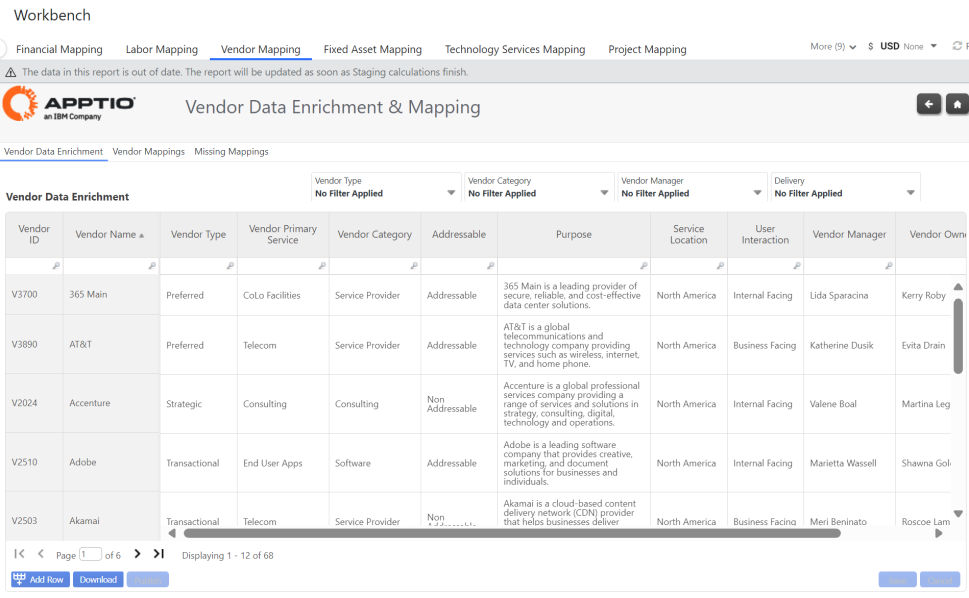
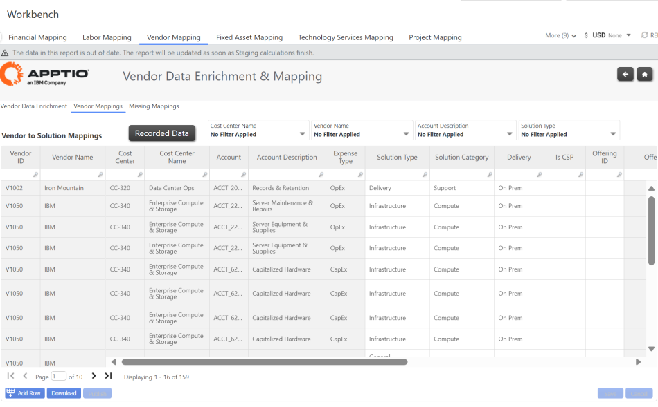
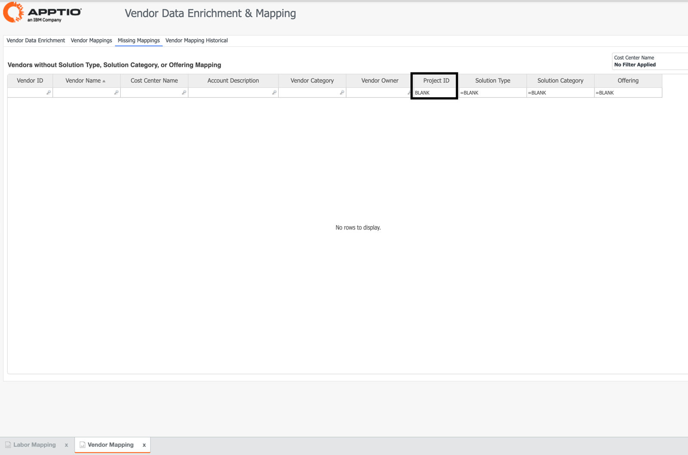

# Mapeamento de fornecedores

## Enriquecimento de dados do fornecedor

Essa guia oferece a capacidade de melhorar os metadados do fornecedor, ingeridos a partir da lista mestre de fornecedores do IDP, e permite uma análise mais rica das despesas do fornecedor.

- Tipo de fornecedor
- Serviço principal do fornecedor
- Categoria do fornecedor
- É CSP (é um provedor de serviços de nuvem)
- Gerente e proprietário do fornecedor
- Meta anual de gastos
  - Representa o orçamento do fornecedor para o ano fiscal atual e não o total de gastos previstos durante a vida útil prevista do fornecedor (por exemplo, contrato de 3 anos)

Um dos principais mapeamentos no Enriquecimento de dados trabalhistas é a coluna "Is CSP". Isso determinará qual fornecedor será definido como um fornecedor de nuvem e será alocado aos dados mestre da nuvem em vez das soluções com base no banco de trabalho de mapeamento de fornecedores. Ao alocar o custo para os dados mestre da nuvem, o custo será alocado para as soluções com base em um mapeamento específico da nuvem para soluções ponderadas pelo valor da fatura de recursos.

## Mapeamento de dados do Cloud Master

Diferentemente de outros custos que são alocados à camada de soluções, os custos de nuvem serão baseados nas contas e/ou nos serviços de aplicativos associados a uma solução.

## Mapeamentos de fornecedores

Oferece a capacidade de mapear as despesas do fornecedor diretamente para tipos de solução e categorias de solução, juntamente com uma ponderação de alocação:

- Tipo de solução
- Categoria de solução
- Oferta de soluções
- Entrega (On Prem vs Public Cloud) \*\*
- ID da oferta
- ID do projeto \*\*
- Ponderação de alocação
  - Oferece a capacidade de determinar a alocação da porcentagem de gastos do fornecedor para cada solução. A ponderação padrão é 1 (100%) para cada fornecedor; no entanto, os usuários podem ajustar ou dividir as porcentagens do fornecedor em suas áreas apropriadas.

|  |  |  |
| --- | --- | --- |
|  | • | Tipo de solução |

|  |  |  |
| --- | --- | --- |
|  | • | Categoria de solução |

|  |  |  |
| --- | --- | --- |
|  | • | Oferta de soluções |

|  |  |  |
| --- | --- | --- |
|  | • | Entrega (On Prem vs Public Cloud) \*\* |

|  |  |  |
| --- | --- | --- |
|  | • | ID da oferta |

|  |  |  |
| --- | --- | --- |
|  | • | ID do projeto \*\* |

|  |  |  |
| --- | --- | --- |
|  | • | Ponderação de alocação |

|  |  |  |
| --- | --- | --- |
|  | • | Oferece a capacidade de determinar a alocação da porcentagem de gastos do fornecedor para cada solução. A ponderação padrão é 1 (100%) para cada fornecedor; no entanto, os usuários podem ajustar ou dividir as porcentagens do fornecedor em suas áreas apropriadas. |

\*\* Delivery e Project Id são atributos opcionais que podem ser aproveitados para aumentar a granularidade das alocações. Por exemplo, permitir que os projetos para os mesmos fornecedores sejam alocados para diferentes ofertas de serviços.

## Mapeamentos ausentes

Identifica os fornecedores que não foram mapeados para um tipo/categoria de solução e oferta(s).

