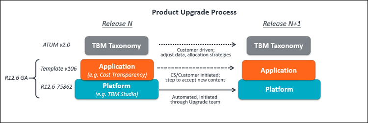
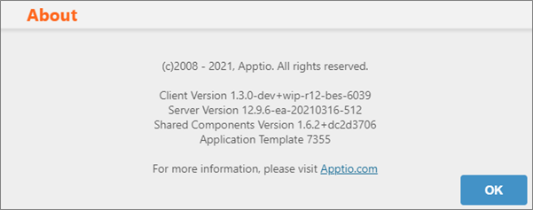
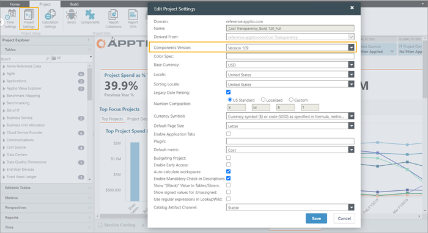
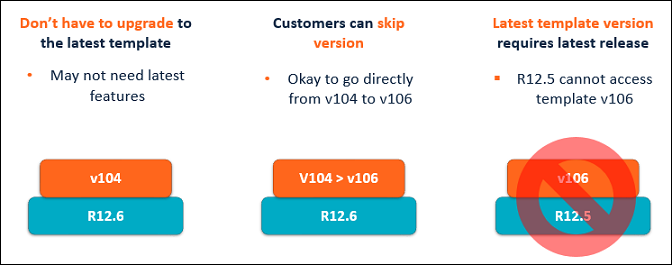

# About upgrading Costing Standard

- Applies to: TBM Studio 12.x and later, on Template v102 and later

The upgrade process for Costing Standard involves updates to the following layers.

## Platform layer

The platform (or Apptio code base), called TBM Studio, is a set of features and capabilities that
allow you to perform tasks that drive the Apptio applications, such as creating models, uploading
data sets, allocating costs, and creating reports. TBM Studio also includes the Apptio calculation
engine.

The goal is to upgrade all TBM Studio 12.x customers to the latest release each quarter. In an
effort to keep our applications updated with the latest features and performance enhancements, we
schedule mandatory maintenance during a specific date range. For dates, contact your Customer
Success Manager or the [CS-Upgrade Team](https://community.apptio.com/docs/DOC-9207 "(Opens in a new tab or window)").

**Versioning**. R12 is a shortcut referring to the current version of TBM Studio base product.
Incremental releases of TBM Studio are represented as 12.1, 12.2, etc. To upgrade to a new version
of TBM Studio, contact your Customer Success Manager.

To see the version of TBM Studio you are running, select  > About.

The following window displays the TBM Studio version:

## Applications layer

Applications are pre-defined components that use platform capabilities to achieve a use case.
Application components may contain the following content elements:

- Master data sets
- Model objects
- Taxonomy
- Metrics
- Perspectives
- Reports

**Versioning**. The versioning for Apptio applications is reflected as template versions.
Template v106, for example, is the version number assigned to the application components released
with TBM Studio 12.6. It's possible to use earlier template versions (for example, Template v105 on
TBM Studio 12.6) but not vice versa. For example, you can't run Template v106 on TBM Studio 12.5.

To see the version of template you are running, open TBM Studio and select *Project >
Project Settings*.

The Edit Project Settings dialog opens, displaying the component version.

**Upgrade guidance**

Application updates are at your discretion:

- Move to a new application template if you want to use the latest features and enhancements
  introduced by that template.
- You can choose to upgrade to a new platform version, but remain on your current application
  template version. For example, you can choose to upgrade to TBM Studio 12.6, but remain on Template
  v104 if you don't need the latest features.
- You can skip template versions. For example, you can upgrade from application Template v104 to
  v106, skipping Template v105. However, if you choose to skip versions, you must upgrade all of your
  components to avoid potential issues.

Note: To access a current application template, you must upgrade to the minimum platform release
that supports that template. For example, you can't access Template v106 unless you are on TBM Studio 12.6 and later.

You must upgrade TBM Studio before you upgrade the application template.

For step-by-step instructions:

- Upgrade from Template v103, see [Upgrade Costing Standard from template v103 to the latest version](../v12.x-on-tbm-studio-12.x/upgrade-guide-v103-to-latest/upgradect.html).
- Upgrade from Templates v104 or later, see [Upgrade Costing Standard from
  template v104+ to the latest version](../v12.x-on-tbm-studio-12.x/upgradect-v104.html).

## TBM Taxonomy layer

The TBM Taxonomy is a framework for allocating IT costs in a standard approach that allows
technology leaders to run and optimize IT as a business. Upgrading from one version to another is a
customer-driven decision and is not directly related to the platform or content upgrades. Reference
files for each ATUM version are available in the product. Moving from one ATUM version to another
requires changes to data and allocation strategies to map costs to the new categories. For more
information, see the
