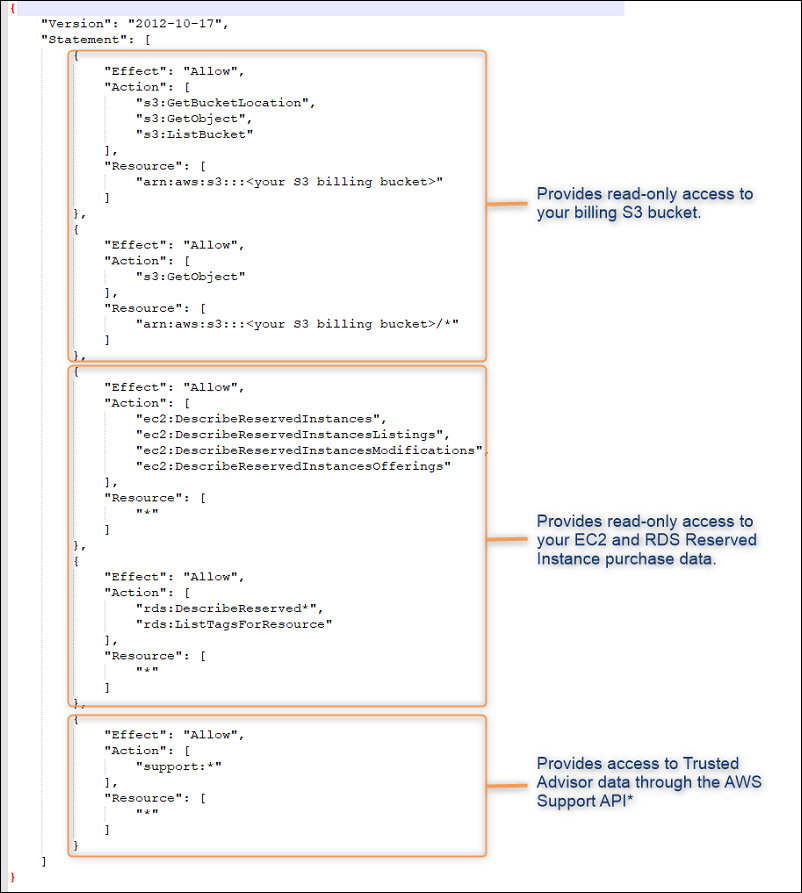
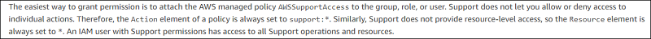

# Apptio - AWS IAM Policy

- Applies to: Apptio Costing Standard or Apptio Cloud Cost Management running on TBM Studio
  v12.3.3 or later.

The attached document includes the JSON-based IAM policy required when setting up a new role in
AWS.This IAM policy includes various permissions allowing Datalink (Classic) to access data in your
AWS environment that CCM requires to provide analytics around your AWS cost and consumption as well
as Trusted Advisor recommendations. The following figure highlights the various sections within the
IAM policy.

Note: Only the first section (S3-related) is required for users of the multicloud
connector.

The Support API is the only option for accessing Trusted Advisor data and requires the support
permission to function correctly. The screenshot below from AWS documentation illustrates the
limitation and for more information, you can refer to the AWS documentation available here: [Getting Started with AWS Support](https://docs.aws.amazon.com/awssupport/latest/user/getting-started.html "(Opens in a new tab or window)")

[Link to policy file](https://community.apptio.com/viewdocument/apptio-aws-iam-policy?CommunityKey=15f4e51d-d06f-4641-94c5-f2598d137d06&tab=librarydocuments "(Opens in a new tab or window)")
