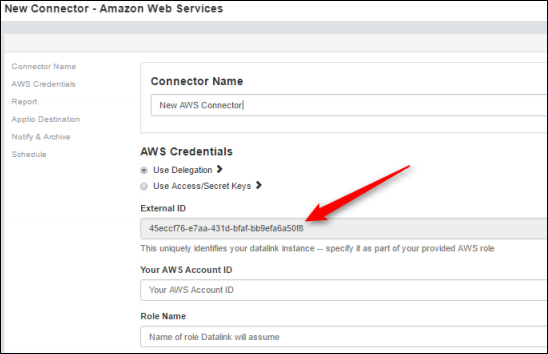
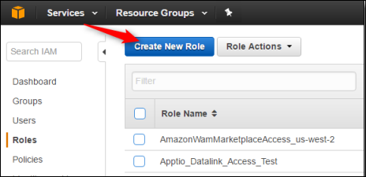
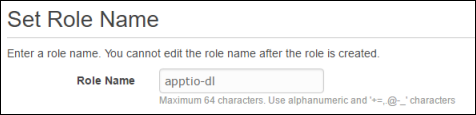
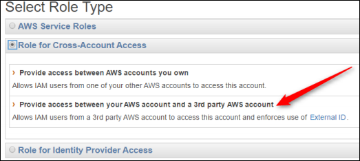
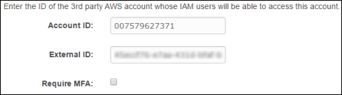

# Complete AWS Configuration Dependencies

- Applies to: Apptio Costing Standard or Apptio Cloud Cost Management on TBM Studio 12.3.3 and
  later

Complete the following steps for Amazon Web Services (AWS) configuration dependencies.

## Create an S3 bucket

To create an S3 bucket, follow these steps:

1. Log into the AWS Management Console for the account with which you want to integrate.
2. From the Services menu, navigate to the Amazon S3 console.
3. Select **Create Bucket**.
4. Type a name for the bucket and select a region where the bucket will reside.
5. Click **Create**.

To set permissions for the bucket, follow these steps:

1. In the AWS Management Console, navigate to My Billing Dashboard.
2. Select **Preferences**.
3. Under Receive Billing Reports, type the S3 bucket name, and select **Sample
   policy**.
4. Copy the policy.
5. Navigate to the Amazon S3 console, then select the bucket you created.
6. Click **Properties**, **Permissions**, and then select
   **Add bucket policy**.
7. Paste the policy you copied, and then click **Save**.

## Enable billing reports (Cost Allocation)

To enable all Receive Billing options:

1. In the AWS Management Console, navigate to My Billing Dashboard, then select
   **Preferences**.
2. Under Receive Billing Reports, make sure that your S3 bucket name appears in **Save to
   S3 Bucket**.
3. Enable all billing report options by selecting the following boxes: Monthly report, Detailed
   billing report, Cost allocation report, and Detailed billing report with resources and tags.
4. Click **Save Preferences**.

## Enable tags for billing reports

To enable all tags in your billing reports:

1. In the AWS Management Console, navigate to My Billing Dashboard.
2. Select **Cost Allocation Tags**.
3. Enable all tags you will use to analyze your spend.

DataLink can authenticate with AWS to obtain permissions to access AWS Data Sources.

**Delegation** — DataLink will assume an AWS IAM Role that your organization has created to
obtain temporary permissions to access your AWS data. We recommend this approach from a security
standpoint.

## Delegation

1. Within the new DataLink AWS connector, select the **Use Delegation within the AWS
   Credentials** section, then copy the entire string in the **External
   ID** field.

   
2. If security policies are not already created, within your AWS environment, create the IAM
   Security Policies to be attached to the IAM Role. This will be configured in AWS and assumed by the
   AWS connector. See the [Security
   policies](#completeawsconfidependencies__Securitypolicies) section below for the specific policies to create.
3. In your AWS console, navigate to the IAM service and create a new IAM role.

   
4. Specify a role name. This role name will be entered into the DataLink AWS connector, so create a
   name that is DataLink-specific.

   
5. Next, specify the role type:

   Select **Role for Cross-Account Access**.
   Then, choose **Provide access between your AWS account and a 3rd party AWS
   account**.

   
6. Enter the Apptio Datalink (Classic) account ID (007579627371) and External ID (available in the
   AWS connector – see step 1 above).

   
7. Attach the appropriate policies (created in step 2 above) to the role.
8. In the new DataLink AWS connector, enter the account ID for your AWS account and the name of the
   role that was just created.

## Security policies

This will create a policy that allows the holder (a user, group, or in our case, a role) to read
items from the specified bucket. Replace "my-bucket" with the name of the bucket you would like
DataLink to access.

S3
:   ```
    { "Version": "2012-10-17", "Statement": [ { "Sid": "Stmt1468715091000", "Effect": "Allow", "Action": [ "s3:GetBucketLocation", "s3:GetObject", "s3:ListBucket" ], "Resource": [ "arn:aws:s3:::my-bucket" ] }, { "Effect": "Allow", "Action": [ "s3:GetObject" ], "Resource": [ "arn:aws:s3:::my-bucket/*" ] } ] }
    ```

Describe EC2 reserved instances
:   ```
    { "Version": "2012-10-17", "Statement": [ { "Sid": "Stmt1431460354000", "Effect": "Allow", "Action": [ "ec2:DescribeReservedInstances", "ec2:DescribeReservedInstancesListings", "ec2:DescribeReservedInstancesModifications", "ec2:DescribeReservedInstancesOfferings" ], "Resource": [ "*" ] } ] }
    ```

Describe RDS reserved instances
:   ```
    { "Version": "2012-10-17", "Statement": [ { "Action": [ "rds:DescribeReserved*", "rds:ListTagsForResource" ], "Effect": "Allow", "Resource": "*" } ] }
    ```

Describe Trusted Advisor checks
:   This policy is provided by AWS by default: AWSSupportAccess

    ```
    { "Version": "2012-10-17", "Statement": [ { "Effect": "Allow", "Action": ["support:*" ], "Resource": "*" } ] }
    ```

For more information about how to create a role in Amazon Web Services, see [Creating IAM Roles - AWS Identity and Access Management](https://docs.aws.amazon.com/IAM/latest/UserGuide/id_roles_create.html "(Opens in a new tab or window)").
