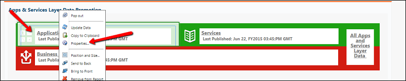
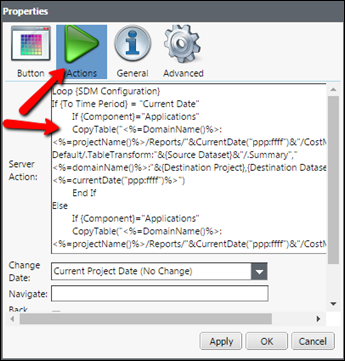
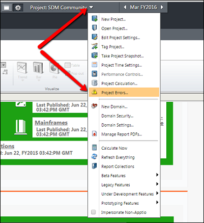
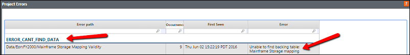

# How To: Source Data Management Configuration and Project Errors Table

*Reporting Tab (SDM Project/Promote Data)*

**Application**: The SDM project is used to copy data from one project to another within the
same instance. However, the proper configuration is needed to ensure that the correct data is
copied/pasted to and from the specific project. The “Project Errors” table from the project drop
down menu is a great tool to help troubleshoot configuration.

**SDM Configuration:**

To access the properties for a button you will need to be in edit mode and right click and choose
properties. This will open up a Properties view shown below. That view will allow you to choose
Actions from the viewer and look at the source code.

Note:

Make sure to only right-click on the button as left-clicking will force the button to execute the
copy from the selected source/target destination.

**Project Error Table:**

The error message will be displayed after the copy table button has been pressed if the source
code is not correct. As shown below, the error at hand is that the backing table is not found. The
code needs to include the backing table “Mainframe Storage Mapping” for the button to execute
properly.

There are numerous types of errors, but all will be identified in the project errors table in the
error column.
