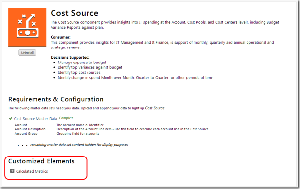

# About customizations to your project

If you have customized your Apptio Content, and you install a component, the upgrade
process will not upgrade the customized element(s) of the component. The upgrade will keep the
customized elements intact (no changes will be applied), and upgrade any elements that have not been
customized.

## Introduction

For example, if you changed a master data set and made no other customizations, you will not get
the new version of the master data set when you upgrade. However, you will get other reports as well
as the upgrade of the other Content Elements related to that component, such as the master data set
and the metrics.

If you have not customized your Apptio Content, the upgrade process will replace your versions of
the same Content Elements with the latest version. Note that this may result in a change in
functionality.

## Customizations

The following actions are considered customizations to a project.

- Removing a column from a master data set
- Changing a report component
- Changing a metric, perspective, or published field
- Changing a data column type, such as from a Key to a Label
- Unmastering a master data set and leaving it unmastered. If you re-master the data set without changing the data set, it is no longer a customization.

## Configurations

The following actions are not considered a customization to the project. They are
configurations.

- Adding a column to a master data set
- Mapping a data set to a master data set
- Changing the Visibility setting of a data set, such as Hide from Inference Engine
- Changing the Category setting of a data set

## Identify customizations

The Customized Elements section of the Component
Details page identifies the customizations between your project and the current
release.

Click the plus sign (+) next to identified elements to get more information on the
customization.

