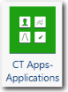
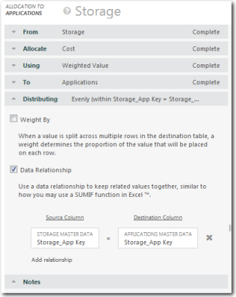

# CT Apps - Applications component

The Applications component is a foundational prerequisite component that is
used by the Applications Insights Component. The Applications component provides new reports and
also creates metrics that are exposed in the Application Insights Component.

Applies
to: Costing Standard on TBM Studio 12.0 and later

Component Icon:

## Supporting tables

When you install the CT Apps - Applications component, a new Applications group is created with
three tables: Applications (model table), Applications Master Data, Applications Reference List.

The Applications Reference List table includes a list of application families (e.g.: Business
Apps, Collaboration, Database, etc.) and the various application functions associated with each
application family. You should not modify this table.

## Master data

For a description of the fields in the master data table, see the information on the CT Apps -
Applications component page in the product. To display the page:

1. Click the **Project** tab in the ribbon.
2. Click **Components**.
3. Click the **CT Apps - Applications** component.

## Upload the data

Upload your application data. The required and recommended fields are listed below. All of the
fields can be mapped to the Applications Master Data table.

- Actual Units (required)
- Application Business Owner (recommended)
- Application Count (recommended)
- Application Family (required)
- Application Function (recommended)
- Application ID (required)
- Application In Service Date (recommended)
- Application Investment Objective (required)
- Application IT Owner (recommended)
- Application Lifecycle (recommended)
- Application Name (required)
- Application Retirement Date (recommended)
- Application Type (recommended)
- Application User Category (recommended)
- Business Criticality (recommended)

## Map the data

After uploading the application data, map the table to the Applications Master Data table.

After you map the data, there should be value allocated from IT Resource Towers, Servers,
Tickets, and Projects to Applications in the Cost model.

## Allocate Storage to Applications

Recall that the Storage LUNs mapped to Applications when you configured Storage. To allocate
Storage to Applications, follow the steps below.

1. Click Storage within the Storage group.
2. Check out the Storage document.
3. Click **Add Allocation** and define the Allocation using the following settings:

   

## Related information

- [Send feedback about
  Help Center](productfeedback@apptio.com "(Opens in a new tab or window)")
