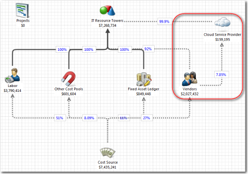

# Configuring Cloud for Costing Standard 12.1 through 12.5x

Use the CTF - Cloud Service Provider component to import usage data from web services.
The component is optional.

## Introduction

If you are using Amazon Web Services (AWS), Microsoft Azure, SoftLayer, or CenturyLink, you can
import usage data from the monthly usage and billing reports. The data is used in the CTF reports
and the Application and Services reports. The data can help you compare the cost of cloud services
to in-house services. To use the webservices data, you must install the CTF - Cloud Service Provider
component.

## Two different configuration procedures

There are two different configuration procedures:

- [Amazon Web Services configuration](aws.html "To configure the application for Amazon Web Services, you must install the CTF-Cloud Service and CTF-Amazon Web Services components.")
- [Microsoft Azure and other providers configuration](azure.html "To configure the application for Microsoft Azure or other providers, you must install the CTF-Cloud Service component.")

Each procedure is documented separately.

## Linked to vendors

For cloud cost to be calculated correctly, vendor data must be entered into the Costing Standard
application. The vendor data identifies the costs coming from web services and allocates them to the
cloud services. The model shown below shows the relationship.

## Related information

- [Send feedback about
  Help Center](productfeedback@apptio.com "(Opens in a new tab or window)")
