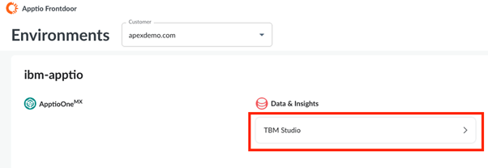
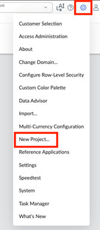
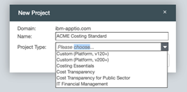
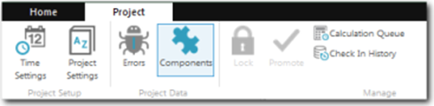
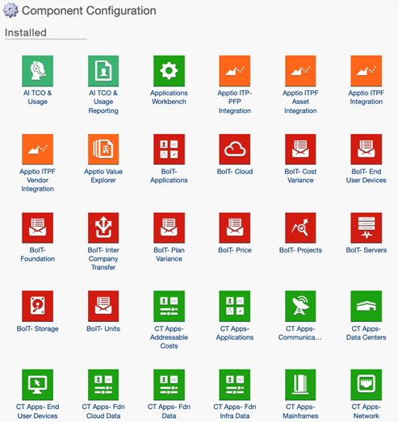
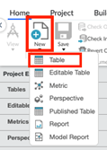
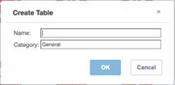
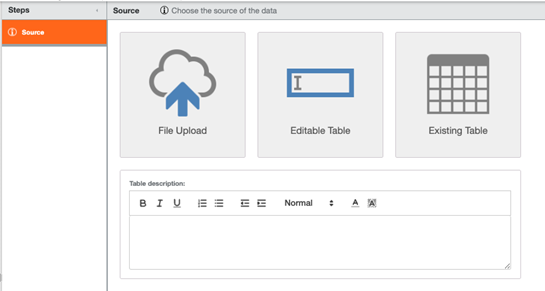
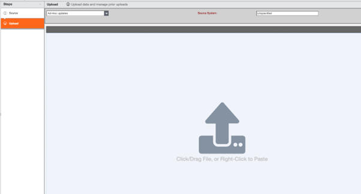
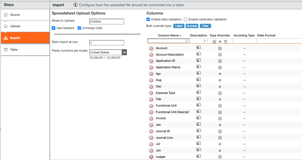

# Create a Project

Projects group together data sets, metrics, models, and reports. When you create a new
project, you can choose from these major types: Costing Standard, Custom. You can create
multiple projects

1. Access TBM Studio
   1. Log in to **IBM Apptio**.
   2. From the application launcher, select **TBM Studio**.
   3. Ensure you have the required permissions (typically Admin)

   
2. **Step 2: Create a New Project**
   1. In TBM Studio, navigate to the **Settings** icon on the top
      right.
   2. Click **New Project**.

      
   3. A **New Project dialog box will open.**
   4. Enter a **Name of the project** that clearly identifies the purpose (for example,
      ACME *Costing Standard*).
   5. Then choose a **Project Type**
   6. Click **Create**.

      

## Project Type

When you create a new project, you have two options:

- **Create an application project.** Application projects serve as templates for new
  projects. When you create an application project, the application automatically creates
  data sets, metrics, models, and reports based on the application template. The application
  templates include: Costing Transparency for Costing Standard, Costing Essentials for
  Essentials project
- **Create a custom project.** A blank project has no data sets, models, metrics, or
  reports. Create a new custom project if you do not want to build on previous work. This
  includes: Custom (Platform, v120+)

Note: Costing Essentials project and Custom (Platform, v200+) projects are licensed
separately.

For more information about additional project settings, go [here](https://www.ibm.com/docs/en/apptio-commercial/tbm-studio/saas?topic=administration-about-studio-project "(Opens in a new tab or window)")

## Set time

The project time defines the start and end dates of a project, and the type of periods that
will be used.

In a time-enabled project, start and end dates are set for the data and the fiscal year is
defined. In a time-enabled project, you can enter data on a regular basis, allocate it to a
specific time period, and see trends across the duration of the project. You can view report
data for the current month or period, or for quarter, half, or full year time periods. The
application supports Gregorian, 445, 454, 544, and 13 period calendars.

For more information on how IBM Apptio supports time-enabled projects, go [here.](https://www.ibm.com/docs/en/apptio-commercial/tbm-studio/saas?topic=administration-enable-time-project "(Opens in a new tab or window)")

**Set the project time**

1. In the TBM Studio.
2. Click the Project tab in the Ribbon.
3. Click Time Settings. The Configure Project Time Settings dialog displays as shown
   below.

   
4. Select a Start of Project time period and an End of Project time period. Select dates
   that include historical data that you will be importing into the project.

   Note: Once you
   set the Start of Project date, you cannot change it. However, you can change the End of
   Project date.
5. Configure any other project time settings appropriate to your project.
6. Click Configure Time.

   

For more details on the available calendar options and how to configure them, go [here.](https://www.ibm.com/docs/en/apptio-commercial/tbm-studio/saas?topic=administration-configure-project-time-settings "(Opens in a new tab or window)")

## Installing Components

A component in the Costing Standard application
bundles reports and metrics together to provide insights into your business. A component
also may install one or more model tables into your project

****Install a
component****

1. Check that you are at the beginning of time in your project.
2. On the Project tab, click **Components**.

   
3. From the Available area on the Component Configuration screen, click the icon that
   corresponds to the component you want to install.
4. On the details page for the component, click **Install**.

   

Note: You cannot uninstall a component once it has been installed. You can disable a
component which removes the associated reports but leaves the tables and
metrics.

Once you install all the components in Costing Standard, then all the
Top-Level Reports will be added. If the customer does not want to view any of these
Top-Level reports, they will have to create a custom project or they can individually
disable the reports.

**Load data**

Master data tables provide a way to map
your data to the data required by the CT application.

Each Costing Standard (CT)
component has a master data table. The master data table provides structure to the related
data. Reports, allocations, and other configuration items are tied to the master data table
structure. You do not upload data directly to the master data tables. Instead, you append or
map data (using Map step in data pipeline) to the tables. This ensures the structure of the
master data tables is not changed.

You must upload your source data into the
application. After you upload the data, you can map it to the master data table for a
component. The data tables you upload should contain fields that can be mapped to the
required fields in the master data tables. The data tables do not need to contain all of the
fields in the master data tables.

For more details on the types of data that can be
uploaded and the different methods available to upload data, go [here](https://www.ibm.com/docs/en/apptio-commercial/tbm-studio/saas?topic=data-upload "(Opens in a new tab or window)")

The general procedure for uploading a
source table is given below:

1. Click the **Home** tab in the Ribbon.
2. Click the **New** menu and then click **Table**.

   
3. In the Create Table dialog, enter a name for the table.
4. Enter a category. As you start typing, matching names of categories that already exist
   will be displayed. Also, you can enter a new category name. The categories are used to
   organize the tables in the Project Explorer.

   
5. Click **OK**. The application creates the table and displays the Source step in the
   transform pipeline as shown below.
6. Click the **File Upload** option. For more information on other options, go [here](https://www.ibm.com/docs/en/apptio-commercial/tbm-studio/saas?topic=data-upload "(Opens in a new tab or window)").

   
7. A upload step will get created where user can Click/drag file or Right-click to paste
   the file.

   
8. An Import step is added to the pipeline.
9. Click the **Import** step in the pipeline and review the settings:
   - Start import at row - Indicate the first row in the table to be included in the
     import.
   - Columns to Exclude - Indicate if there are columns you want to exclude.
   - Text Encoding -If the data file uses a particular character encoding, select the
     encoding scheme from the list. If you are unsure about the encoding, select the
     Autodetect encoding option.
   - Delimited -Select the character that separates the data fields in the file. Most
     often this will be a comma.
   - Text qualifier -If there are special text characters in the data, indicate the text
     qualifier that is used to surround those characters.
   - Columns - Review the columns listed at the right, and if desired, change the column
     types. To filter by column type (key, text, number, date), click a type icon in the
     search field of the Type column.

   
10. To review the uploaded table, click the **Table** step in the pipeline.
11. If the table is acceptable, click **Save** in the Ribbon.
12. If you are done making edits, click **Check In** in the Ribbon. For more information
    on Check In and Check out, go [here](https://www.ibm.com/docs/en/apptio-commercial/tbm-studio/saas?topic=administration-best-practices-check-out-check-in "(Opens in a new tab or window)")

For more details on additional functionality related to table uploads, go [here.](https://www.ibm.com/docs/en/apptio-commercial/tbm-studio/saas?topic=data-upload-file "(Opens in a new tab or window)")

**Delete a table**

1. Check out the table.
2. On the **Home** tab in the **Document** group, click **Delete**.
3. Check in the table.

## Map data to master data

After you have uploaded a source data table and transformed it if necessary, you can map
it to a master data table. Use the following instructions to map data to a master data
table.

There are two methods available to map data to master datasets:

- Map Columns (Preffered)
- Append Tables

**Map Columns**

The primary (and preferred) method to map data is to use Map Columns.The Map Columns
feature is intended to transform your source data set.

If the data is reused for multiple master data sets, create a new table using Source of
Existing Table for each master data set, then add Map Columns.

**Add the Map Columns pipeline step and choose a destination**

1. Create or check out a table and add data into the table. Also, you can apply
   transformative pipeline steps, such as Date Partition.
2. Hover over the pipeline steps, then click **+** to add a new pipeline step. **Map
   Columns** becomes available unless there is a Model step added.

   

   Note: If the table was
   reverted and the data upload was not, the step will not be available until you add any
   other step and then add Map Columns.
3. Click **Map Columns**, then select a destination. If you don't see the master data
   set you were expecting, go to **Components** and install the necessary
   component.

   

## Map to a master data set column

1. Review the Destination Columns. These are the columns in the master data sets that can
   be mapped to. Some may already be mapped because a column header in your table matches an
   expected value in the destination.
2. Select **Choose source** in the Source Column, or to change a mapping, select one of
   the other values in that column.

   
3. Choose one of the column names in the drop-down list. This list shows all columns in the
   table with a matching column type to the destination.

   Note: The following preview table
   will not be updated until the change is saved.

   Tip: If you don't see
   the columns you want in the drop-down list, then they might not be of the right matching
   type for the destination. Go to the Import step and change the Type Override option as
   necessary. If the expected column was created in the transform pipeline, use or change
   the Formulas step.
4. To enter a string or number for all rows, choose **Enter a fixed value for all
   rows**. As a result, every row in the table shows the same value for that column. This
   option does not evaluate formulas. To use a formula, add the **Formulas** step, then
   map the resulting additional column.
5. Enter the value, then click **OK**.You have now mapped two additional columns to the
   master data set by choosing a column from your table and by entering a value.

**Add a custom column to the master data set**

1. To add a column that does not exist in the master data set, click **Add Custom
   Column**. These additions will be maintained between upgrades without any special
   actions.
2. Enter the name of the column you want to add, then choose the type. Select a source for
   that column, either by choosing another column in the table or a fixed value.
3. Click **OK**. Added columns are always optional. Save the table to see the column in
   the preview.

**Append Data**

This method is less preferred because it customizes the master data set, which increases
the time of upgrades to receive new content.

1. In the **Project Explorer**, click the master data table you want.
2. Check out the table.
3. In the transform pipeline, click the **Append** step.
4. Click **Append Table** in the details area.

   
5. Select a source data table, then click **Next.**
6. Map the source columns to the master data set columns using the following **Append to
   ...** Master Data image.

   Note: An asterisk (\*) in the Master Data column indicates that
   the field is required to fully populate the reports that are related to that data set.
   Partial mapping is allowed. If you do not have all of the required data, you can map a
   subset of the required fields, though doing this might result in data missing from one
   or more reports.

   
7. Click Save.

## Validate model allocations

Use the model table view to validate the flow of value in a model. After you have uploaded
and mapped the source data to the appropriate master data table, its associated modeled
tables should begin to show both unit drivers and allocations.

A Costing Standard modeled table is a table to which a Model step has been added. The
modeled table is a transform of a master data table. For example, the Cost Source table is a
transform of the Cost Source Master Data table. Additional transform pipeline steps cannot
be added to Costing Standard modeled tables. The only transform steps displayed for modeled
tables are **Source** and **Model**.

**Driver-allocation diagram**

If you click a model table in **Project Explorer**, and then click the Model step in the
transform pipeline, a driver-allocation diagram is displayed as shown below. Use the diagram
to check the flow of value to and from the table.

The diagram shows the flow of value for the model metric selected in the **Select a
metric** field above the diagram. In Figure A above, the metric is Cost. You can select
any of the model metrics defined for the project.

**Make changes**

You can make changes to the allocations in the Costing Standard model. You can modify the
existing allocations and add new allocations. Before making changes to a model, you should
thoroughly understand how to create and modify models.

For information on how to work with models, see [About Model Studio](https://www.ibm.com/docs/en/apptio-commercial/tbm-studio/saas?topic=metrics-about-model-studio "(Opens in a new tab or window)")

## Installing New IBM Apptio Costing Solutions on Older Template Projects

Use the existing page -
https://www.ibm.com/docs/en/apptio-commercial/costing-standard/saas?topic=configuration-installing-new-apptio-costing-solutions-older-template-projects
