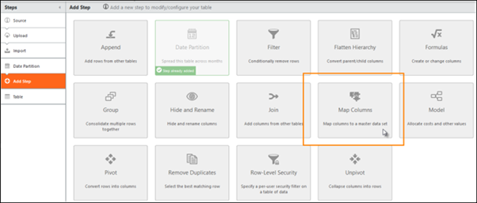
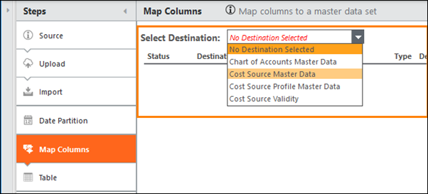
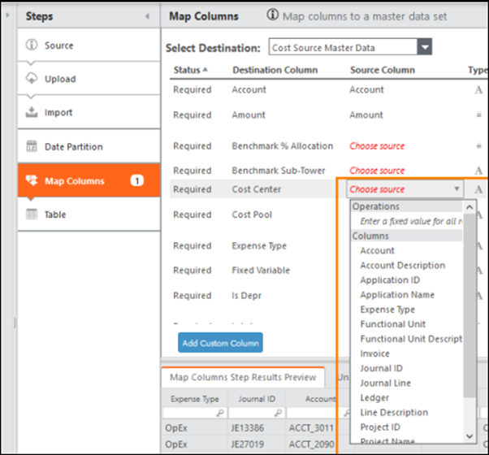
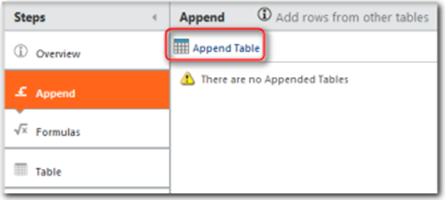
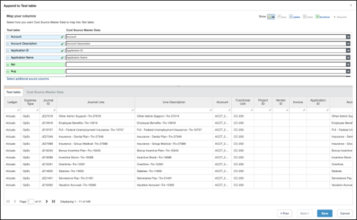

# Map Data to Master Data

After you have uploaded a source data table and transformed it if necessary, you can map
it to a master data table. Use the following instructions to map data to a master data
table.

There are two methods available to map data to master datasets:

- Map Columns (Preffered)
- Append Tables

**Map Columns**

The primary (and preferred) method to map data is to use Map Columns.The Map Columns
feature is intended to transform your source data set.

If the data is reused for multiple master data sets, create a new table using Source of
Existing Table for each master data set, then add Map Columns.

**Add the Map Columns pipeline step and choose a destination**

1. Create or check out a table and add data into the table. Also, you can apply
   transformative pipeline steps, such as Date Partition.
2. Hover over the pipeline steps, then click **+** to add a new pipeline step. **Map
   Columns** becomes available unless there is a Model step added.

   

   Note: If the table was
   reverted and the data upload was not, the step will not be available until you add any
   other step and then add Map Columns.
3. Click **Map Columns**, then select a destination. If you don't see the master data
   set you were expecting, go to **Components** and install the necessary
   component.

   

## Map to a master data set column

1. Review the Destination Columns. These are the columns in the master data sets that can
   be mapped to. Some may already be mapped because a column header in your table matches an
   expected value in the destination.
2. Select **Choose source** in the Source Column, or to change a mapping, select one of
   the other values in that column.

   
3. Choose one of the column names in the drop-down list. This list shows all columns in the
   table with a matching column type to the destination.

   Note: The following preview table
   will not be updated until the change is saved.

   Tip: If you don't see
   the columns you want in the drop-down list, then they might not be of the right matching
   type for the destination. Go to the Import step and change the Type Override option as
   necessary. If the expected column was created in the transform pipeline, use or change
   the Formulas step.
4. To enter a string or number for all rows, choose **Enter a fixed value for all
   rows**. As a result, every row in the table shows the same value for that column. This
   option does not evaluate formulas. To use a formula, add the **Formulas** step, then
   map the resulting additional column.
5. Enter the value, then click **OK**.You have now mapped two additional columns to the
   master data set by choosing a column from your table and by entering a value.

**Add a custom column to the master data set**

1. To add a column that does not exist in the master data set, click **Add Custom
   Column**. These additions will be maintained between upgrades without any special
   actions.
2. Enter the name of the column you want to add, then choose the type. Select a source for
   that column, either by choosing another column in the table or a fixed value.
3. Click **OK**. Added columns are always optional. Save the table to see the column in
   the preview.

**Append Data**

This method is less preferred because it customizes the master data set, which increases
the time of upgrades to receive new content.

1. In the **Project Explorer**, click the master data table you want.
2. Check out the table.
3. In the transform pipeline, click the **Append** step.
4. Click **Append Table** in the details area.

   
5. Select a source data table, then click **Next.**
6. Map the source columns to the master data set columns using the following **Append to
   ...** Master Data image.

   Note: An asterisk (\*) in the Master Data column indicates that
   the field is required to fully populate the reports that are related to that data set.
   Partial mapping is allowed. If you do not have all of the required data, you can map a
   subset of the required fields, though doing this might result in data missing from one
   or more reports.

   
7. Click Save.
