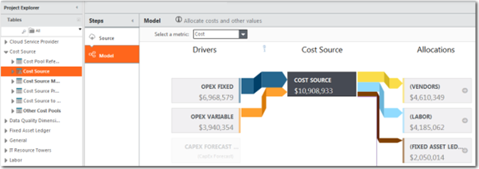

# Validate Model Allocations

Use the model table view to validate the flow of value in a model. After you have uploaded
and mapped the source data to the appropriate master data table, its associated modeled
tables should begin to show both unit drivers and allocations.

A Costing Standard modeled table is a table to which a Model step has been added. The
modeled table is a transform of a master data table. For example, the Cost Source table is a
transform of the Cost Source Master Data table. Additional transform pipeline steps cannot
be added to Costing Standard modeled tables. The only transform steps displayed for modeled
tables are **Source** and **Model**.

**Driver-allocation diagram**

If you click a model table in **Project Explorer**, and then click the Model step in the
transform pipeline, a driver-allocation diagram is displayed as shown below. Use the diagram
to check the flow of value to and from the table.

The diagram shows the flow of value for the model metric selected in the **Select a
metric** field above the diagram. In Figure A above, the metric is Cost. You can select
any of the model metrics defined for the project.

**Make changes**

You can make changes to the allocations in the Costing Standard model. You can modify the
existing allocations and add new allocations. Before making changes to a model, you should
thoroughly understand how to create and modify models.

For information on how to work with models, see [About Model Studio](https://www.ibm.com/docs/en/apptio-commercial/tbm-studio/saas?topic=metrics-about-model-studio "(Opens in a new tab or window)")
