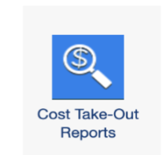

# Cost Take-Out Reports Configuration Guide

## Overview

It is important to understand the purpose and objectives of Cost Take-Out Reports before knowing
about the technical configuration.

Personas: Business Unit Leaders, Vendor Managers, Procurement Managers, Solution Leaders,
Application Owners, Service Owners.

For: Organization leaders who want to identify opportunities to reduce and optimize costs across
labor, vendor, and application spend.

Value: IT and Finance teams struggle to pinpoint high-impact cost reduction opportunities due to
fragmented data and a lack of targeted, cost reduction reports in IBM Apptio. They need clear
visibility into the specific areas of cost drivers to optimize their labor, vendor, and application
spend.

Solution: Cost Take-Out Reports

Product: Apptio Costing Standard

## Use Cases

Out-of-the-box reports designed to help IBM Apptio users to

- Identify opportunities to reduce and optimize costs across labor, vendor, and application spend
  - Support strategic workforce planning and hiring decisions
  - Optimize your vendor portfolio
  - Streamline and rationalize your application portfolio
- Enable fast, data-driven and defensible decisions for organizations.

## Prerequisites

The prerequisites for the Cost Take-Out Reports solution are:

- IBM Apptio Costing Standard license.
- IBM Apptio Server Version: R12.11.17 (or higher).
- Components Version v120 in Project Settings
  - Refer [this guide](install-apptio-ibm-costing-old-template.html)
    to install v120 components on projects with older component versions.

## Component Install

The core of the Cost-Take Out Reports solution is introduced via the Cost Take-Out Reports
component. For new customers, the typical components, such as Cost Source, Labor, Vendor, Fixed
Assets, Applications etc. would also need to be installed, in accordance with the overall intended
architecture. Existing customers can re-use the previously installed components without any changes.

These changes need to be done in TBM Studio

1. Go to the Components icon under Project tab and install the Cost Take-Out Reports
   component.

   

   For the Cost Take-Out Reports to light up, some of these components may need to be
   pre-installed and configured
   - CTF-Cost Source
   - CTF-Labor
   - CTF-Vendor
   - CT Apps- Application
   - CTF –IT Towers
   - CT Apps – Storage
   - CT Apps- Server
   - Vendor Insights Contracts
2. Verify and check in the changes. The three reports will be available in their respective
   collections:
   - Labor Cost Take-Out Report: available in the Labor collection
   - Vendor Cost Take-Out Report: available in the Vendor collection
   - Application Cost Take-Out Report: available in the Application collection
