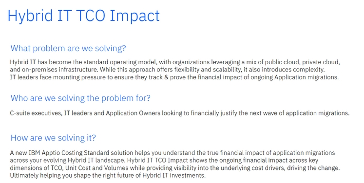
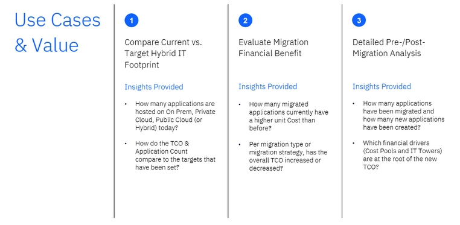
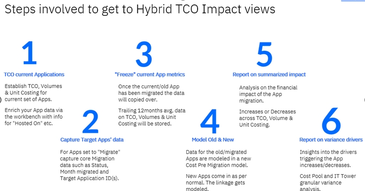
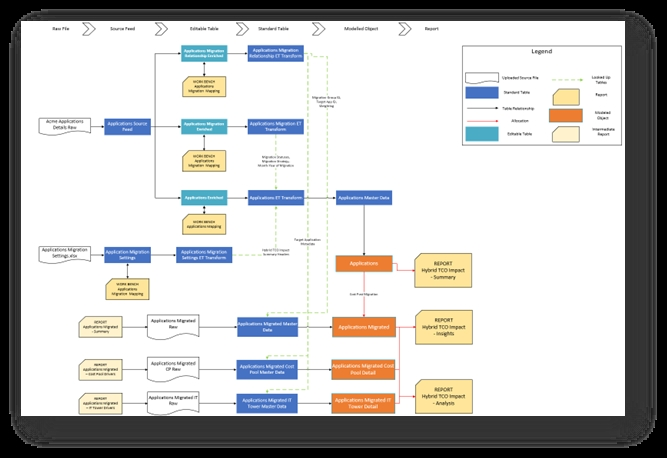
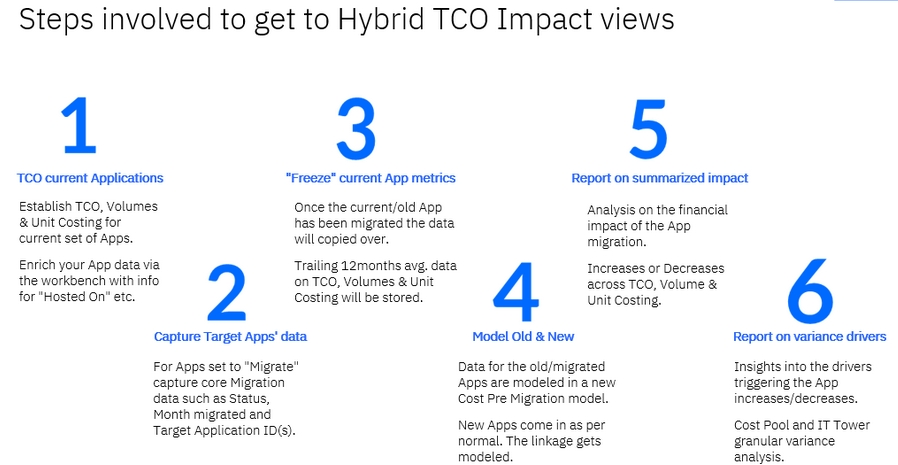
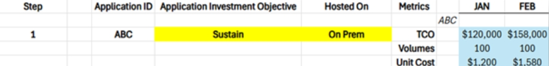
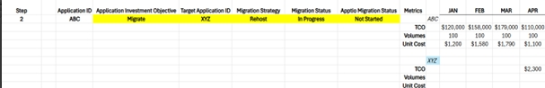
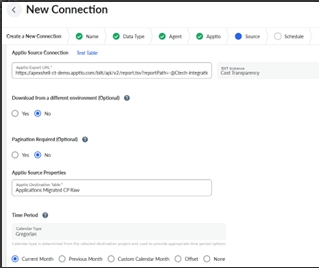
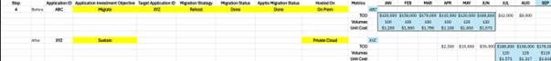

# Hybrid IT TCO Impact Solution

## Overview

Prior to setting up the Hybrid IT TCO Impact solution, let us make sure we know why we are doing
this and understand the reasons and goals that led us to this point. This will ensure the setup
process is clear and focused, making it easier for you to understand and use the solution
effectively.

The following specific problems can be solved by this solution.

The following screen gives a high-level overview of the configuration steps. The detailed
configuration requirements for each step, are described later in the document.

## Component Install

The first step is to install the three new components that have been created for Hybrid IT TCO
Impact solution.

Note: Ensure the Components Version in Project Settings has been set to Version 120. Once installed,
you can switch the Component Version back to the desired/(previous) template.

**Applications Workbench component**

The first component to install is the*Applications Workbench*component.

This component does not have the Hybrid IT TCO Impact reference in the name but is essential to
the Hybrid IT TCO Impact reporting by allowing users to add in essential Application metadata. The
most important (new) field in this Workbench is the column of “**Hosted On**”.
This must be filled for all Applications with the value of either:*On Prem, Private Cloud or
Public Cloud* . In addition to this new field, it allows users to enrich their existing
Applications metadata. Another important field for this solution is “**Application
Investment Objective** ”. Ensure that the value is set to “Migrate” for the applications
subject to migration.

**Hybrid IT TCO Impact component**

The second component is the*Hybrid IT TCO Impact*component.

This creates the framework and hence installs all the necessary tables (both editable and
normal), metrics and models associated with the Hybrid IT TCO Impact solution. It introduces the
application migration workbench.

Note: It also deploys three reports. These are not intended for end-users but rather to facilitate
the step where the average TCO, Unit Cost and Usage Volumes of the current set of applications is
captured and “frozen” as a snapshot in time (as per Step 3 in the above process). For more details
on the content of this component, refer to the description when navigating to the component.

**Hybrid IT TCO Impact Reporting component**

The third and final component is the*Hybrid IT TCO Impact Reporting*component.

This installs three end user reports. It goes from a high-level “level 100” type of report aimed
for C-suite executives down to “level 300” where individual applications can be analyzed for
financial benefits / drawbacks.

For more details on the content of this component, refer to the description when navigating to
the component.

## Architecture

**IBM Apptio Framework**

The above diagram gives an overview of the IBM Apptio Framework as it relates to the architecture
underpinning the Hybrid IT TCO Impact solution. One can see the various flows from Raw Source all
the way to the end user reports. Main items to call out are as follows:

1. Introduction of Application Workbench and Application Migration Workbench: Set of editable
   tables allowing for some much-needed editing on both existing data as well as some new columns. The
   Application Mapping one requires the (manual) unappend from the Application Master data to allow for
   the Editable Transform (ET Transform) to become the new (edited) feed into the Application Master
   data.
2. Minimal changes to Applications Master Data: Apart from swapping out of the feed, this
   architecture is intended to minimize any direct impact on the Applications Master Data. Some new
   columns (e.g.: Hosted On, Migration Strategy etc.) are introduced, indirectly, via the Mapped
   Columns step of Applications ET Transform into Application Master data.
3. Non-End-User reports critical to “freezing” migrated data: As shown in the architecture, there
   are three reports on the left hand (starting position) side; as opposed to on the right hand (final
   position) side. This is intentional, since these capture the migration data and are created in such
   a way that that data needs to be brought back into Apptio, into tables to ultimately facilitate the
   Before vs. After comparison.
4. After the migration of applications, the key new table acts as the primary source for most
   configuration, models, and reports.

**IBM Apptio Model Allocations**

The IBM Apptio framework gives an overview of the new Tables, Master datasets etc. that get
introduced, whereas the above diagram focuses on the new Model metrics and allocations.

- **Cost Post Migration**: Modelled metric that is created as a “parallel”
  modelled metric to the main Cost model, in order to:
  - Not “disturb” the existing Cost Model
  - Allow for a linkage to be made between the Applications object (containing the new, Target
    application data) and the Applications Migrated object (containing the old, migrated application
    data)
  - Allows for any extra drivers to be set (related to migration costs specifically) on an as-need
    basis by the customer (who wishes to further expand this modelled metric)

    Note: If you’re an
    existing customer you will have to (manually) ensure this modelled metric has all the necessary
    allocation lines tagged, as per your existing Cost Model:
  - From Cost Source to IT Resource Towers
  - From IT Resource Towers to Applications
  - From Applications to Applications Migrated
    - Weight By: Target Weighting
    - Data Relationship: Application ID = Target application ID
- **App Count Post Migration**: Modelled metric that is needed to capture the
  Application Count of the new, target applications. This is needed to ensure that the calculation of
  the Trailing 12months Average takes into account the months that the applications is “in existence”.
  I.e. in certain instances, the application might only exist for e.g. 8 months. If that’s the case,
  we need to make sure the Costs get divided by 8 and not a “hardcoded” count of 12.

The Count of the old/migrated applications already gets picked up when the “intermediate”
reports are being created. This modelled metric gets leveraged further on into some of the other
calculated metrics and reports to ensure the new, target application count is correctly represented.

Note: If you’re an existing customer you will have to (manually) ensure this modelled metric has
all the necessary allocation lines in place, as per the above diagram, this means:

- Create a “fake” driver set to 1 into Cost Source
- Create an allocation from Cost Source into IT Towers.
  - No Weight By or Data Relationship needed
- Create an allocation from IT Towers into Applications Migrated
  - Using the “Standard Value” method
  - Value set to Target Application Count column
- **Cost Pre Migration**: Modelled metric exposing the main value of the
  “Trailing 12months” Avg Monthly TCO taken from the “frozen” data for the migrated applications.

This model is pre-created, i.e. no manual setup required.

## Configurations

This section describes all the configuration activities associated with lighting up the Hybrid IT
TCO Impact reports.

Steps 1-4 require some configuration (highlighted
inyellow)
whereas steps 5-6 are the end result, focused on the benefits & insights the reports
deliver.

1. **Step 1: TCO current applications**
   - In order to light up the 3 (end user facing) Hybrid IT TCO Impact reports, step 1 is to ensure
     the total cost of ownership (TCO), usage volumes and Unit Costs are in place and being calculated
     for the current set of applications. Using the normal, best practice ATUM allocations &
     model.
   - Even before any applications would be targeted for migration, leverage the new Applications
     Workbench to make sure values are
     entered for at least:

   Hosted On: On Prem, Private Cloud or Public Cloud

   Application Investment Objective:
   Sustain, Retire, Migrate, Invest

   Both to be set directly at the application level.

   Note:
   To start using the Applications workbench functionality, one will have
   tomanually unappend the
   Raw/Source Application data from the Applications Master Data and re-append it into the Applications
   Source feed table. As highlighted by the above architecture view, this step
   unlocks the Application data to become available for editing.

   Sample:

   

   *The above sample shows the current Application ABC, living it’s “normal life” with TCO, Volumes
   and Unit Cost established as the foundational starting point*.
2. **Step 2: Capture Target Apps’ data**

   Once the current application is set to Migrate, it’s essential to
   start capturing application
   migration related metadata, as it becomes available. This is where the new
   Application Migration Workbench comes into play, with 3 areas of information setting. Note: The
   below tables are only exposing applications that have the Application Investment Objective set to
   “Migrate”

   **Application Migration**: This editable table contains the
   following fields:
   - *Migration Strategy*(Rehost, Replatform, Repurchase, Refactor)

     Free text field but
     ideally to be set with one of the above values

     Used in the reports as a Pivot and/or Filter
     option.
   - *Migration Status*(Planning, In Progress, Reviewing, Done)

     Indicates mostly the
     operational status of the migration.

     Free text field but ideally to be set with one of the
     above values

     The value “Done” is used to indicate that the application’s data is ready to be
     “frozen” and hence is used as a critical filter on the “intermediate” reports. Note: used in
     conjunction with the Apptio Migration Status field set to “Done”.
   - *Apptio Migration Status* (Planning, In Progress, Reviewing, Done)

     Indicates mostly the
     Apptio allocation status of the migration.

     Free text field but ideally to be set with one of
     the above values

     The value “Done” is used to indicate that the application’s data is ready to
     be “frozen” and hence is used as a critical filter on the “intermediate” reports. Note: used in
     conjunction with the Migration Status field set to “Done”.
   - *Month Year Migrated*

     Indicates when the application officially got migrated.

     Free
     text field but ideally to be set as e.g.: Oct 2025.

   **Application Migration Relationship**: This editable table contains
   the following fields:
   - *Target Application ID*: Application ID of the new, target application. Expected to be
     onboarded and exist into the Applications Master data (as per normal). Note: Can be more than 1,
     i.e. supports scenarios where 1 current application is getting migrated into 1,2,3, n number of new
     applications.
   - *Target Weighting*: In case of a 1-m scenario, this allows for a weighting to be set and
     associated with the m(any) new applications. If not applicable of left blank, this will be set to
     1.
   - **Application Migration Group ID**: To be created and set manually. In case
     of a 1-m scenario this would allow the user to look at the financial before vs. after comparison
     data through the lens of an aggregated group as opposed to individual applications (where some of
     the financials might not make sense to be viewed at)

   E.g:

   Current/Old Application| New/Target Application |App Migration Group
   ID

   ABC 123 App Group A

   ABC 456 App Group A

   **Application Migration
   Settings**:

   Editable Table allowing the user to set certain settings with respect to
   Target tracking and customizing the HTML text on the reports. The Description column provides the
   necessary details on each of the settings.

   

   *In Step 2 Application ABC has now been flagged to Migrate, the migration process has
   started and is ongoing. Application XYZ has been identified as the Target application ID.*
3. **Step 3: “Freeze” current application metrics**

   At some point the current application will be considered migrated. Apptio will acknowledge this
   when BOTH the Migration status and Apptio Migration status columns have been updated and set to
   “Done”.

   

   *In Step 3 Application ABC has been fully migrated. Hence time to “freeze” and capture the
   12months average data (in blue) with respect to TCO, Volumes and Unit Cost*.

   That is
   considered the trigger point for when the “freezing” of the data of the current application takes
   place. This freeze will happen as follows:The set of the below 3 reports will pick up all
   applications in the Applications Master Data where the Migration status and Apptio Migration status
   columns are equal to Done. These reports will calculate the Trailing Twelve months average for the
   key metrics of Total Cost of Ownership (TCO), Volumes and Unit Cost. The latter 2 metrics will only
   be calculated at the Summary level and therefore don’t apply to the Cost Pool and IT Tower
   reports.

   Note: The formula that calculates the average ensures it checks how long the
   application has been in existence for by checking the application count (since not all applications
   might have been in existence for 12months).

   Where part a happens automatically, this part b
   requires the user to set up an
   Apptio-to-Apptio datalink connector. This connector is necessary to take the
   report output, “freeze” it at that period in time and drop it back into the associated
   table.

   Apptio Datalink Connector: Sample below. For more details, consult Help
   Center.

   

   Associated
   “Receiver” Tables

   Applications Migrated Raw

   Applications Migrated CP
   Raw

   Applications Migrated IT Raw

   Note: This connector is intended to drop in ALL the
   migrated applications as it pertains to a given month. In that sense it will be a cumulative view
   across time. Month 1 might have 10 applications. Month 2 might have 15 applications.
4. **Step 4: Model Old & New**

   Once Step 3 has been completed, all the
   necessary “Before Migration” data is now in place and available across the 3 tables, as per
   above.

   The main dataset of Applications Migrated gets used and automatically exposed to the
   (new) modelled metric of Cost Pre Migration. No action required here, since the Driver for this
   modelled metric is automatically created to use the Avg Monthly TCO column. The 2 other datasets
   don’t get exposed to any modelled metrics, since they’re only being used in the Hybrid IT TCO Impact
   Analysis (level 300) report. They have a modelled step added to them so they can get reported on as
   needed.

   The key configuration activity in this step is related to the (new) modelled metric of
   Cost Post Migration. The component introduces an allocation from Applications to Applications
   Migrated, leveraging the existing Cost model as the Driver. This suffices to light up the Hybrid IT
   TCO Impact Insights (level 200) report. However, in order to light up the Hybrid IT TCO Impact
   Analysis (level 300) report, the model of Cost Post Migration needs to replicate all allocation
   lines from Cost Source up to Applications and into Applications Migrated. Hence,
   it’s required to (manually) Tag
   all these existing Cost allocation lines with the new modelled metric of Cost Post
   Migration , in order for the Cost Pool and IT Tower Analysis breakdowns to work on
   the Hybrid IT TCO Impact Analysis (level 300) report.

   The 3rd and final new modelled metric of
   App Count Post Migration is needed to capture the Application Count of the new, target applications.
   This is needed to ensure that the calculation of the Trailing 12months Average takes into account
   the months that the applications is “in existence”.

   Note: If you an existing customer you will
   have to ensure this modelled
   metric has all the necessary allocation lines in place, as per the above diagram,
   this means:
   - Create a “fake” driver set to 1 into Cost Source
   - Create an allocation from Cost Source into IT Towers.
   - No Weight By or Data Relationship needed
   - Create an allocation from IT Towers into Applications Migrated
   - Using the “Standard Value” method
   - Value set to Target Application Count column

Via the above 3 modelled metrics, the framework is now in place to allow for the Before vs. After
migration results to get calculated and exposed on the reports.

Various calculated metrics are in place to facilitate this, the most notable ones are those
starting with “TTM…” in the name. These are in place to ensure that the TCO, Unit Cost and Volume
data for the application post migration are equally using the Average Trailing Twelve Months (TTM)
methods to ensure it’s an apples-to-apples comparison between the Before vs. After results.

*In Step 4 the new Application XYZ is now ready and hence being compared on an ongoing basis to
the “frozen” data of the migrated Application ABC.*

## Reporting

The Hybrid IT TCO Impact Reporting component installs 3 reports, as part of the Reporting
Collection called “Hybrid IT”. One will see a reference to Level 100, 200, 300 implying that the set
of reports each time exposes more data and goes a step further & deeper.

**Level 100: Hybrid IT TCO Impact - Summary**

Note: This report mainly uses the Applications Master dataset (as per normal) as well as the new
column of “Hosted On” as introduced via the new Applications Workbench component. This column is to
be set across the Applications, at the Applications level. Target setting is to be done using the
new Applications Migrations Workbench.

**Level 200: Hybrid IT TCO Impact - Insights**

Note: This report mainly uses the (new) Applications Migrated dataset. It requires the Before
Migration data to be brought in via the “freezing method” as outlined before.

**Level 300: Hybrid IT TCO Impact - Analysis**

Note: This report mainly uses the (new) Applications Migrated dataset. It requires the Before
Migration data to be brought in via the “freezing method” as outlined before. It also requires the
Cost Pool and IT Tower Details data to be flowing, as described before.

## Call Outs

This final section aims to summarize a set of “call outs” to be mindful of when configuring as
well as operating this solution as part of your monthly IBM Apptio business mgmt processes.

**Comparison Time Horizon**

The method being used for the Before vs. After comparison is the Trailing 12 months method. When
reviewing migrated applications throughout time and comparing them to the new, target applications,
be mindful that after 12 months the old/migrated application will no longer be picked up or at least
no costs will show up anymore for those applications.

In other words, at this point the comparison time horizon (the time period during which you can
do a meaningful comparison between the Before vs. After TCO, volumes and Unit Cost) is somewhat set
at max. 12 months.

**Add other drivers into Cost Post Migration**

Take advantage of the fact that this new modelled metric Cost Post Migration is a “parallel” cost
model.

Add in any other financial drivers you believe should be considered as part of the Cost Post
Migration view if any of them aren’t “naturally” being picked up by the Cost model.
