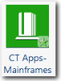

# CT Apps - Mainframes component

he Mainframes component is part of Costing Standard Applications and Services
module. It is used to understand the TCO of the mainframes and to allocate the mainframe costs to
the Applications object.

Applies to: Costing Standard on TBM Studio 12.0 and
later

Component Icon:

## Requirements

You must install the following Costing Standard Foundation application components before you
install the Mainframes component:

- Cost Source
- IT Towers

## Supporting tables

When you install the CT Apps - Mainframes component, a new End User Devices group is created with
six tables:

- Mainframe LPARs (model table)
- Mainframe LPARs Master Data
- Mainframe Storage (model table)
- Mainframe Storage Master Data
- Mainframes (model table)
- Mainframes Master Data

## Master data

For a description of the fields in the master data tables, see the information on the CT Apps -
Mainframes component page in the product. To display the page:

1. Click the **Project** tab in the ribbon.
2. Click **Components**.
3. Click the **CT Apps - Mainframes** component.

## Upload the data

Upload your mainframes data. The required and recommended fields are listed below by master
table.

Mainframe LPARs Master Data

- Application ID (required)
- Application Name (required)
- LPAR (required) (LPAR: logical partition)
- Mainframe (required)
- Object Identifier (required)

Mainframe Storage Master Data

- Application ID (required)
- Application Name (required)
- Object Identifier (required)
- Storage ID (required)

Mainframes Master Data

- Actual Units (required)
- CPU Capacity (recommended)
- Guaranteed MIPS (recommended)
- Location (recommended)

## Map the data

After uploading the mainframe data, map the table to the master data tables.

After you map the data, there should be value allocated as described below.

- Mainframe LPARs - From Mainframes to Mainframe LPARS, and from Mainframe LPARS to
  Applications.
- Mainframe Storage - From IT Resource Towers to Mainframe Storage, and from Mainframe Storage to
  Applications.
- Mainframes - From IT Resource Towers and Data Centers to Mainframes, and from Mainframes to
  Mainframes LPARS.
