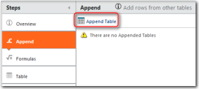
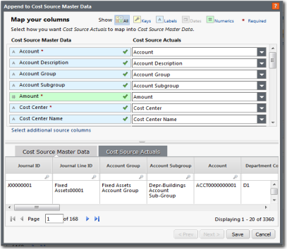

# Map data to a master data table

After you have uploaded a source data table and transformed it if necessary, you can map
it to a master data table. Use the following instructions to map data to a master data
table.

Applies to: Costing Standard on TBM Studio 12.0 and later

## About this task

The primary (and preferred) method to map data is to use Map Columns instead of the instructions
in the information below. The Map Columns feature is intended to transform your source data set. If
the data is reused for multiple master data sets, create a new table using Source of Existing Table
for each master data set, then add Map Columns. For full instructions, see [Map Columns](https://community.apptio.com/docs/DOC-11750 "(Opens in a new tab or window)")
.

The information below explains the less-preferred method for mapping data using the Append step
on the master data set. This method is less preferred because it customizes the master data set,
which increases the time of upgrades to receive new content. For more information, see [Append data](https://community.apptio.com/docs/DOC-4980 "(Opens in a new tab or window)")
.

## Procedure

1. In the **Project Explorer**, click the master data table you want.
2. Check out the table.
3. In the transform pipeline, click the **Append** step.
4. Click **Append Table** in the details area.

   
5. Select a source data table, then click **Next.**
6. Map the source columns to the master data set columns using the following **Append to
   ...** Master Data image.

   

   Note: An asterisk (\*) in the Master
   Data column indicates that the field is required to fully populate the reports that are related to
   that data set. Partial mapping is allowed. If you do not have all of the required data, you can map
   a subset of the required fields, though doing this might result in data missing from one or more
   reports.
7. Click Save.
