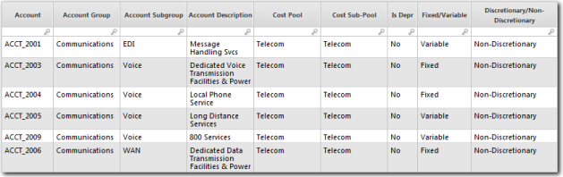

# Populate the Cost Source Master Data table

The Cost Source Master Data table defines the data required for the cost and budget
related reports. To populate the table, you must upload cost figures as well as budget figures. To
populate the Cost Source Master Data table, upload two data sets: Cost Actuals and Cost Budget. Map
the data sets to the Cost Source Master Data table.

Applies to: Costing Standard on TBM Studio 12.0 and later

## Typical data sources

Cost and budget figures usually are pulled from sources such as the general ledger and chart of
accounts. This data often is provided by applications such as Oracle, SAP, Lawson, and Cognos
Financial Statement Reporting. The data you use will determine the level of detail available and the
columns that you will map to the Cost Source Master Data table.

## Multiple tables

You may have to upload multiple tables. Typical tables are described below.

- General Ledger (GL) — The general ledger is the financial source of truth in most companies. It is a time sensitive accounting record used to keep track of financial transactions. The transactions are categorized into various accounts and often categorized by regional owners or cost centers.
- Chart of Accounts — A chart of accounts provides a complete listing of every account in an accounting system. An account is a unique record for each type of asset, liability, equity, revenue, and expense.
- Organizational Hierarchy— An organizational hierarchy identifies each job, its function and
  where it reports to within the organization
- Budget — The budget is the expected spend by various levels of granularity based on how a
  customer tracks their financials. In the Costing Standard application, the budget is tracked by cost
  center and by account.

You append the tables to the Cost Source Master Data table. The tables must contain fields that
can be mapped to the appropriate fields in the Cost Source Master Data table.

## Master data

For a description of the fields in the master data table, see the information on the CTF - Cost
Source component page in the product. To display the page:

1. Click the Project tab in the Ribbon.
2. Click Components in the Ribbon.
3. Click the CTF - Cost Source component.

## Required and recommended fields

The required and recommended fields needed to light up the standard Costing Standard reports are
listed below.

- Account (required)
- Account Description (recommended)
- Account Group (recommended)
- Account Subgroup (recommended)
- Amount (required)
- Benchmark % Allocation (required)
- Benchmark Sub-Tower (required)
- Cost Center (required)
- Cost Center Name (recommended)
- Cost Center Owner (recommended)
- Cost Pool (required)
- Cost Sub Pool (recommended)
- Expense Type (required)
- Fixed Variable (required)
- Is Depr (required)
- Is Labor (required)
- Journal ID (required)
- Journal Line Description (recommended)
- Jounal Line ID (required)
- Owner (required)
- Project ID (recommended)
- Project Name (recommended)

## Key allocation fields

The Cost Source Master Data table has several key fields that are used to allocate value from the
Cost Source table to the Labor, Fixed Asset Ledger, Vendors, Other Cost Pools, and Projects tables.
The table below shows how the key fields are mapped. The metafields are optional, but if you enter a
value in a metafield in the Cost Source Master data set, you must enter the same value in the target
data set.

| This field in the Cost SourceMaster Data table: | Must match this field: | In this target table: |
| --- | --- | --- |
| Cost Source\_Labor Key | Cost Source\_Labor Key | Labor Master Data |
| Labor Key Metafield | Cost Source Key Metafield |
| Cost Source\_Fixed Asset Key | Cost Source\_Fixed Asset Key | Fixed Asset Master Data |
| Fixed Asset Key Metafield | Cost Source Key Metafield |
| Cost Source\_Vendor Key | Cost Source\_Vendor Key | Vendor Master Data |
| Vendor Key Metafield | Cost Source Key Metafield |
| Cost Source\_Other Cost Pool Key | Cost Source\_Other Cost Pool Key | Cost Source to ITResource Master Data |
| Other Cost Pool Key Metafield | Cost Source Key Metafield |
| Cost Source\_Project Key | Cost Source\_Project Key | Projects Master Data |

## Map the chart of accounts data

There are five fields in the Cost Source Master Data table that must be mapped for the value to
flow correctly from the Cost Source table to the rest of the model. The fields are:

- **Cost Pool** — One of the standard ATUM cost pools.
- **Cost Sub-Pool** — One of the standard ATUM cost sub-pools.
- **Is Depr** — Identifies an entry as a depreciated or non-depreciated.
- **Fixed Variable** — Identifies an entry as fixed or variable.
- **Discretionary/Non-Discretionary** — Identifies and entry as discretionary or non-discretionary.

If the data you bring into the application does not include fields that can be mapped to the
fields above, you will need to create a mapping table to provide the information. Typically, the
mapping table assigns values to each of the accounts in your chart of accounts. An example table is
shown below. Note the last three columns.



Using this table, you can use the Lookup function to determine the values for each account. For
example, you could use the following formula for the Fixed Variable field:

```
=Lookup(Account,Chart of Accounts
        Mapping,Account,{Fixed/Variable})
```

## Related information

- [Send feedback about
  Help Center](productfeedback@apptio.com "(Opens in a new tab or window)")
