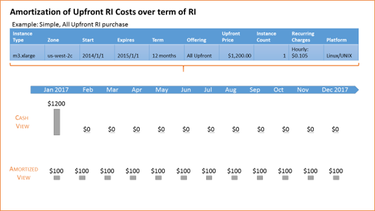
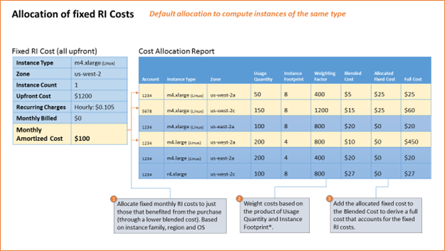
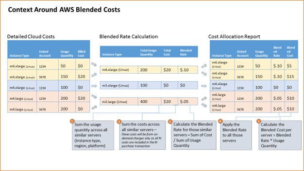

# Reserved Instance Costs - Allocations within Apptio

Reserved Instances (RIs) include pricing options by which all or some of the costs are
paid upfront at the time of purchase. For those options (All Upfront or Partial Upfront), Apptio
will spread the upfront cost evenly each month across the term of the RI purchase. Those effective
monthly cost will be added to any recurring fees associated with the RI (0 in the case of All
Upfront) to form the effective accrued monthly cost.

## Determining an effective monthly costs for RI purchases

It is this effective accrued monthly cost for an RI that will be used when allocating costs to
AWS billing line items for those resources that benefit from RI purchases. The following diagram
illustrates how a simple, All Upfront RI cost would be spread across all months of the RI.

## Important note on billing data sources: Cost Allocation report versus the Cost and Usage report

Apptio currently leverages AWS’ Cost Allocation report for monthly billing data. AWS has plans to
deprecate the Cost Allocation report and recommends using the Cost and Usage report. As a result,
Apptio is currently developing integration with the Cost and Usage report. For the time being,
however, the Cost Allocation report is the primary source for monthly billing and the allocations
described below are based on the Blended Rates included in the Cost Allocation report.

## How do RI fixed costs get allocated to AWS billing line items?

Reserved Instance costs are not reflected in the billing line items for the AWS resources that
benefit from those RI purchases. To address that issue, Apptio allocates the fixed costs (after
amortizing those costs across all months of the RI term as shown above) to each line item in the
bill. Apptio’s approach is to spread items based on instance family/type, OS, and
region/availability zone and weight by the usage quantity of each applicable line item. The diagram
below illustrates how costs will be spread from the purchase to a monthly bill.

## Important Note on Blended Costs in the Cost Allocation Report

AWS’ calculation of costs in the Cost Allocation Report is an important factor to consider in the
context of allocating fixed RI costs back into the usage line items. The following diagram
illustrates conceptually how AWS determines blended costs, particularly when RIs are involved. The
key takeaway is that costs in the Cost Allocation report are based off a Blended Rate which is
effectively the aggregate cost divided by the aggregate usage quantity for a cohort of instances
regardless of associated account and tags.

## How do new, flexible RIs change RI fixed cost allocations?

With new regional and instance size flexible EC2 RIs, cost allocations will rely on instance
family and region instead of instance type and availability zone. Monthly RI costs will be weighted
by the usage line item usage quantity multiplied by a normalization factor which takes into account
the instance’s relative size. This change is only applicable to EC2 RIs, not RIs for other AWS
services such as RDS or Elasticache.

## How do RI modifications affect my RI cost allocations?

While RI modifications are becoming rarer as a result of the newer RI flexibility introduced by
AWS, your organization may still have Reserved Instances that have been modified and it will be
necessary to bring RI modification data into Apptio. Why is this step necessary? When a modification
occurs, AWS creates a new RI purchase entry for the new RIs that are created as a result of the
modification and updates the end date of the original RI purchase entry such that it expires on the
date of the modification. AWS does not update the upfront cost on the original RI purchase entry nor
does AWS include a prorated amount in the upfront cost of the new RI purchase entry (or entries if
the modification create multiple RIs). So, where RIs have been modified, the new RIs will look
artificially cheaper than the original as none of the upfront costs are applied. The following steps
will help address the situation by ingesting and configuring the RI modifications within your Apptio
environment.

## Related information

- [Send feedback about
  Help Center](productfeedback@apptio.com "(Opens in a new tab or window)")
