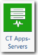
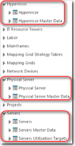
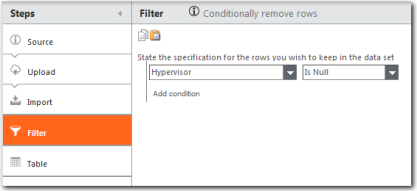
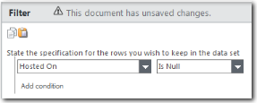
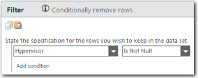

# CT Apps - Servers component

The Servers component is a foundational prerequisite component that is used by
the Servers Insights component. The Servers component does not provide new reports but is used to
create metrics that are exposed in the Server Insights component.

Applies to: Costing Standard on TBM Studio 12.0 and
later

Component Icon:

## Supporting tables

When you install the CT Apps - Servers component, three new groups of tables are created as shown
inn the following image.

Each group contains a minimum of two tables: a master data table and a model table. The model
tables are: Hypervisor, Physical Server, and Servers.

## Relationship between the Servers, Hypervisor, and Physical Server tables

The Servers table lists all of the physical and virtual servers. It does not include the
hypervisor servers. The hypervisor servers are allocated to the virtual servers in one of two ways
based on the data:

- If a virtual server CAN be associated with the server on which it is hosted, list the server in
  the Hypervisor table.
- If a virtual server CANNOT be associated with the server on which it is hosted, spread the
  hypervisor costs across the virtual servers weighted by virtual server size.

The Physical Servers table lists only the physical servers.

- The Hypervisors table lists the physical servers that host virtual servers. Often you can
  identify these servers because the server data will show these server ID’s in a HOSTED ON column.
  This means there are servers hosted on the physical server. In addition, some Server data displays a
  Hypervisor column with a “yes” or “no”. Finally, one additional way to identify these servers is
  based on the software associated with these servers – VMWare ESX is commonly associated with
  Hypervisors.

## Master data

For a description of the fields in the three master data tables, see the information on the CT
Apps Servers component page in the product. To display the page:

1. Click the **Project** tab in the ribbon.
2. Click **Components**.
3. Click the **CT Apps - Servers** component.

## Transform the server data

Typically, you will upload one file that contains the data for the three master data tables:
Servers Master Data, Physical Server Master Data, Hypervisor Master Data. You will create a copy of
the file and modify it to include the data needed by each of the master data tables.

To accommodate the three master data sets, create three new tables from the original server data
table:

1. Click New > Table in the Ribbon.
2. Give the table a name that is easily associated with the master data table.
3. For the source, click Existing Table and select the original server data table.
4. Repeat for the other two tables.

## Servers data table

When you map the servers data to the Servers Master Data table, it should include all physical
and virtual servers, but not hypervisor servers. You must filter the servers data to exclude the
hypervisor servers.

1. Open the servers data table you created.
2. Add a **Filter** step to the transform pipeline similar to the following filter
   example.

   

## Physical servers data

When you map the servers data to the Physical Servers Master Data table, it should include all
physical servers and hypervisors, but not virtual servers. You must filter the servers data to
exclude the virtual servers using a filter similar to the filter shown below.

**NOTICE**

When you map the data to the Physical Servers Master Data table, you must include the text
"Asset\_Resource - Compute" at the beginning of the ITRT\_Server Key field. For example:

="Asset\_Resource - Compute"&&OSCategory

## Hypervisor data

When you map the servers data to the Hypervisor Master Data table, it should include only
hypervisors, but not physical or virtual servers. You must filter the servers data to exclude the
physical and virtual servers using a filter similar to the filter shown below.

## Map the data

After you have created the three data tables, map them to their respective Master Data
tables.

## Related information

- [Send feedback about
  Help Center](productfeedback@apptio.com "(Opens in a new tab or window)")
