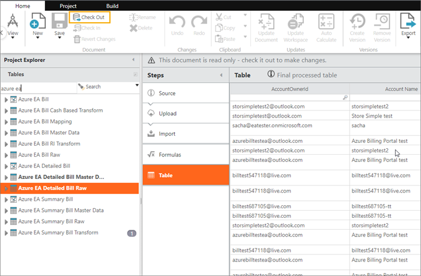

# Tag values in Azure to Apptio Schema

This article will help you tag values in Azure to the Apptio schema. While this article
explains how to parse values in the Tag column of Azure's bill so that it can provide relevant
tagging information in Apptio, note that other columns within Azure, including Account,
Subscription, Cost Center, and Department, can be mapped directly into Apptio. This article is
intended to provide guidance into how you can map any columns or tags into Apptio from
Azure.

Applies to: Apptio Costing Standard on TBM Studio 12.3.3 and later

## Parse tag values in Azure

Resource tags are available in the Azure detailed billing file available in your EA portal and
ingestible into Apptio via Datalink (Classic). These tags are encoded as a JSON-formatted string
within the Tags column on the bill. Parsing the tag values into usable attributes requires some
additional configuration in Apptio. This document will guide you through the steps necessary to
parse desired tag values out of the JSON-formatted string and into new columns in the Apptio data
set.

Example:

{ "Dept": "Engineering", "Function": "Product Development", "Environment": "Development",
"CostCenter": "4739"}

The steps described below will work for a single tag and should be repeated for each tag you wish
to parse out of the Tags column.

Note: **Definitions used in the steps below** - Every tag is comprised of a common structure
called a key-value pair. With respect to tags, think of the key in the key-value pair as the column
name and the value as the data stored in that column. In the example included in the steps below, we
will be parsing out the values for an Environment tag, where the key equals Environment and the
value is the data associated with the Environment key.

## Summary of tasks

1. Open TBM Studio in Apptio and check out Azure EA Detailed Bill Raw.

   
2. In Steps, add a Formulas step.
3. Create a new column called "Environment".
4. Set Environment =IF(FIND("Environment", Tags)>0, split((RIGHT(Tags,LEN(Tags)-FIND("Environment", Tags)-(LEN("Environment")+2))),1,""""), "")
5. To implement this for other tags into your Apptio environment, copy the formula in Step 2, above, and copy/replace “Environment” with whatever tag key value you want to parse out of the Tags column.
6. Save and check in changes once all edits are completed on your workspace.

Note:

- The basic operation here is to find the word "Environment" and then, from two characters after
  its end, grabbing everything in the tags column up to the next **“** symbol. Note that Apptio is
  case sensitive, and therefore both the value and case need to match.
- Apptio recommends one column per tag. Avoid performing this operation in multiple columns
  because it is harder to clean up and optimize your configuration in the future, and can have a
  negative performance impact.

## Map Azure tags to the Apptio schema

Once the Azure tags are parsed in the Azure EA Detailed Bill Raw table, these columns can now be
used to map into the Apptio Schema by mapping this into the Azure EA Detailed Bill Master Data set.
Please note that you can follow the below steps to also map other Azure columns (Account,
Subscription, Cost Center, Department, etc.).

To map Azure tags to the Apptio Schema:

1. Navigate to Azure EA Detailed Bill Master Data and check it out.
2. In Steps, select Append > Edit.
3. Map the columns that were parsed from that Tag column in the previous section, and any other
   columns you would like to map. Below are some example columns that can be mapped:
   - Application
   - Cost Center
   - Environment
   - Project
   - Purpose
   - System Owner
4. Save the mappings.
5. Save Azure EA Detailed Bill Master Data and check it in.

This will populate the data in the master data set as configured.

## Related information

- [Send feedback about
  Help Center](productfeedback@apptio.com "(Opens in a new tab or window)")
