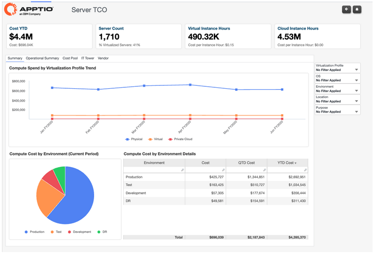
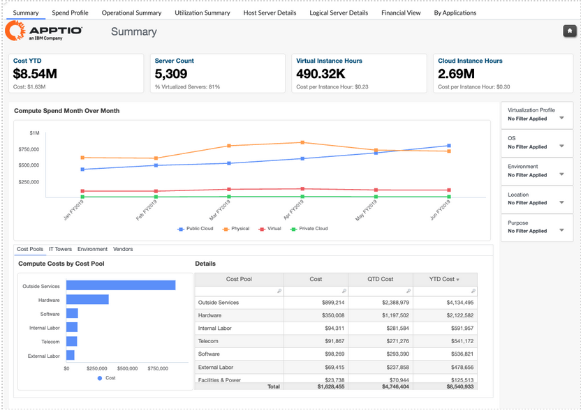
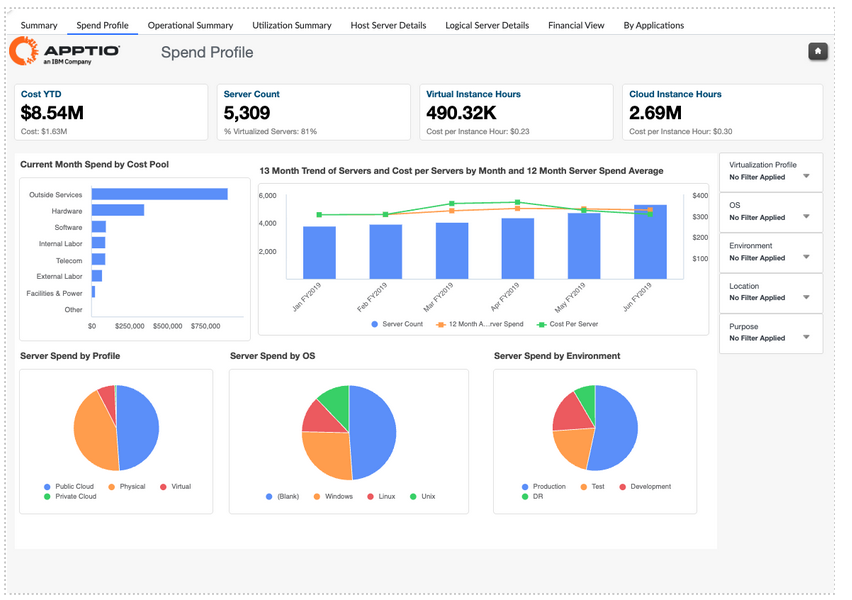
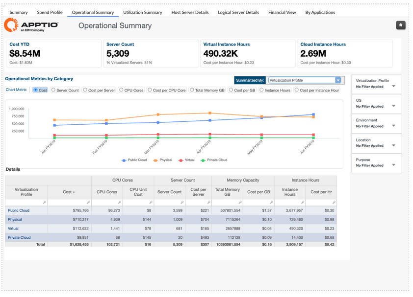
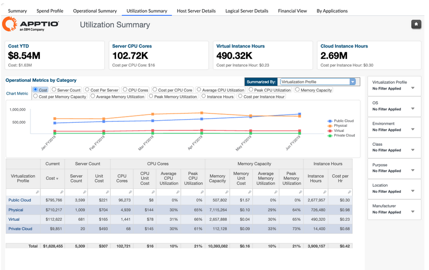
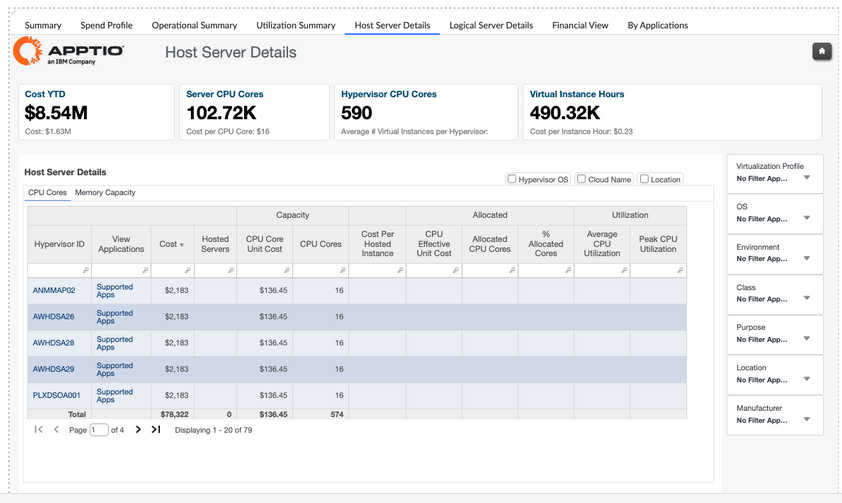
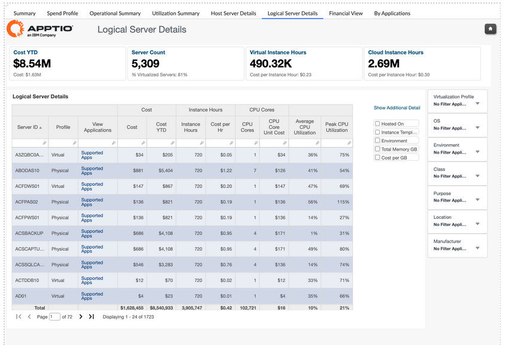
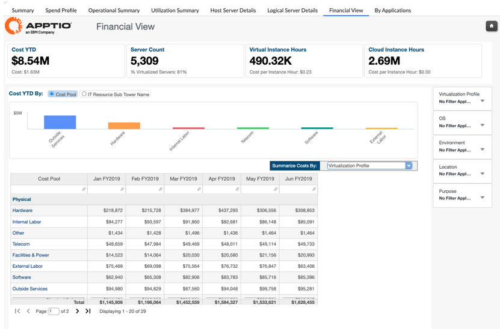
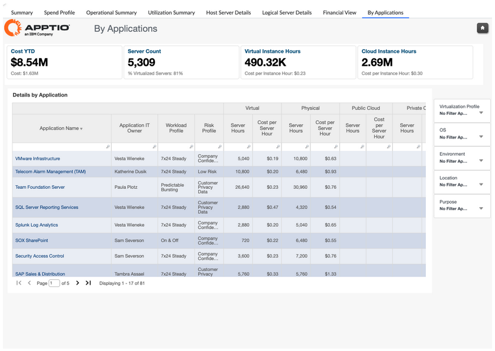

# Compute Reports

## Reports - Compute Cost Overview

**Infrastructure & Cloud Summary**

The Infrastructure & Cloud Summary report serves as a centralized entry point to
understand infrastructure spending across servers, storage, and public cloud. It provides
a consolidated, high-level view of year-to-date OpEx, usage, and unit cost trends,
enabling stakeholders to quickly assess cost distribution, identify anomalies, and
navigate into detailed infrastructure-specific reports for deeper analysis.

This
report is designed for use by the following roles:

- IT Finance
- Infrastructure and Platform Owners
- Service Owners
- IT Operations Leadership

**Insights Provided:**

- Review year-to-date infrastructure costs across physical servers, virtual servers,
  private cloud, and public cloud environments
- Understand cost, usage, and unit cost trends by virtualization profile to assess
  efficiency and infrastructure mix
- Analyze storage spend by type (SAN, NAS, Tape) along with capacity, utilization, and
  cost-per-GB trends
- Gain a consolidated view of public cloud OpEx by service category to understand cloud
  cost drivers
- Identify infrastructure areas that warrant deeper analysis by navigating directly to
  Server TCO, Storage TCO, or Public Cloud TCO reports

For more details on how to use the Infrastructure & Cloud Summary report, go
[here](https://www.ibm.com/docs/en/apptio-commercial/costing-standard/saas?topic=r-summary "(Opens in a new tab or window)")

**Server TCO**

The Server TCO report provides a consolidated view of total compute costs and operational
metrics across on-premises, private cloud, and public cloud server environments. It
analyzes compute spend by virtualization profile, environment, cost pool, and vendor,
while tracking key indicators such as server count, instance hours, and unit costs to
support informed infrastructure and financial decision-making.

This report is
designed for use by the following roles:

IT Finance

Infrastructure Managers

Cloud and Platform Architects

**Insights Provided:**

- Understand total year-to-date and period compute costs across physical, virtual,
  private cloud, and public cloud environments
- Analyze cost distribution by virtualization profile to compare physical versus virtual
  economics and assess virtualization effectiveness
- Review compute spend by environment (Production, Test, Development, DR) to support
  workload prioritization and investment decisions
- Identify key cost drivers across cost pools such as hardware, software, labor,
  facilities, and infrastructure services
- Evaluate vendor-level compute spend to support vendor management, platform
  standardization, and optimization initiatives
- Compare unit cost metrics such as cost per server, cost per instance hour, and cost
  per GB to inform consolidation and cloud migration business cases

For more details on how to use the Server TCO report, go [here.](https://www.ibm.com/docs/en/apptio-commercial/costing-standard/saas?topic=r-summary "(Opens in a new tab or window)")

## Reports - Compute Insights & Optimization

The Compute Insights & Optimization collection within the Infrastructure Insights
endpoint provides a comprehensive view of compute cost, capacity, utilization, and
operational efficiency across hybrid infrastructure environments. It brings together
financial, operational, and utilization-focused reports to help organizations understand how
compute resources are consumed across physical, virtual, and cloud platforms, and how those
consumption patterns translate into cost. This collection supports ongoing optimization by
highlighting inefficiencies, utilization gaps, unit cost drivers, and application-level
compute impacts, enabling informed decisions around consolidation, rightsizing,
virtualization strategy, and cloud migration planning.

**Reports included in this collection:**

• Compute Summary

• Compute Spend Profile

• Compute Operational Summary

• Compute Utilization Summary

• Host Server Details

• Logical Server Details

• Compute Financial View

• Compute by Applications

Note: This collection is available in a separate endpoint: **Infrastructure Insights**

**Compute Summary Report**

The Compute Summary report provides a high-level view of total compute spend across the
enterprise, covering both on-premises and cloud environments. It helps visualize how
compute costs are distributed across key dimensions such as cost pools, environments,
vendors, and IT resource towers, enabling stakeholders to quickly understand overall spend
patterns and trends.

**This report is designed for use by the following roles:**

• IT Finance

• Infrastructure Managers

• Compute and Cloud Teams

• IT Service Owners

**Insights Provided:**

• Understand total year-to-date compute spend and current period costs across
physical, virtual, private cloud, and public cloud infrastructure.

• Track server
inventory and utilization through KPIs such as server count, virtualization rate, instance
hours, and cost per instance hour.

• Analyze month-over-month compute spend trends
to identify growth patterns or anomalies.

• Compare compute costs across cost
pools, IT towers, environments, and vendors to understand where compute costs are being
incurred.

• Assess whether compute spending aligns with infrastructure and
virtualization strategy to support optimization and modernization decisions.

For
more details on how to use the Compute Summary report, go [here.](https://www.ibm.com/docs/en/apptio-commercial/costing-standard/saas?topic=reports-compute-summary "(Opens in a new tab or window)")

**Compute Spend Profile Report**

The Compute Spend Profile report provides a detailed view of how compute costs are
distributed across the server landscape. It focuses on cost structure and trends, helping
you understand where compute spend is concentrated and how server costs are evolving over
time. This report complements the Compute Summary by offering deeper insight into cost
pools, server mix, and long-term spend patterns.

**This report is designed for use
by the following roles:**

• IT Finance

• Infrastructure Managers

• Compute and Cloud Teams

• IT Service Owners

**Insights Provided:**

• Analyze current-month compute spend by cost pool to understand the primary cost
drivers such as hardware, outside services, and software.

• Track 13-month trends
in server count, cost per server, and average annual server spend to identify anomalies or
shifts in infrastructure strategy.

• Understand how compute spend is distributed by
virtualization profile, operating system, and environment to assess balance and
standardization.

• Identify areas where server cost patterns diverge from expected
business or infrastructure strategy, supporting optimization and rationalization efforts.

**For more details on how to use the Compute Spend Profile report, go** [here.](https://www.ibm.com/docs/en/apptio-commercial/costing-standard/saas?topic=r-spend-profile "(Opens in a new tab or window)")

**Compute Operational Summary Report**

The Compute Operational Summary report provides visibility into the operational
characteristics of on-premises compute resources. It focuses on key operational
metrics—such as server costs, CPU cores, memory, and cost per instance hour—broken down by
virtualization profile. This report helps teams understand how operational consumption and
cost behavior are evolving across the compute environment.

**This report is
designed for use by the following roles:**

• IT Finance

• Infrastructure Managers

• Compute and Operations Teams

• IT Service Owners

**Insights Provided:**

• Analyze operational spending across virtualization profiles to understand how
physical and virtual compute resources contribute to overall costs.

• Review key
operational metrics such as CPU cores, memory capacity, instance hours, and associated
unit costs to assess efficiency.

• Identify trends and variances in operational
cost behavior that may indicate inefficiencies or misalignment with infrastructure
strategy.

• Detect anomalies in operational spending to support corrective actions,
optimization initiatives, and informed capacity planning.

For more details on how
to use the Compute Operational Summary report, go [**here.**](https://www.ibm.com/docs/en/apptio-commercial/costing-standard/saas?topic=r-operational-summary-1 "(Opens in a new tab or window)")

**Compute Utilization Summary Report** 

The Compute Utilization Summary
report provides insight into how utilization of on-premises compute resources impacts
overall cost. It combines cost, capacity, and utilization metrics to show how efficiently
physical and virtual compute resources are being consumed across virtualization profiles,
environments, and locations.

**This report is designed for use by the following
roles:**

• IT Finance

• Infrastructure Managers

• Compute and Operations Teams

• IT Service Owners

**Insights Provided:**

• Understand how average and peak CPU and memory utilization influence compute costs
across virtualization profiles.

• Identify underutilized or overutilized compute
resources contributing to inefficiencies or cost pressure.

• Analyze
utilization-driven cost trends to assess whether consumption aligns with compute strategy.

• Detect anomalies in utilization patterns that may indicate configuration issues
or optimization opportunities.

For more details on how to use the Compute
Utilization Summary report, go [here.](https://www.ibm.com/docs/en/apptio-commercial/costing-standard/saas?topic=reports-compute-report-collection-hbm#topic_bmy_qjb_xcc__UtilizationSummaryreport__title__1 "(Opens in a new tab or window)")

**Host Server Details Report** 

The Host Server Details report provides a
detailed view of compute spend and utilization at the physical host level. It focuses on
on-premises host machines, showing cost, capacity, and utilization metrics to support
decisions related to physical infrastructure efficiency and virtualization strategy.

**This report is designed for use by the following roles:**

• IT Finance

• Infrastructure Managers

• Compute and Operations Teams

**Insights Provided:**

• Review year-to-date host server costs alongside CPU cores, memory capacity, and
instance hours.

• Analyze average and peak utilization of CPU cores and memory to
assess physical server efficiency.

• Identify hosts with high cost but low
utilization that may be candidates for consolidation or retirement.

• Understand
how hypervisor capacity and virtual instance density impact overall host economics.

For more details on how to use the Host Server Details report, go [here.](https://www.ibm.com/docs/en/apptio-commercial/costing-standard/saas?topic=reports-compute-report-collection-hbm#topic_bmy_qjb_xcc__HostServerDetailsreport__title__1 "(Opens in a new tab or window)")

**Logical Server Details Report** 

The Logical Server Details report provides
visibility into compute spend, capacity, and utilization at the virtual machine level. It
enables analysis of logical servers across environments, applications, and hosting
platforms to understand how virtual workloads consume compute resources.

**This
report is designed for use by the following roles:**

• IT Finance

• Infrastructure Managers

• Application and Service Owners

**Insights Provided:**

• Analyze compute costs and unit rates for individual virtual machines.

•
Review instance hours, core counts, memory allocation, and utilization to assess workload
efficiency.

• Identify virtual machines with disproportionate cost relative to
utilization.

• Support rightsizing and workload optimization by linking utilization
metrics to cost outcomes.

For more details on how to use the Logical Server Details
report, go [here.](https://www.ibm.com/docs/en/apptio-commercial/costing-standard/saas?topic=reports-compute-report-collection-hbm#topic_bmy_qjb_xcc__LogicalServerDetailsreport__title__1 "(Opens in a new tab or window)")

**Compute Financial View Report** 

**Overview**

The Compute Financial View report presents a financial perspective of compute
spending across classes, environments, locations, operating systems, and virtualization
profiles. It helps users understand how compute costs are distributed across financial
dimensions and how they trend over time.

**This report is designed for use by the
following roles:**

• IT Finance

• Infrastructure Managers

• IT Leadership

**Insights Provided:**

• View year-to-date compute spend by cost pool and IT sub-tower to understand
financial distribution.

• Identify which environments, platforms, or profiles are
driving the highest compute costs.

• Track financial trends to determine whether
compute spending aligns with infrastructure strategy.

• Detect anomalies in compute
spend that may require deeper operational or utilization analysis.

For more details
on how to use the Compute Financial View report, go [here.](https://www.ibm.com/docs/en/apptio-commercial/costing-standard/saas?topic=reports-compute-report-collection-hbm#topic_bmy_qjb_xcc__FinancialViewreport__title__1 "(Opens in a new tab or window)")

**Compute by Applications Report** 

The Compute by Applications report
provides an application-centric view of compute spend across hybrid environments. It
connects server usage and cost metrics to applications, enabling a clearer understanding
of how compute resources support business workloads.

**This report is designed for
use by the following roles:**

• IT Finance

• Application Owners

• Infrastructure Managers

**Insights Provided:**

• Understand compute spend distribution by application, including server hours and
cost per server hour.

• Identify applications with high compute intensity or
unfavorable unit costs.

• Analyze how compute costs vary across workload profiles,
environments, and risk categories.

• Support hybrid application analysis by
understanding how compute spend is split across on-prem and cloud resources.

For
more details on how to use the Compute by Application report, go [here.](https://www.ibm.com/docs/en/apptio-commercial/costing-standard/saas?topic=reports-compute-report-collection-hbm#topic_bmy_qjb_xcc__ByApplicationsreport__title__1 "(Opens in a new tab or window)")

