# Data Centers TCO - Configuration Guide

## Overview

**What problem are we solving?**

The solution addresses the growing complexity and cost pressures associated with modern data
centers, including increasing AI workloads, higher energy demand, and capacity constraints.
Organizations often lack a unified view of cost, consumption, and infrastructure limitations, making
it difficult to plan expansion, consolidation, or migration strategies. Data Center TCO provides a
consistent view of data center costs, capacity, and constraints to support informed long-term
investment decisions.

**Who are we solving the problem for?**

Key personas include IT leadership, IT Finance, data center facility owners, infrastructure
owners, application owners, product owners, and service owners who need visibility into cost and
capacity.

**How are we solving it?**

IBM Apptio Data Center TCO is a collection of pre-built content designed for IBM Apptio Costing
Standard that includes reports, tables, and data model elements to help organizations understand the
total cost, capacity, and operational constraints of their data center footprint. It delivers a
consistent enterprise-wide view of unit economics and infrastructure resources such as power,
cooling, space, and rack density to support better investment and operational decisions.

## Use Cases

1. **Understand your data center cost footprint**
   - **Total cost & unit economics :** Get a consolidated view of spend by site and region,
     with unit costs like $/kW, $/rack, and $/sqft to identify inefficiencies.
   - **Cost driver transparency:** See how costs break down across power, labor, and vendor
     contracts to defend TCO and make smarter pricing and procurement decisions
2. **Identify and optimize capacity utilization & constraints**
   - **Capacity utilization and constraints visibility by site :** Identify utilization,
     constraints, and headroom by site to spot overcapacity and bottlenecks early and plan ahead.
   - **Vendor & contract cost visibility :** Understand how facility and vendor contracts
     drive site-level costs to enable proactive pricing, procurement and contract optimisation.
3. **Improve accountability of data center consumption**

   - **Cost allocation to compute and storage :** Allocate data center costs to servers and
     storage to establish defensible unit economics and support for showback/chargeback.
   - **Infrastructure, Application, Product, and Service cost visibility:** Identify which
     infrastructure, applications, products, and services are driving data center spend to improve
     accountability across business units.

## Prerequisites

The following prerequisites are required for the Data Center TCO solution:

- IBM Apptio Costing Standard
- Server Version: Public Preview - 12.11.21, GA -12.11.22 or later
- Components version v120

## Component Install

Note: Before proceeding verify your project’s Components Version is set to “Version 120”.

Use this guide for more information - [Installing New IBM Apptio Costing Solutions on Older Template Projects](../configuration/config-instnew.html)

- From the Project ribbon, click on the **Project Settings** button.
- Verify or set the Components Version to “Version 120”.

  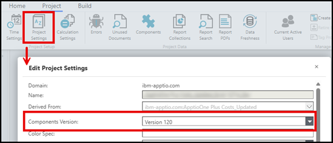
- Click the **Save** button.

The **Data Center TCO solution** is enabled via two components.

- **Data Centers TCO:** This component installs the datasets, editable tables, metrics,
  allocation logic, and core data structures required to analyze data center operations and establish
  defensible unit economics across locations and facilities. This component is required before
  installing either of the reporting components below.
- **Data Centers TCO Reporting**: Installs the Classic reports for Data Center TCO reporting
  and analysis.
- **Data Centers TCO NX Reporting**: Installs the NX reports for Data Center TCO reporting and
  analysis.

Customers can install either the Classic or NX reporting component based on their reporting
experience preference. However, the base Data Centers TCO component must be installed first in all
scenarios.

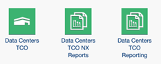

## Data Requirements

The Data Center TCO solution requires three key categories of data to enable cost, capacity, and
allocation insights:

1. **Financial Data (via IT Resource Towers)**

   Financial data such as vendor and labor costs
   are ingested through standard Costing integrations and mapped to IT Resource Towers. The costs must
   be categorized under a sub-tower contained within the IT Resource Towers = Data Center tower to be
   captured at the data center level.
2. **Usage Data (Data Centers Feed table)**

   Operational and capacity data must be provided in
   the Data Centers Feed table to enable reporting and unit economics. Review required data.

   [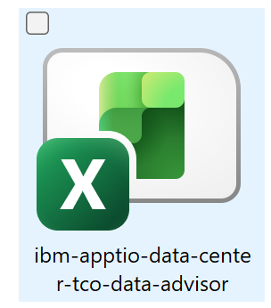](../../resources/data-center-tco-data-advisor.xlsx "(Opens in a new tab or window)")

   This includes required metrics such as:
   - Rack usage and capacity (RU)
   - Power usage and capacity (kW)

   Optional but recommended metrics include:
   - Space (square footage) usage and capacity
   - Cooling usage and capacity

   These metrics are typically sourced from DCIM, BMS, LogicMonitor, or facilities systems
   and critical for calculating utilization, identifying inefficiencies, and enabling driver-based
   allocations.

   Use available Editable tables to enrich the usage data.
3. **Metadata (for allocation and enrichment)**

   Metadata enriches reporting and supports
   allocation logic. Key fields include:

   - Core identifiers: Data Center ID, Name, Region, Tier (required for allocation and
     reporting)
   - Additional attributes: Location, Facility Type (Owned, Leased, Colocation), Cost Center, Service
     Name (also used for Product Name)
   - Operational context: Manager, Purpose, Certification Level, Commissioned status

   This data is typically sourced from CMDB (e.g. ServiceNow) and facilities systems.

   Use
   available Editable tables to enrich the metadata data.

## Allocation Logic

**IT Resource Tower → Data Center Allocation** Costs mapped to the Data Center tower are
allocated to individual data centers using a predefined weighting logic. By default, this uses a
combination of:

- Data Center Square Footage Occupied
- Infrastructure allocation percentage

**Data Center → Infrastructure Allocation** Data center costs are further allocated to
infrastructure components such as Servers, Storage, and Mainframe.

This allocation is typically driven by:

- Location alignment
- Usage-based drivers such as Server Hours, Storage (GB/TB), or Mainframe consumption
  (MIPS/MSUs)

These allocation methods are configurable and can be tailored to reflect the most accurate
consumption model or your business-specific rules.

**REMINDER:** Data Center TCO focuses on facility and operational costs, including:

- Power and energy
- Cooling
- Space (lease, colocation, or owned facilities)
- Maintenance and operations
- Security
- Labor and other facility-related expenses

- It **excludes infrastructure hardware** costs such as servers, storage, and network devices.
  These infrastructure assets are included in subsequent areas of the cost model as illustrated in the
  Architecture section of this document.

## Architecture

Cost model

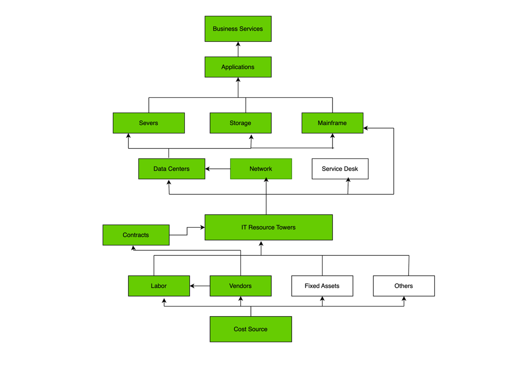

Options for Network Allocation (Advanced Use case)

- **Option 1: Legacy Allocation Strategy**

  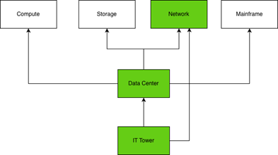

  **Key Considerations:**
  - More accurate when detailed data is available on network devices located within each data center
    and their associated power, space, and cooling consumption.
  - Higher data and configuration requirements, as it requires granular infrastructure data to
    allocate shared Data Center costs to Network.
  - Best suited for mature environments with detailed asset and utilization data.
- **Option 2: Alternative Allocation Strategy**

  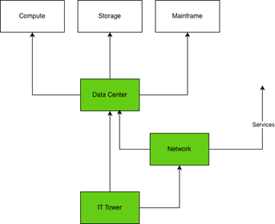

  **Key Considerations:**
  - Simpler to implement, as Network costs can be allocated to Data Centers using a high-level
    driver such as location.
  - Lower data requirements, making it easier to configure when detailed device-level data is not
    available.
  - Provides a practical approximation while maintaining flexibility to treat Network as a separate
    tower.Best suited for mature environments with detailed asset and utilization data.

Note:

To direct allocation flows from Network to Data Centers or Data Centers to Network, ensure you
have the required data and customize the allocation.

**Lineage flow diagram**

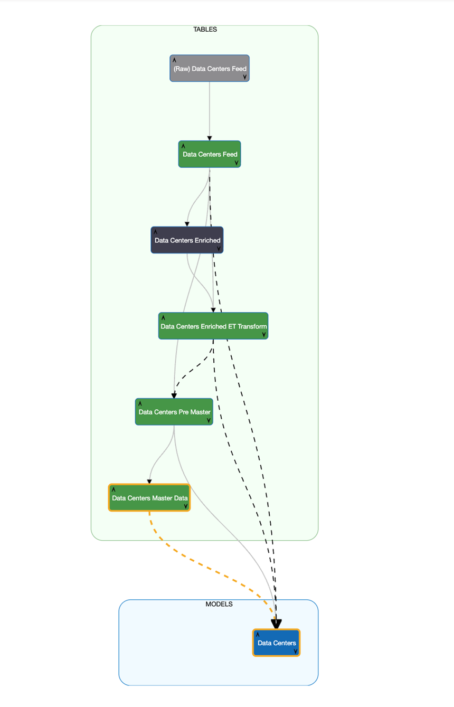

## Configuration

**Datasets** Follow these steps to populate the primary “Data Centers Feed” table:

1. Navigate to **TBM Studio**.
2. Load your raw inbound data center data into a custom intake table. Our suggested name for your
   custom intake table is shown below (where brackets and bracketed text is replaced with values of
   your own choosing): Data Centers from [Source System Name] Raw
3. We recommend against adding Steps to raw intake tables. Ideally, each raw table’s Steps pipeline
   should appear like the screenshot below.

   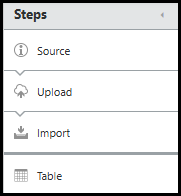
4. After creating a raw intake table, transform the table by right-clicking the Table step and
   selecting **Create New Table from This Step**

   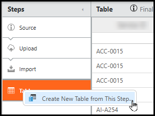
5. Name the new table the same as the raw intake table without the “Raw” suffix.
6. Open the transformed table and add a Map Columns step and positioned as the step before the
   Table step.
7. In the **Select Destination** dropdown, select **Data Centers Feed**.

   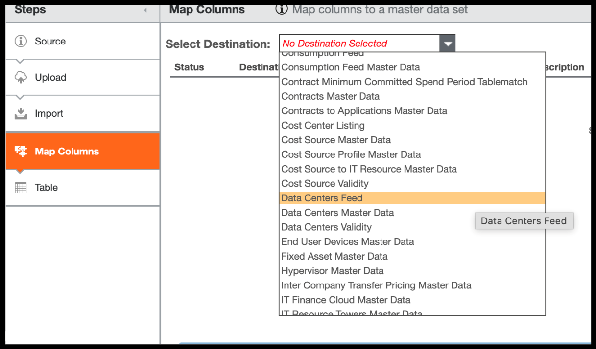
8. Map fields from your transform table’s fields to those in the **Data Centers Feed**
   table.

   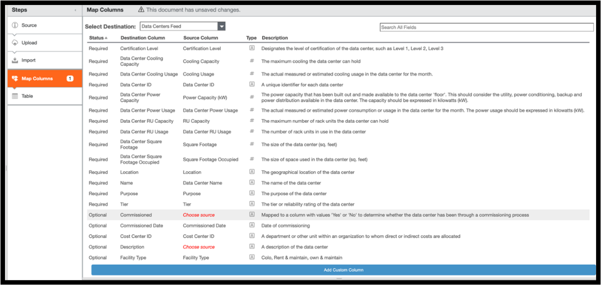
9. **Save** and check-in your changes.

**Editable Tables**  
This Editable Tables section is used for optional data
enrichment. The Data Center TCO solution will function correctly without this step. However, it
allows additional or corrected values to be incorporated, when needed. The applied logic ensures
that values from the Editable Table are only used when the corresponding fields in the primary
dataset are blank, incorrect, or incomplete, meaning existing data is not overridden.

**Data Centers Enrichment report** Use the Data Centers Enrichment report (in the Workbench
report collection) to enhance or enrich your data center data.

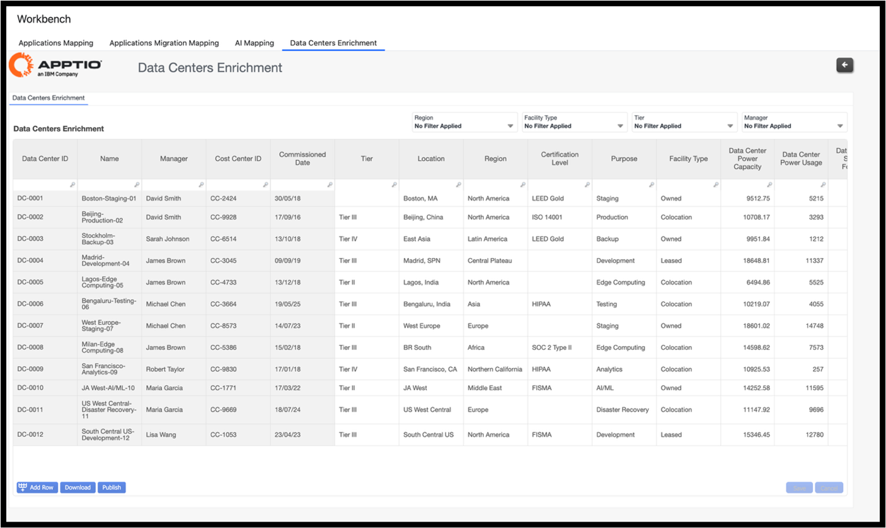

**Data Centers Admin report** Use this report to manage the allocation methods and allocation
weightings for affecting data centers.

In the **Allocation Method** tab: select a method by updating its selection to **Yes** from
the available two methods for allocating Data Centers costs to compute and storage:

- **Assumed Percentage Split**: Select this option to apply a fixed percentage split between
  Compute and Storage across all Data Centers. Use this when granular allocation data is not
  available.
- **Table Upload Method**: Select this option to allocate costs based on detailed data (for
  example, power consumption). This enables allocation at an individual Data Center level.

Click **Save**, then **Publish** to apply the selection.

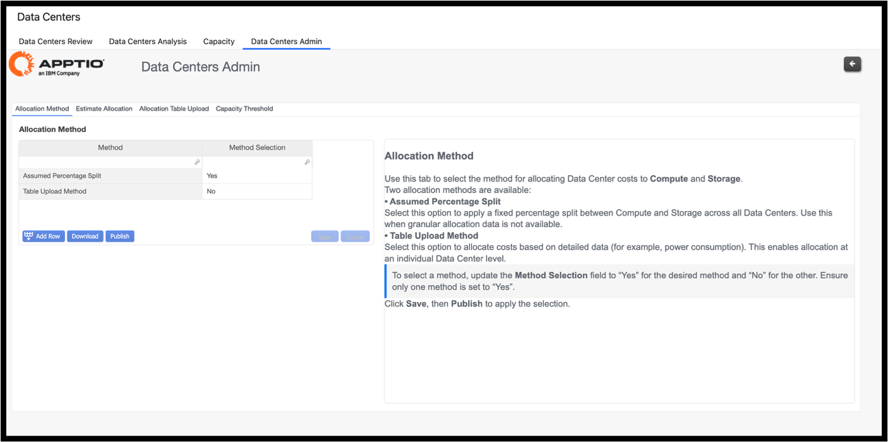

If the **Assumed Percentage Split** is set to **Yes**, go to the **Estimate Allocation**
tab and follow the on-screen instructions to apply updates.

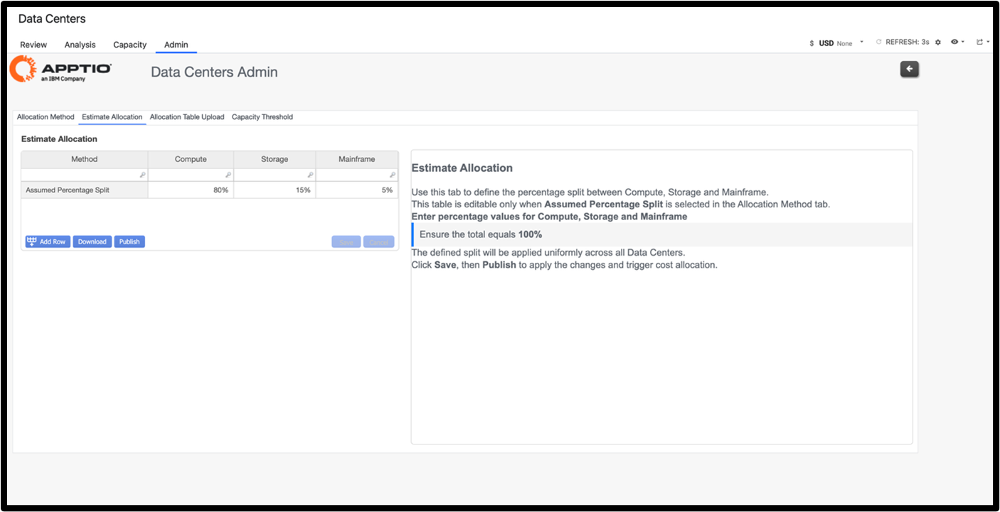

If the **Table Upload Method** is set to **Yes**, go to the **Allocation Table Upload**
tab and follow the on-screen instructions to apply updates.

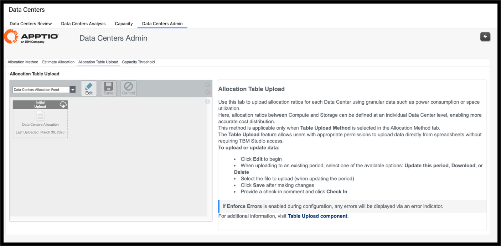

**Capacity Threshold** tab: Use this tab to define Low Utilization Threshold (%) and High
Utilization Threshold (%) values for different capacity types.

- **Low Utilization Threshold (%)** identifies underutilized resources that may indicate excess
  capacity or optimization opportunities.
- **High Utilization Threshold (%)** identifies resources approaching capacity limits and
  potential operational risks.

Each capacity type can have a different threshold based on operational
considerations.  
For example:

- **Square Footage (Sqft):** Helps identify space constraints or consolidation
  opportunities.
- **Rack Units:** Thresholds can be configured based on installed rack capacity and growth
  requirements.
- **Power (kW):** High thresholds indicate power infrastructure nearing limits, while low
  thresholds may indicate excess unused capacity.
- **Cooling (kW):** High thresholds help identify cooling saturation risks, while low
  thresholds may indicate overprovisioned cooling capacity

These thresholds support proactive capacity planning and utilization monitoring across the Data
Center.

The current threshold values are provided as general guidelines and can be updated based on
organizational requirements and operational needs.

Follow the on-screen instructions to update the threshold values.

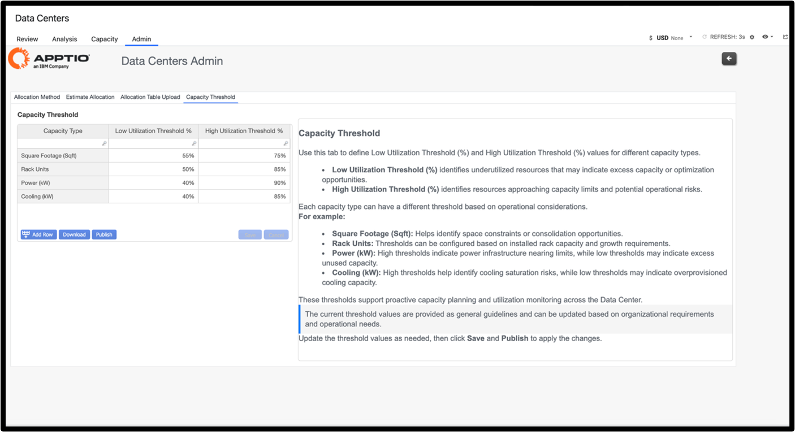

**Allocations** Follow these steps to complete allocation configuration:

1. Open TBM Studio.
2. Go to the **Data Centers** object and check it out.
3. If the “CT Apps- Data Centers” component has been installed, add the **Infrastructure** field
   to the **Data Centers** object’s identifier. If the **Data Centers TCO** component has been
   installed for the first time, continue with the next steps.

   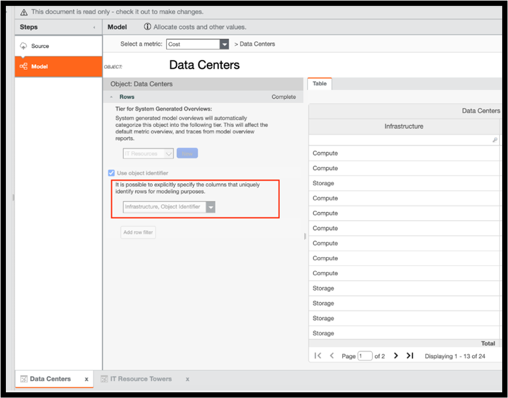
4. Go to the **IT Resource Towers** object and check it out.
5. Set the metric to **Cost**.
6. Open the allocation strategy targeting the Data Centers object.
7. In the Distributing section, set the following options:
   - Enable “Weight By”
   - Select the “Table Column” option and set the column to the “Weighting” column from **Data
     Centers Master Data** table.

   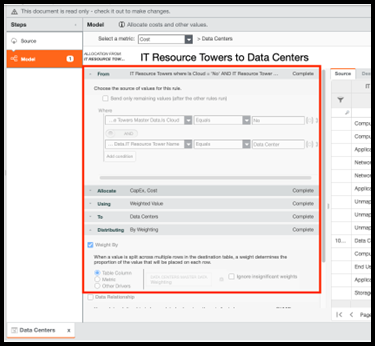
8. Open the Data Centers object.\
9. Open the allocation strategy targeting the **Servers** object and set the following options
   as shown in the screenshot below:
   - In the From section, set its filter where the **Data Centers Master Data.Infrastructure**
     equals “Compute”.
   - In the Distributing section, set the following options:
     - Enable “Weight By”
     - Select the “Table Column” option and set the column to the “Server Hours” column from **Servers
       Master** table.
     - Enable “Data Relationship” and match on the following:
     - Location = LocationClose the allocation strategy targeting the Servers object.

   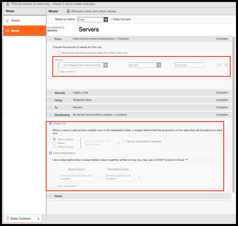
10. With the **Data Centers** object still open continue to the next step.
11. Open the allocation strategy targeting the **Storage** object and set the following options
    as shown in the screenshot below:
    - In the From section, set its filter where the **Data Centers Master Data.Infrastructure**
      equals “Storage”.
    - In the Distributing section, set the following options:
      - Enable “Weight By”
      - Select the “Table Column” option and set the column to the “Used Space” column from **Storage
        Master Data** table.
      - Enable “Data Relationship” and match on the following:
      - Location = Location

    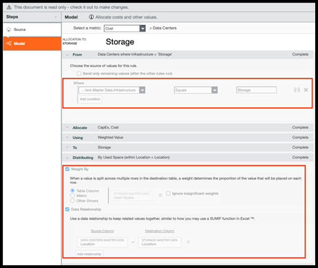
12. Open the allocation strategy targeting the Mainframes Object and set the following options as
    shown in the screenshot below:
    - In the From section, set its filter where the **Data Centers Master Data.Infrastructure**
      equals “Mainframe”.
    - In the Distributing section, set the following options:
      - Enable “Data Relationship” and match on the following:
      - Location = Location

    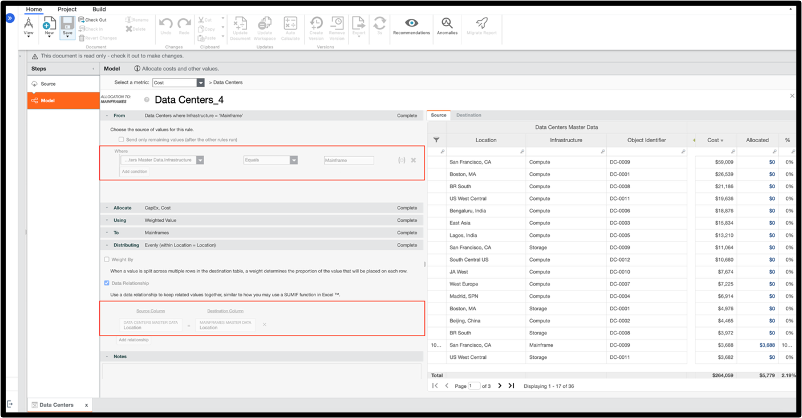
13. **Save** and Check in the changes.
14. Select **CapEx** metric and setup allocations in the same way as the Cost metric’s
    allocations.

## Reporting

Besides the Data Centers Admin report, the Data Center TCO solution includes three primary reports:

1. **Data Centers Review report**

   **For:** Data Center/Facility Owners, Executives, IT Finance

   **Key Benefits:**​

   - Identify top data centers by cost and physical footprint and compare by region, manager,
     facility type (colocation / leased) and tier​
   - Understand TCO cost drivers including power, cooling, labor, and vendor spend​
   - View unit costs to compare data center sites, including $/kW, $/rack, and $/sq ft​

   Compare data center sites, identify inefficiencies, and guide investment, consolidation, and
   capacity planning decisions.

   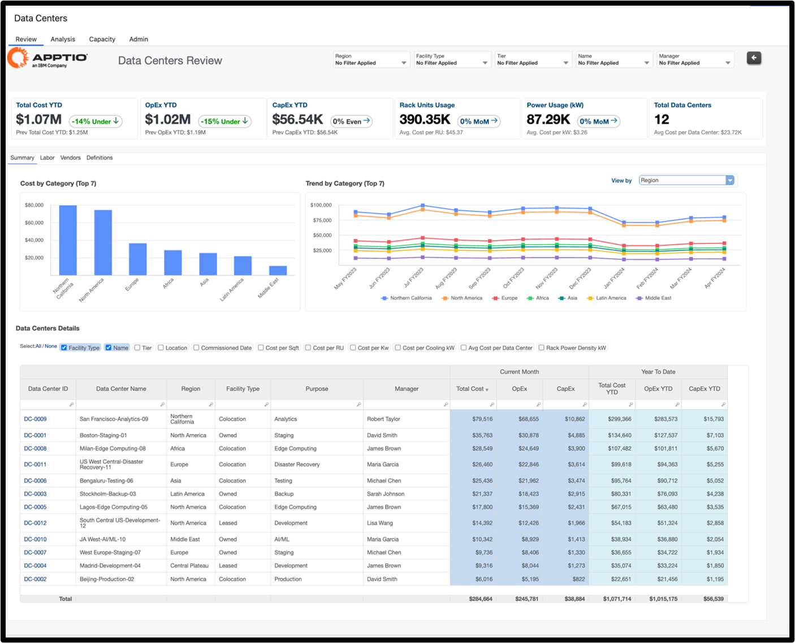
2. **Data Centers Analysis report**

   **For:** IT Finance, Infrastructure Analysts

   **Key Benefits:**

   - View Data Center costs and consumption in a flexible table format using filters and optional
     dimensions, metrics, and time.
   - View usage of Power, Square Footage, Rack Units, Cooling and compare with capacity
   - Analyse trends across various time periods - monthly, quarterly, or as needed for
     reporting.

   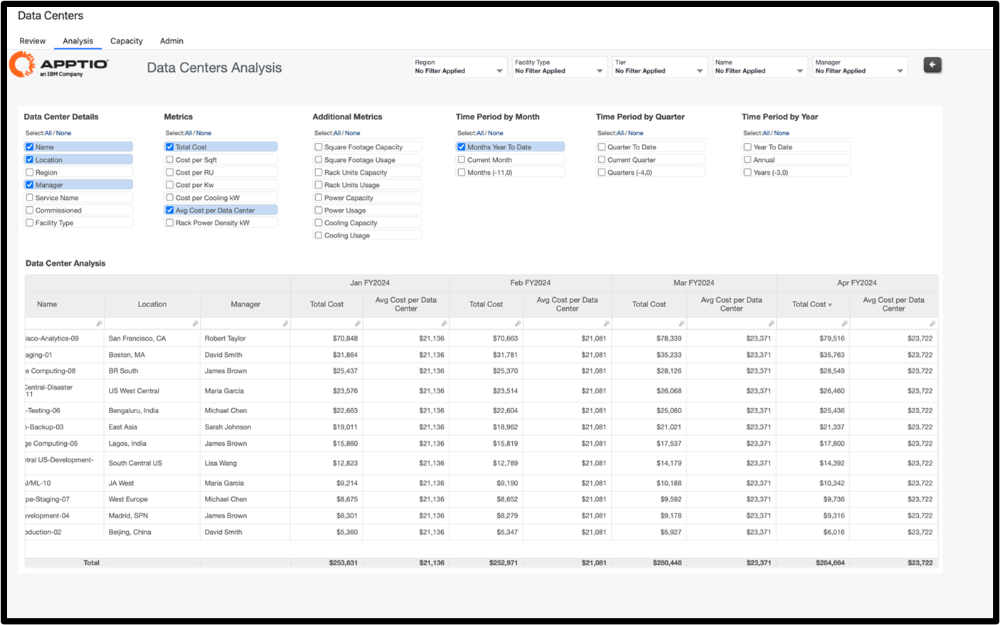
3. **Capacity report**

   **For :** Data Center / Facility Owners

   **Key Benefits:**

   - Understand total capacity of data center sites across power, cooling and space
   - Monitor capacity utilization to identify areas of constraints
   - Improve site utilization and identify recoverable capacity before investing in expansion

   Identify the potential capacity and limitations of your data centers to proactively optimize
   and plan expansions confidently

   Note:

   The highlights in the report indicates utilization of the total capacity based on the threshold
   %.

   - If Utilization > High Utilization Threshold % : Pink
   - Utilization < Low Utilization Threshold % : Yellow
   - Utilization is in between High Utilization Threshold % and Low Utilization Threshold % :
     White

   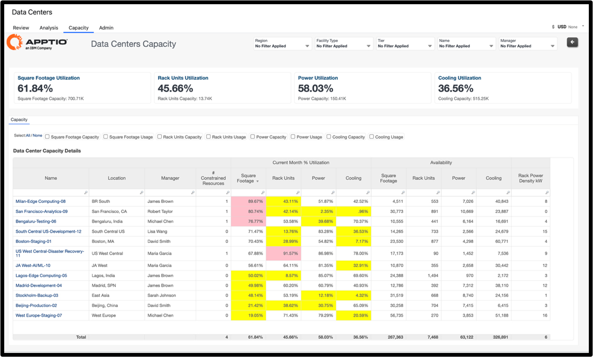

**Modernization UI Reports:**

1. **Data Centers Enrichment report**

   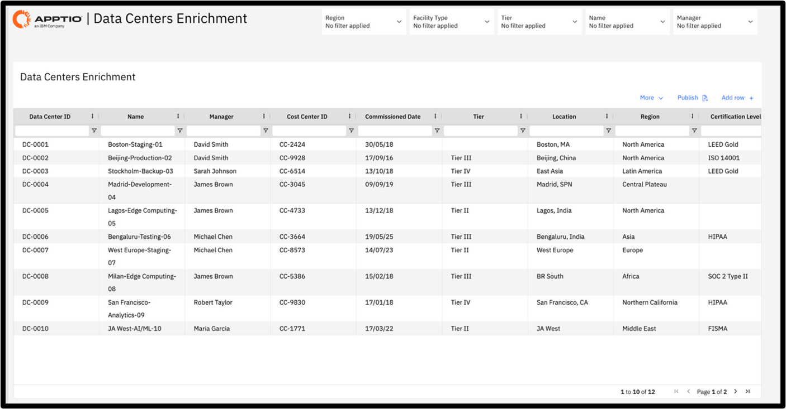
2. **Data Center Admin report**
   - **Allocation Method:** 

     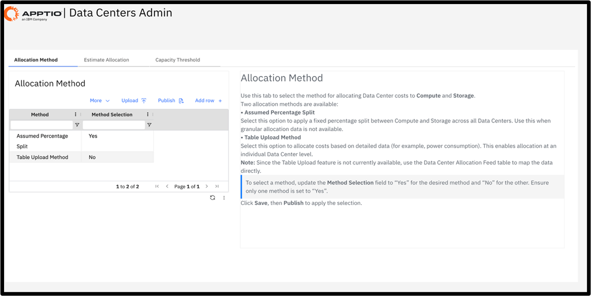
   - **Estimate Allocation:**

     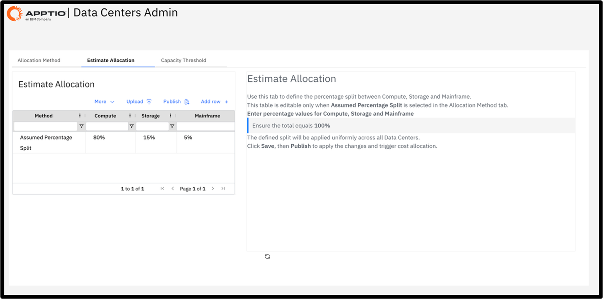
   - **• Capacity Threshold:**

     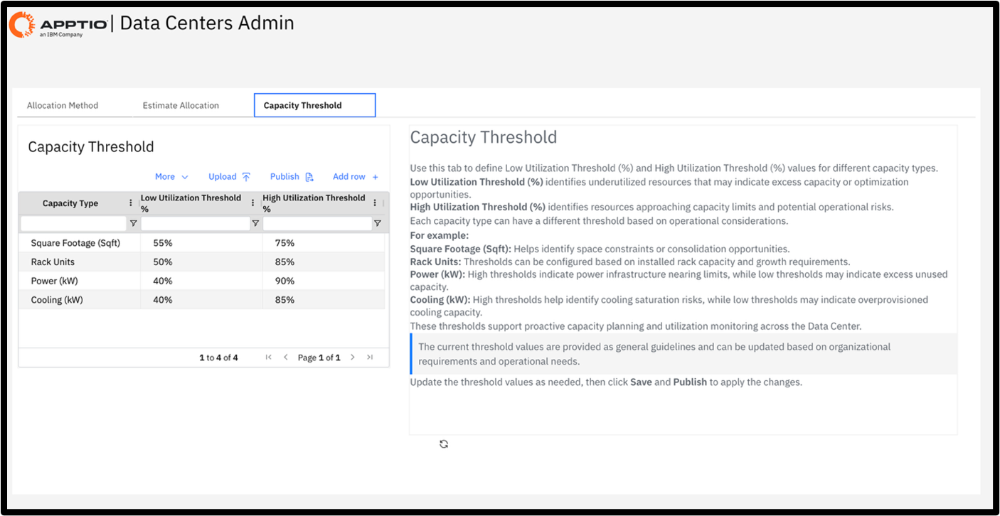
3. **Data Centers Review report**

   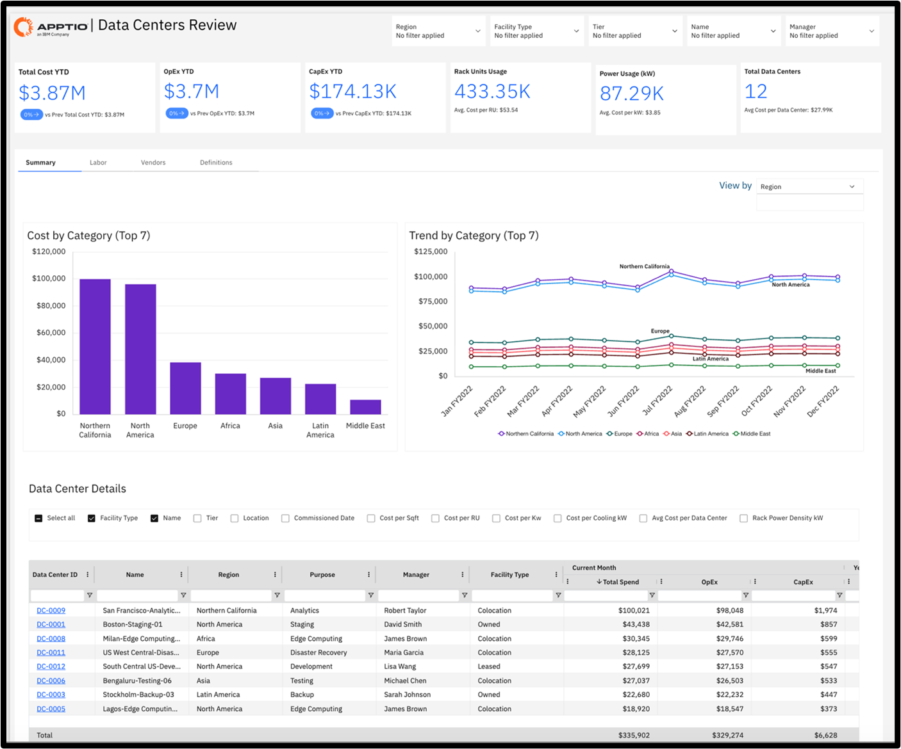
4. **Data Centers Analysis report**

   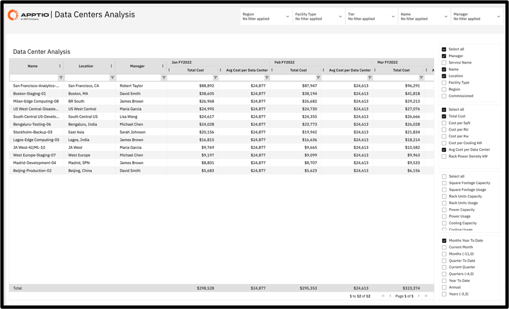
5. **Capacity report**

   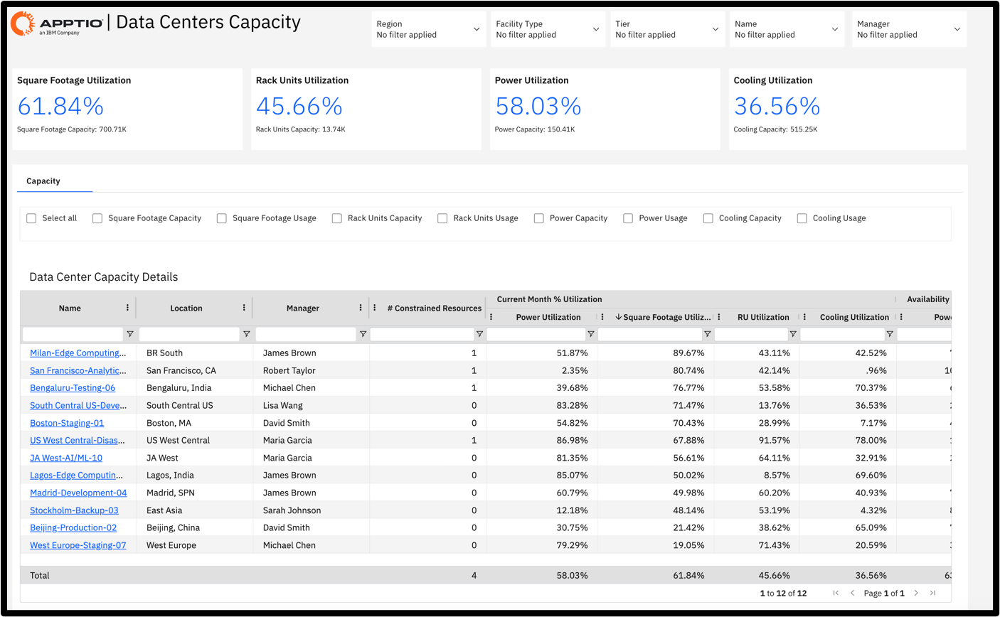
