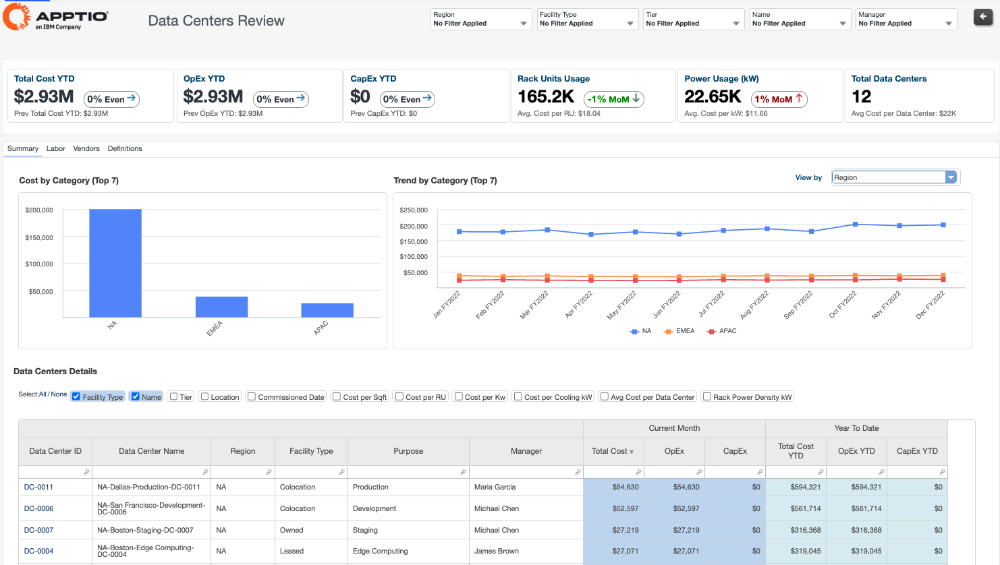
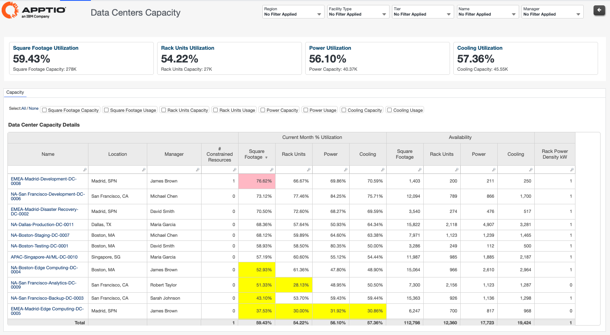
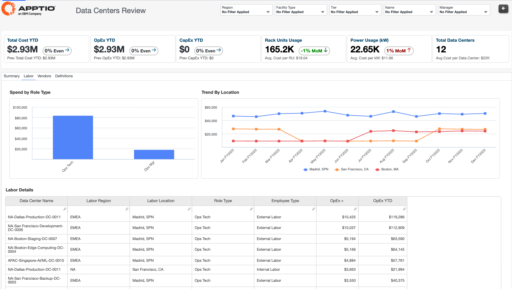
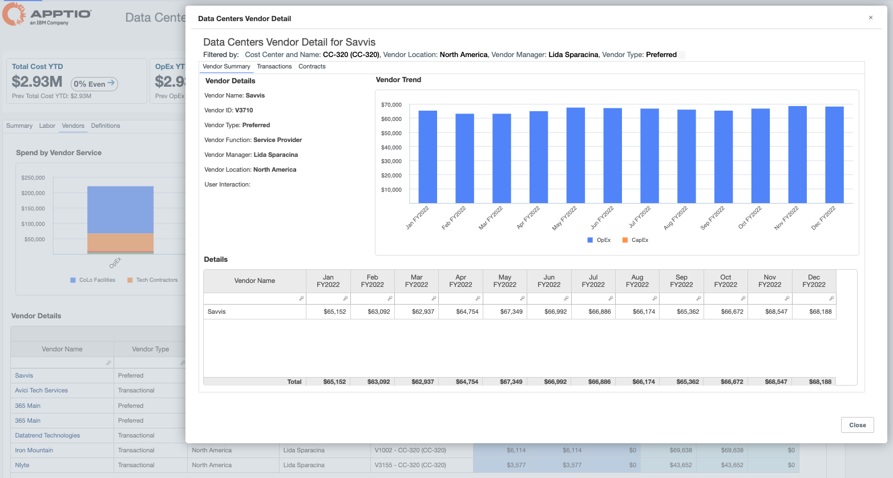
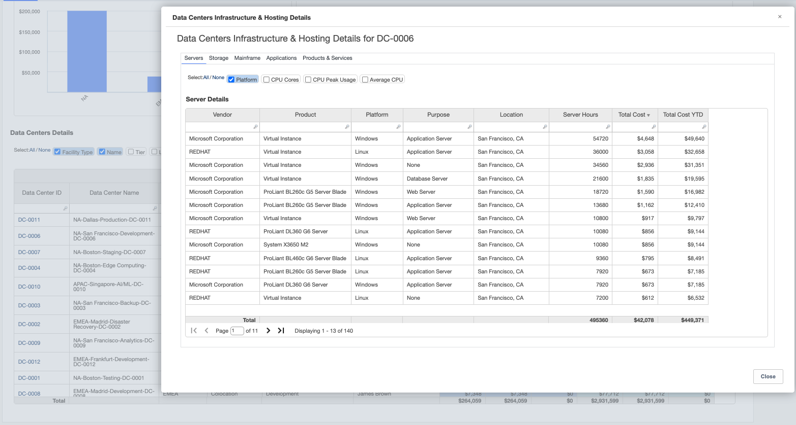
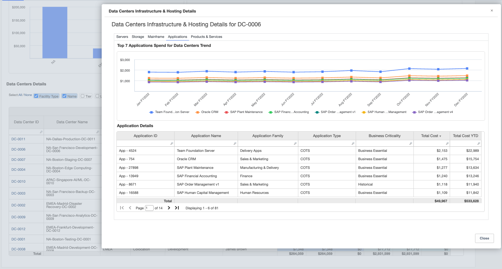

# Data Centers Classic Reports

## Data Center TCO & Unit Economics

The Data Centers Review report provides a consolidated view of data center spend, operational
metrics, and utilization across all facilities. It enables organizations to understand total cost,
OpEx and CapEx distribution, rack utilization, power usage, labor and vendor costs, and how
infrastructure, applications, and services consume data center resources.

This report is designed for use by the following roles:

- IT Finance
- IT Leaders
- Data Center Managers
- Infrastructure Owners
- Service Owners

Insights Provided:

- Understand total data center spend across regions, facility types, and operational
  categories including OpEx and CapEx.
- Analyze rack unit usage, power consumption, and cost efficiency metrics such as cost per
  rack unit and cost per kilowatt.
- Review labor and vendor spend trends to identify major operational cost drivers and optimization
  opportunities.
- Drill into infrastructure, applications, products, and services hosted within each data center
  to understand resource consumption and allocation.
- Compare spend and utilization trends across locations to support consolidation, modernization,
  and investment planning.

## Data Centers Capacity

The Data Centers Capacity report provides visibility into utilization and available capacity
across square footage, rack units, power, and cooling resources. It helps organizations identify
constrained facilities, understand remaining capacity headroom, and optimize space and power
planning across the data center portfolio.

This report is designed for use by the following roles:

- Data Center Managers
- Infrastructure and Operations Teams
- Capacity Managers
- IT Finance

Insights Provided:

- Analyze utilization percentages across square footage, rack units, power, and cooling resources.
- Identify constrained data centers and understand where capacity risks may impact future
  growth.
- Review available capacity across facilities to support expansion, migration, and consolidation
  planning.
- Compare rack power density and utilization efficiency across locations and facility types.
- Detect underutilized or overutilized facilities to improve operational efficiency and reduce
  unnecessary costs.

## Vendor & Labor Analysis

The Vendor & Labor tabs within Data Center Review report provides detailed visibility into
vendor spend, contracts, renewals, and labor costs supporting data center operations. It enables
organizations to understand operational cost drivers, monitor vendor dependencies, track contract
obligations, and evaluate workforce-related spending across facilities and locations.

This report is designed for use by the following roles:

- IT Finance
- Procurement Teams
- Data Center Managers
- Infrastructure and Operations Leaders

Insights Provided:

- Understand vendor spend distribution across service providers, vendor categories, and
  operational services supporting data center operations.
- Review vendor contract details, renewal timelines, and associated spending to support
  procurement planning and contract governance.
- Analyze labor costs by role type, employee type, region, and operational location.
- Track vendor and labor spend trends over time to identify operational cost increases,
  concentration risks, or financial anomalies.
- Identify opportunities to optimize vendor relationships, contract renewals, and workforce
  allocation to improve operational efficiency and reduce costs.

## Infrastructure & Hosting Details

The Infrastructure & Hosting Details report provides detailed visibility into the
infrastructure resources, applications, storage, and hosted services operating within each data
center. It enables organizations to understand how infrastructure assets consume data center
resources and contribute to overall operational costs.

This report is designed for use by the following roles:

- Infrastructure Owners
- Application Owners
- Service Owners
- Data Center Managers
- Enterprise Architects

Insights Provided:

- Analyze servers, storage, mainframe, applications, and services hosted within individual
  data centers.
- Understand infrastructure cost distribution across platforms, vendors, environments, and
  operational purposes.
- Review application and service spend trends associated with each data center location.
- Identify infrastructure components contributing most significantly to operational costs and
  utilization.
- Support migration, rationalization, and modernization initiatives through detailed hosting and
  dependency analysis.

