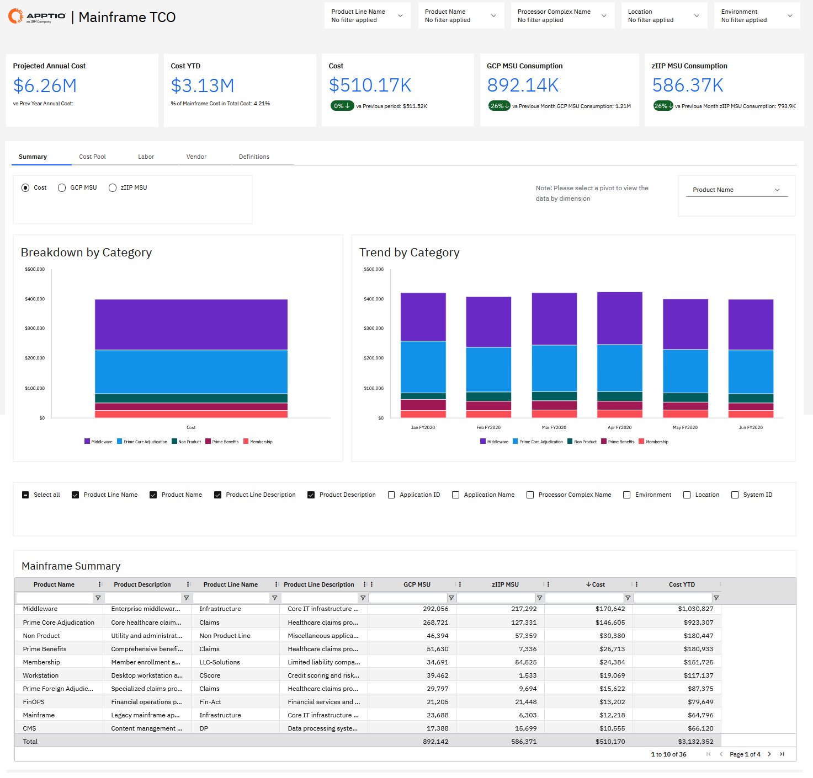
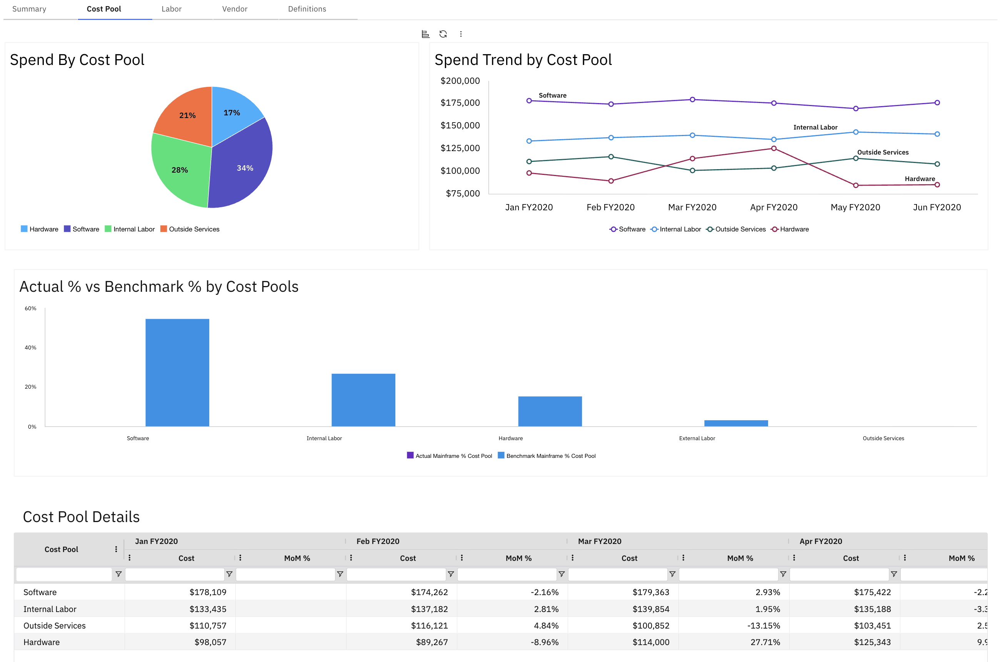
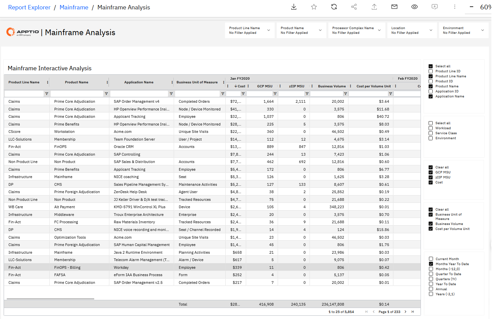
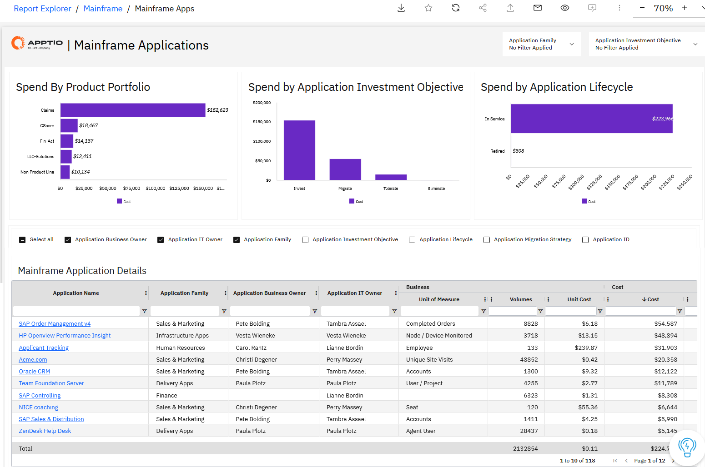
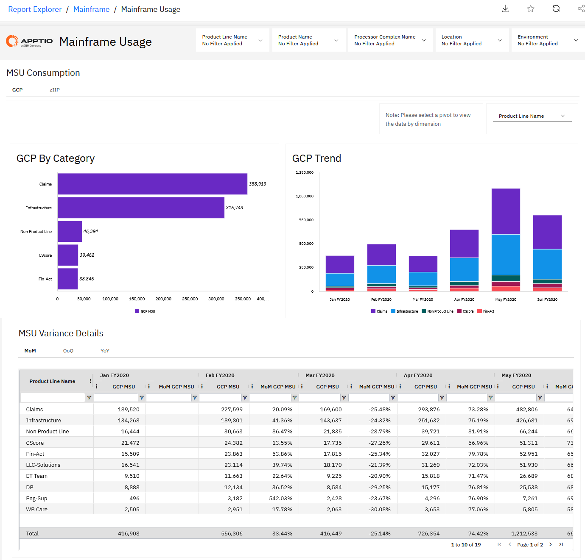
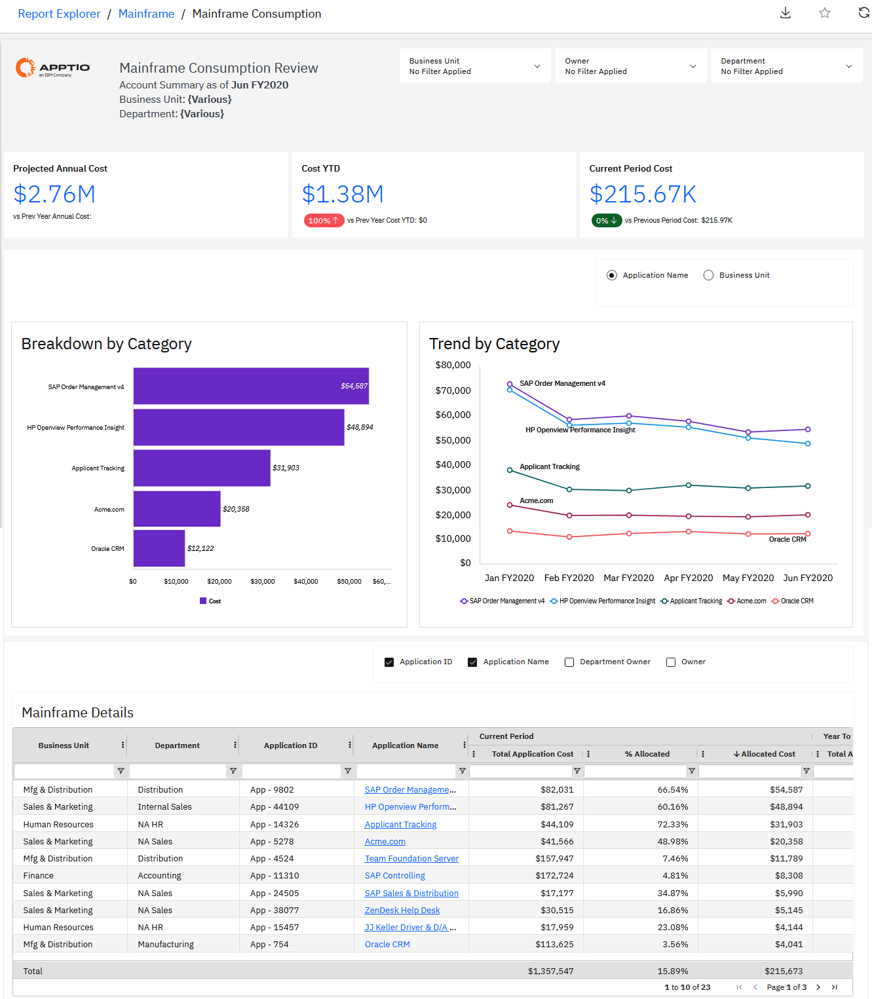
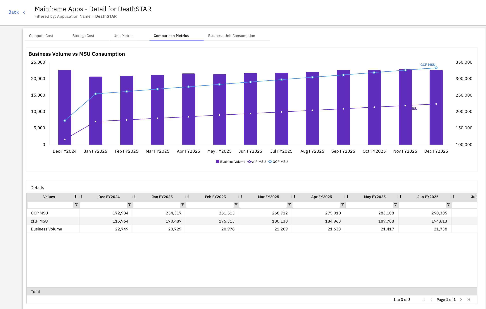

# Mainframe NX Reports

The Mainframe collection provides a comprehensive and defensible view of mainframe
total cost of ownership, consumption, utilization, and allocation. It brings together financial,
operational, and workload-level insights to help organizations understand where mainframe costs
originate, how they are consumed, and how they can be accurately allocated to applications and
business units.

This collection enables IT and finance leaders to analyze mainframe costs alongside
consumption metrics such as GCP and zIIP MSUs, track trends over time, compare usage to
business volumes, and identify inefficiencies or anomalies. By combining cost transparency,
unit-cost analysis, and utilization insights, the collection supports informed decision-making
around optimization, capacity planning, and funding models.

The reports in this collection support cost accountability through transparent showback and
chargeback views, help validate cost structures against benchmarks, and provide visibility
into workload efficiency and long-term consumption trends. Together, they enable organizations
to confidently communicate mainframe TCO, defend budgets, and drive continuous efficiency
improvements.

**Reports available in this collection include:**

- Mainframe TCO – Cost Transparency & Allocation
- Mainframe TCO – Cost Pool Composition & Peer Comparison
- Mainframe Analysis
- Mainframe Application
- Mainframe Utilization
- Mainframe Showback & Chargeback
- Mainframe TCO - Mainframe Utilization & Efficiency Insights

## Mainframe TCO - Cost Transparency & Allocation

This report provides a comprehensive view of total mainframe cost and consumption by
combining costs, GCP/zIIP MSUs, and calculated unit costs in one integrated view.

Use this report to understand the complete mainframe cost picture, identify major cost
drivers, and communicate TCO to stakeholders. The report breaks down spending across labor,
vendors to pinpoint optimization opportunities.

This report is designed for use by the following roles:

- CIO and IT Leadership
- Mainframe Cost Center Owner
- IT Finance

Insights Provided:

- Comprehensive view of total cost and consumption combining costs, GCP/zIIP MSUs, and
  calculated unit costs.
- Understanding of cost and usage trends over time.
- Breakdown of key cost drivers across labor, vendors to pinpoint optimization
  opportunities.

## Mainframe TCO - Cost Pool Composition & Peer Comparison

This report provides a detailed breakdown of mainframe TCO across key cost pools including
hardware, software, labor, facilities, and outside services. Industry benchmark percentages
are overlaid to highlight how your cost structure compares to industry norms.

Use this report to identify potential cost optimization areas, validate budget assumptions,
and support strategic improvement initiatives. The peer comparison enables evidence-based
discussions about mainframe cost structure.

This report is designed for use by the following roles:

- CIO and IT Leadership
- IT Finance
- Mainframe Cost Center Owner

Insights Provided:

- Detailed breakdown of mainframe TCO across hardware, software, labor, facilities, and
  outside services cost pools.
- Benchmark percentages overlaid to show how cost structure compares to industry norms and
  peer organizations.
- Identification of cost pools where spend is significantly above or below industry
  benchmarks.
- Support for strategic improvement initiatives through evidence-based cost structure
  analysis.

## Mainframe Analysis

This report provides flexible analysis of mainframe costs and consumption using customizable
filters, dimensions, metrics, and time periods. The report enables viewing of both GCP and
zIIP MSU consumption to compare different types of workload processing.

Use this report for detailed analysis of cost and consumption patterns across various
dimensions and time periods. The flexible format supports export for further analysis in other
tools or dashboards.

This report is designed for use by the following roles:

- Mainframe Cost Center Owner
- IT Finance
- Capacity Planning

Insights Provided:

- View mainframe costs and consumption in flexible table format using filters and optional
  dimensions, metrics, and time.
- Consumption analysis for both GCP and zIIP MSU to compare different types of workload
  processing.
- Trend analysis across various time periods including monthly, quarterly, or custom ranges
  for reporting.
- Export capability for further analysis in other tools or dashboards.

## Mainframe Application

This report provides a comprehensive view of mainframe-backed applications, combining
application-level costs, business volumes, unit costs, and mainframe consumption metrics (GCP
and zIIP MSUs) into a single integrated view. It enables organizations to understand how
mainframe resources are consumed by individual applications and how those costs translate into
business value.

This report is designed for use by the following roles:

- CIO and IT Leadership
- Mainframe Cost Center Owner
- Application Owners

Insights Provided:

- View application-level total cost, cost YTD, GCP MSU, and zIIP MSU consumption in a
  single integrated view.
- Understand unit cost by business volume (e.g., cost per order, cost per account, cost
  per transaction).
- Analyze spend by application family, investment objective, and lifecycle stage (Invest,
  Migrate, Tolerate, Eliminate).
- Identify high-cost or high-consumption applications to prioritize optimization,
  modernization, or retirement decisions.

## Mainframe Utilization

This report tracks MSU consumption trends by workload category, workload type, product line
name, product name, and application name. The report highlights significant month-over-month
changes and provides quarter-over-quarter and year-over-year views for long-term trend
analysis.

Use this report to monitor workload consumption patterns, identify utilization anomalies, and
track long-term consumption trends. The conditional highlighting draws attention to
significant changes that may require investigation.

This report is designed for use by the following roles:

- Capacity Planning
- Application Owner
- Mainframe Cost Center Owner

Insights Provided:

- MSU consumption trends by workload category showing usage across different types of
  processing.
- Usage tracking by workload type, product line name, product name, and application name for
  detailed analysis.
- Month-over-month MSU consumption monitoring with conditional highlights identifying
  significant changes.
- Quarter-over-quarter and year-over-year views to understand long-term consumption trends.

## Mainframe Showback & Chargeback

This report connects mainframe usage to costs by application, workload, or business unit
using actual consumption data. The report ensures cost allocation reflects true consumption
through integration with IBM IntelliMagic Vision data.

Use this report to provide clear, defensible showback and chargeback views to business units.
The data-driven approach makes cost discussions productive by grounding them in actual usage
metrics.

This report is designed for use by the following roles:

- Business Relationship Manager
- IT Finance
- Application Owner

Insights Provided:

- Connection of mainframe usage to costs by application, workload, or business unit based on
  actual consumption.
- Cost allocation that reflects true consumption using IBM IntelliMagic Vision data for
  accuracy.
- Clear, defensible showback and chargeback views for business units with transparent
  methodologies.
- Data-driven cost discussions grounded in actual usage metrics and consumption
  patterns.

## Mainframe TCO - Mainframe Utilization & Efficiency Insights

This report identifies mainframe efficiencies through workload-level utilization insights
that reveal patterns, spikes, and underused capacity. The report tracks all workloads and
applications currently active on the mainframe along with their MSU consumption.

Use this report to inform smarter planning and usage decisions by identifying inefficiencies,
tracking consumption trends, and spotting workload spikes. The detailed visibility supports
operational efficiency improvements.

This report is designed for use by the following roles:

- Capacity Planning
- Application Owner
- Mainframe Cost Center Owner

Insights Provided:

- Identification of mainframe efficiencies through workload-level utilization insights
  revealing patterns, spikes, and underused capacity.
- Tracking of all workloads and applications currently active on the mainframe along with
  their MSU consumption.
- Consumption trend tracking by workload type, product line, and application to identify
  inefficiencies.
- Workload spike tracking and identification of opportunities to improve operational
  efficiency.

