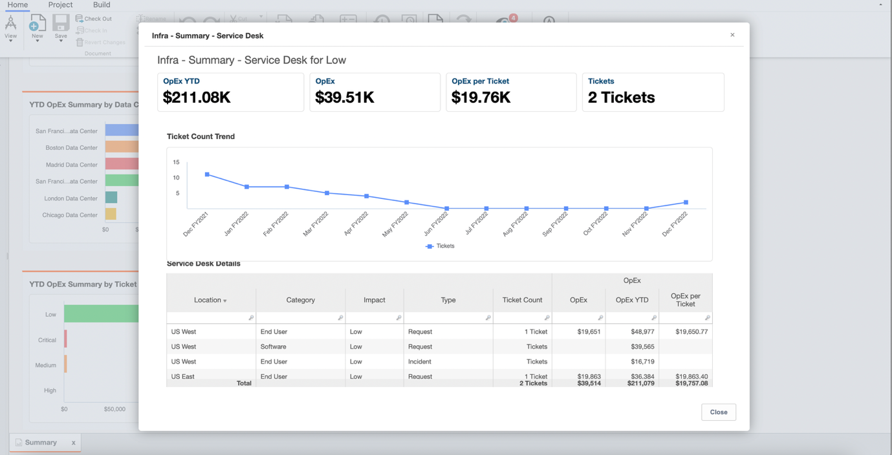
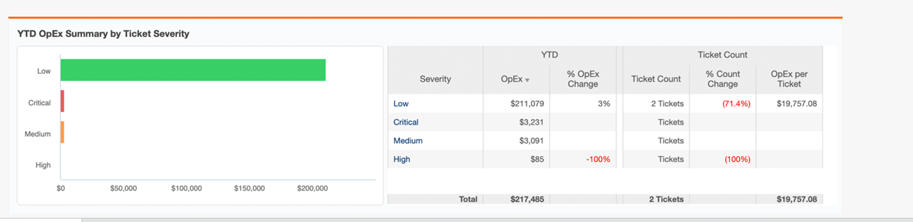
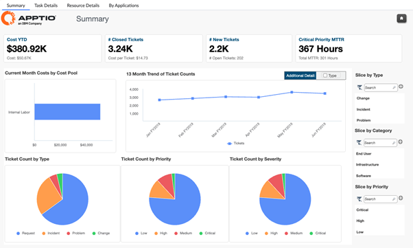
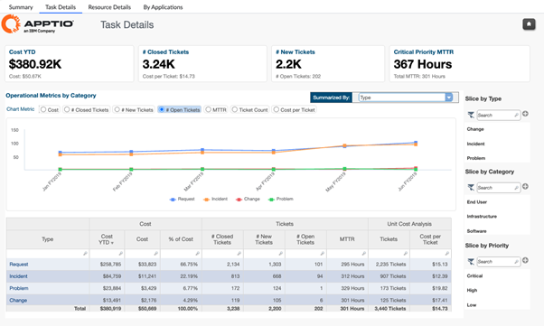
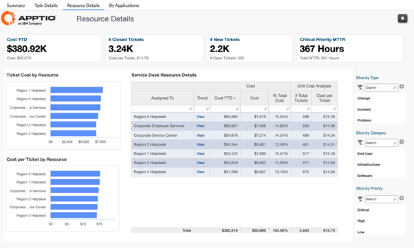
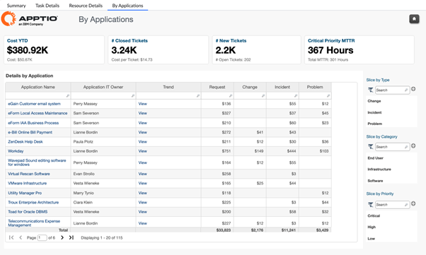

# Service Desk Reports

## Reports - Service Desk Cost Overview

This analysis is part of
Infrastructure Review report, and provides visibility into the operational expenditure
associated with service desk activities and ticket handling. It brings together cost,
volume, and severity metrics to help organizations understand where service desk spend is
concentrated, how ticket demand is trending, and how efficiently support resources are being
utilized.

This report is designed for use by the following roles:

- Service Desk Managers
- IT Finance
- Service Owners

**Insights Provided**

- Identify which ticket severities, categories, or impact levels are driving the highest
  service desk costs and cost per ticket.
- Track period-over-period trends in ticket volumes and service desk spend to understand
  demand patterns and operational efficiency.
- Analyze the relationship between ticket severity, volume, and cost to identify
  opportunities for process improvement, automation, or service optimization.

## Reports - Service Desk Insights & Optimization

The Service Desk collection provides a consolidated view of service desk costs, ticket
volumes, and operational performance across the enterprise. It brings together financial and
operational insights to help organizations understand how support demand, ticket
characteristics, and resource utilization drive service desk spend. This collection enables
IT and service leaders to monitor efficiency, identify cost drivers, and support continuous
improvement in service delivery by linking tickets, resources, and applications to cost
outcomes.

**Reports available in this collection:**

Service Desk Summary Report

Service Desk Task Details

Service Desk Resource Details

Service Desk By Application Report

**Note:** This collection is available in a separate endpoint**:** **Infrastructure
Insights**

## Service Desk Summary Report

The Service Desk Summary report provides a consolidated view of service desk operating
costs and ticket volumes across the enterprise. It highlights overall spend, ticket trends,
and key performance indicators such as cost per ticket and mean time to resolution, enabling
a quick assessment of service desk efficiency and cost behavior.

This report is designed for use by the following roles:

- IT Operations
- Service Desk Managers
- IT Finance
- Service Owners

Insights Provided

- Understand total service desk cost and ticket volumes for the selected period.
- Identify cost distribution by ticket type, priority, severity, and category.
- Track ticket count trends over time to identify demand patterns and spikes.
- Assess cost per ticket and MTTR to evaluate service desk efficiency.

## Service Desk Task Details Report

The Service Desk Task Details report provides a deeper operational view of service desk
activity by breaking down ticket costs, volumes, and performance metrics by task type. It
helps teams understand how different request, incident, problem, and change activities
contribute to overall service desk spend.

This report is designed for use by the following roles:

- IT Operations
- Service Desk Managers

Insights Provided

- Analyze ticket cost and volume by task type such as requests, incidents, problems, and
  changes.
- Review trends in opened, closed, and outstanding tickets over time.
- Identify task types with high cost per ticket or prolonged resolution times.
- Support workload balancing and process improvement decisions based on task-level
  metrics.

## Service Desk Resource Details Report

The Service Desk Resource Details report focuses on the cost and productivity of service
desk resources. It provides visibility into how support teams, locations, or resource groups
contribute to ticket resolution volumes and overall service desk costs.

This report is designed for use by the following roles:

- IT Operations
- Service Desk Managers

Insights Provided

- Understand service desk cost distribution by resource, team, or location.
- Compare cost per ticket and ticket volumes across service desk resources.
- Identify high-cost or low-efficiency support groups.
- Support staffing, sourcing, and resource optimization decisions.

## Service Desk By Application Report

The Service Desk By Application report connects service desk costs and ticket volumes
directly to the applications they support. It enables application owners and IT leaders to
understand which applications generate the highest support demand and cost.

This report is designed for use by the following roles:

- Application Owners
- Service Owners

Insights Provided

- Identify applications generating the highest service desk costs and ticket volumes.
- Analyze ticket types and costs associated with specific applications.
- Support application rationalization and improvement initiatives by highlighting
  support-intensive systems.
- Enable accountability by linking service desk spend to application ownership.

