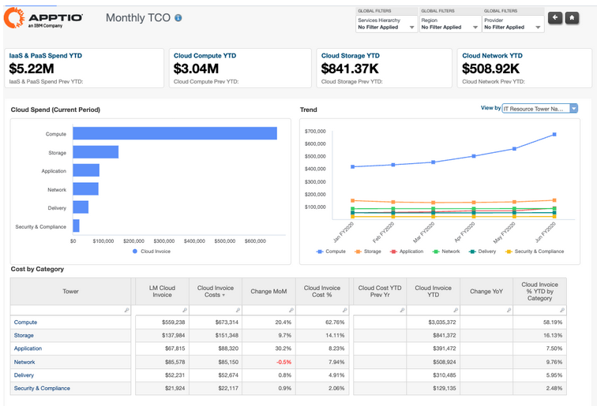
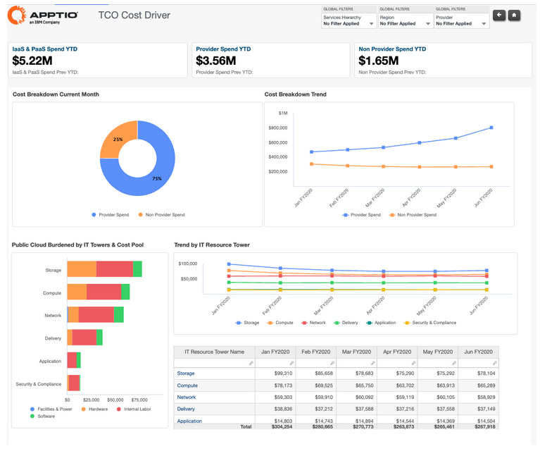
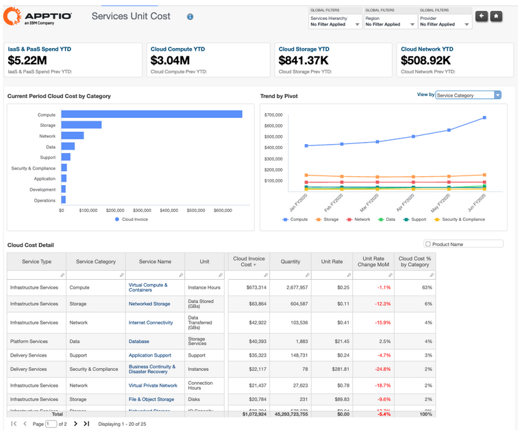
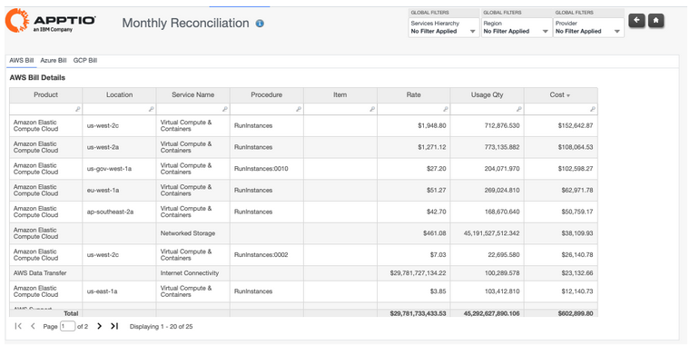

# Public Cloud Reports

**Public Cloud Integrated Reports**

The Cloud report collection provides comprehensive visibility into public cloud spending,
combining provider invoices with associated non-provider costs to deliver a complete view of
cloud total cost of ownership (TCO). These reports support financial governance, cost
optimization, and accountability by enabling organizations to understand where cloud spend
originates, how it is consumed, and what drives cost changes over time—across services,
applications, and IT resource towers.

The Cloud collection includes the following reports:

- Cloud Monthly TCO
- Cloud TCO Cost Driver
- Cloud Services Unit Cost
- Cloud Monthly Reconciliation

## Cloud Monthly TCO

The Cloud Monthly TCO report provides a comprehensive view of total monthly public cloud
spending, combining cloud provider charges with associated non-provider costs such as labor,
software, and supporting services. It enables organizations to understand the true, fully
burdened cost of cloud consumption and identify which organizations, applications, services,
and resource towers are driving spend.

This report is designed for use by the following roles:

- IT Finance
- FinOps / Cloud Center of Excellence (CCoE)
- Service and Solution Owners
- Cloud Platform Owners

**Insights Provided:**

- Understand total monthly and year-to-date public cloud spend, including both provider
  and non-provider costs.
- Identify which applications, organizations, and IT resource towers are driving the
  highest cloud consumption.
- Analyze cloud spend trends over time to detect growth patterns, anomalies, or cost
  spikes.
- Compare spend across cloud service categories such as compute, storage, network,
  application.
- Assess month-over-month and year-over-year changes in modeled cloud invoice costs.
- Evaluate the contribution of each service category to overall cloud spend using unit
  cost and percentage metrics.

## Cloud TCO Cost Driver

The Cloud TCO Cost Driver report explains the composition of total cost of ownership for
public cloud consumption by breaking spend into provider and non-provider components. It
highlights how cloud provider charges are complemented by additional costs such as internal
labor, facilities, software, and supporting services required to deliver and operate cloud
workloads. The report helps organizations move beyond invoice-level cloud spend to
understand the full economic impact of cloud adoption across IT resource towers and cost
pools.

This report is designed for use by the following roles:

- IT Finance
- FinOps / Cloud Center of Excellence (CCoE)
- Service and Solution Owners
- Cloud Platform and Infrastructure Owners

**Insights Provided:**

- Understand the split between cloud provider spend and non-provider costs contributing to
  total cloud TCO.
- Identify which non-provider cost categories (for example, labor, software, facilities)
  are driving overall cloud costs.
- Analyze how cloud TCO is distributed across IT resource towers such as compute, storage,
  network, application, and delivery.
- Track trends in provider versus non-provider costs over time to identify structural cost
  shifts.
- Assess which towers or services carry higher fully burdened costs relative to pure cloud
  invoice spend.
- Support cloud optimization and financial planning decisions by highlighting the true
  cost drivers behind cloud consumption.

## Cloud Services Unit Cost

The Cloud Services Unit Cost report provides visibility into how public cloud spend and
consumption are trending across key service categories such as Compute, Storage, Network,
Data, and Platform services. It helps organizations understand not only total spend, but
also the underlying consumption patterns and effective unit rates that drive cloud costs. By
combining cost, usage, and unit rate metrics, this report supports deeper analysis of
efficiency and cost behavior at the service level.

This report is designed for use by the following roles:

- IT Finance
- FinOps / Cloud Center of Excellence (CCoE)
- Service and Solution Owners

**Insights Provided:**

- Analyze cloud spend by service category to understand which services are driving the
  highest costs.
- Track consumption trends (such as instance hours, storage volume, or data transfer)
  across service types.
- Review effective unit rates and month-over-month unit rate changes to identify pricing
  or usage efficiency shifts.
- Identify services where cost growth is driven by increased consumption versus higher
  unit rates.
- Compare service-level cost distribution to support optimization, rightsizing, and
  pricing discussions.
- Support ongoing cloud cost optimization by highlighting services with unfavourable cost
  or unit rate trends.

## Cloud Monthly Reconciliation

The Cloud Monthly Reconciliation report enables reconciliation of modeled cloud costs with
the original monthly bills received from cloud service providers. It provides detailed,
line-item visibility into cloud invoices—such as product, service, region, usage quantity,
rates, and total cost—to ensure accuracy, completeness, and consistency between provider
bills and reported cloud spend. This report supports financial control, audit readiness, and
confidence in cloud cost reporting.

This report is designed for use by the following roles:

- IT Finance
- FinOps / Cloud Center of Excellence (CCoE)
- Cloud Platform and Billing Owners
- Financial Controllers and Auditors

**Insights Provided:**

- Reconcile modeled cloud costs against monthly provider bills to validate accuracy.
- Review detailed invoice line items by product, service, region, and usage metrics.
- Identify discrepancies between billed amounts and expected or modeled costs.
- Validate usage quantities, rates, and charges across cloud providers.
- Support month-end close, audit processes, and financial assurance for cloud spend.
- Increase trust in downstream cloud cost reports by ensuring bill-level consistency.

