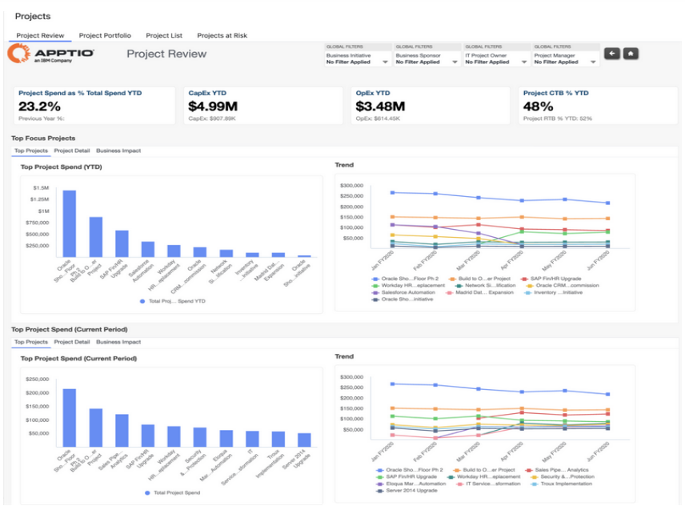
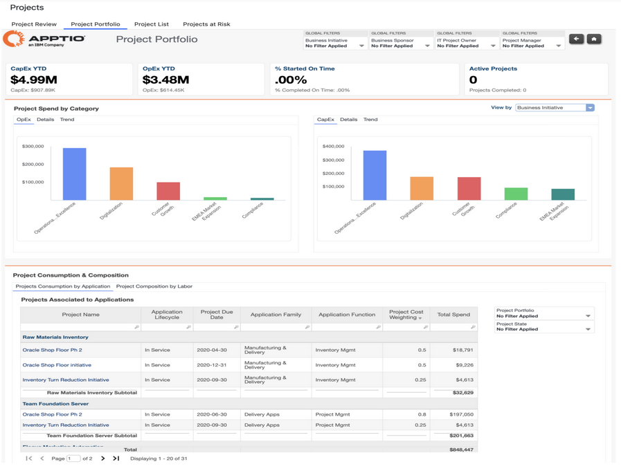
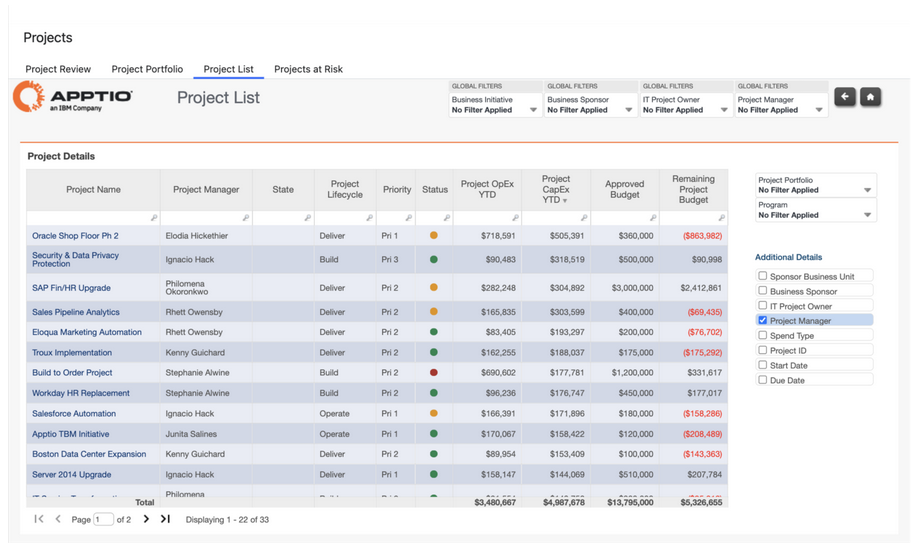
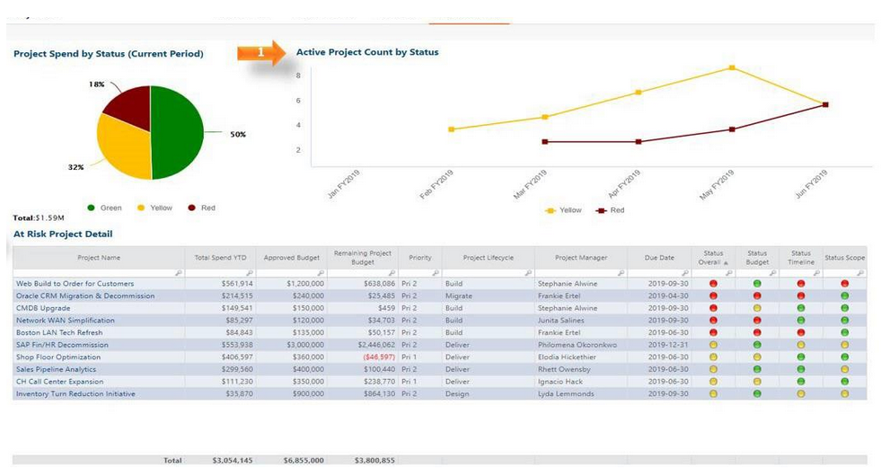

# Projects Reports

The **Projects report collection** provides visibility into IT project spend, budget
performance, portfolio composition, and delivery risk. These reports help IT Finance, the
Project Management Office (PMO), and application or service owners monitor project investments,
assess alignment with business initiatives, and identify financial or delivery risks across the
project portfolio.

This collection includes:

- Project Review
- Project Portfolio
- Project List
- Projects at Risk

## Project Review

The Project Review report provides visibility into project spend, budget performance, and
delivery status across top projects. It helps IT Finance, the Project Management Office (PMO),
and Service or Solution Owners review how project investments are tracking against approved
budgets, timelines, and business initiatives.

Use this report to monitor year-to-date project spend, identify top projects by spend, and
assess whether projects are delivering as planned.

This report is designed for use by the following roles:

- IT Finance
- Project Management Office

**Insights Provided:**

- Review project spend KPIs and understand how project spend compares to total IT spend.
- Identify top projects based on year-to-date and current-period spend.
- Analyze project spend by business initiative, project portfolio, project manager, business
  sponsor, IT project owner, or spend type.
- Compare project spend against approved budgets to identify overruns or remaining budget.
- Monitor project status, schedule adherence, and completion progress.
- Understand project goals, health status, and performance trends over time.
- Evaluate the business initiative associated with a project and assess its business impact.

For more details on how to use the Project Review report go [here](https://www.ibm.com/docs/en/apptio-commercial/costing-standard/saas?topic=reports-projects-review "(Opens in a new tab or window)")

## Project Portfolio

The Project Portfolio report provides a portfolio-level view of project investments,
composition, and consumption. It helps users understand how project spend is distributed
across categories, business initiatives, and applications, and how projects progress through
their lifecycle.

Use this report to evaluate project portfolio balance, resource consumption, and the impact
of projects across applications and cost pools.

This report is designed for use by the following roles:

- IT Finance
- PMO
- Application Owners

**Insights Provided**

- Review KPIs related to overall project activity and portfolio composition.
- Analyze project spend by category to understand consumption patterns.
- Identify the highest project spend by business initiative.
- Assess project volume, lifecycle phase, and completion status across initiatives.
- Understand how many projects are active, nearing completion, or behind schedule.
- Review project consumption by application to understand downstream impact.

For more details on how to use the Project Portfolio report go [here](https://www.ibm.com/docs/en/apptio-commercial/costing-standard/saas?topic=reports-project-portfolio "(Opens in a new tab or window)")

## Project List

The Project List report provides a comprehensive view of all projects and their current
state. It allows users to review project-level details, understand the mix of OpEx and CapEx
investments, and analyze project status across the portfolio.

Use this report to inventory projects, review their financial characteristics, and drill into
individual project details.

This report is designed for use by following roles:

- IT Finance
- PMO

**Insights provided:**

- Review the full list of projects and understand key project attributes.
- Determine how many projects are active and assess their current state.
- Analyze project investments split between OpEx and CapEx.
- Add additional columns to review deeper project details as needed.
- Drill into individual projects to review KPIs, spend, drivers, vendors, labor, and
  impacted applications.
- Understand total project spend and identify trends in OpEx versus CapEx over time.

For more details on how to use the Project List report go [here](https://www.ibm.com/docs/en/apptio-commercial/costing-standard/saas?topic=reports-projects-list "(Opens in a new tab or window)")

## Projects at Risk

The Projects at Risk report highlights projects that are at risk based on status and spend
trends. It helps users identify projects requiring attention and understand the financial
exposure associated with at-risk initiatives.

Use this report to monitor project health and prioritize corrective actions.

This report is designed for use by following roles:

- IT Finance
- PMO

**Insights Provided:**

- Identify projects that are at risk and understand their distribution across the portfolio.
- Analyze the total spend associated with at-risk projects.
- Focus attention on projects with the highest risk and financial impact.

For more details on how to use the Projects at Risk report go [here](https://www.ibm.com/docs/en/apptio-commercial/costing-standard/saas?topic=reports-projects-risk "(Opens in a new tab or window)")

