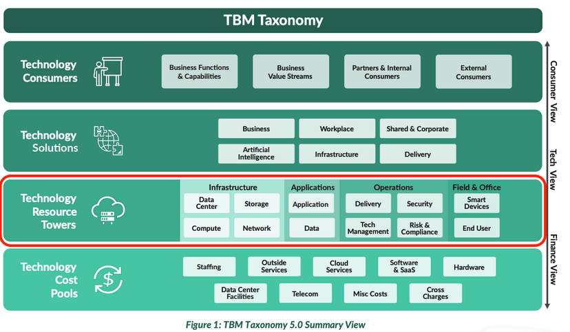

# Resource Towers Overview

## Overview

Resource Tower provide a functional view of IT spend by organizing costs into IT resource
towers and sub-towers, enabling consistent analysis of actual spend versus budget across
monthly, quarterly, and annual review cycles.

Resource Towers help identify significant period-over-period changes in IT spend, highlight
budget variances across towers and sub-towers, and support analysis of top cost drivers.
This view enables better alignment of IT spending with budgets and business priorities.

**What are Resource Towers**

In Technology Business Management (TBM) and the Apptio TBM Unified Model (ATUM),
**Resource Towers categorize technology costs by function**, rather than by expense
type. While **Cost Pools** classify costs by what they are (for example, labor or
software), **Resource Towers classify costs by where and how they support the technology
stack** (for example, Applications, Platforms, End User).

Mapping costs to Resource Towers translates raw financial data into a functional,
service-oriented view of IT. This standardized approach makes cost data actionable for
service owners, transparent to business stakeholders, and usable across advanced TBM use
cases such as optimization, planning, and chargeback.

## Personas

- **IT Finance** - Monitor IT spend against budget and analyze variances across towers.
- **IT Managers / Resource Managers** - Review cost transparency and manage resource
  allocation by tower.
- **Service Owners** - Validate and understand costs supporting specific IT services or
  resources.

## Use Cases

**Supported out-of-the-box:**

- **Monitor Period-over-Period Spend Changes**

  Review month-over-month or quarter-over-quarter changes in IT tower and sub-tower
  spend to quickly identify emerging trends and potential issues.
- **Analyze Budget Variance by Tower**

  Compare actual spend against budget at the tower and sub-tower level to identify
  over- or under-spend and focus corrective actions.
- **Identify Primary Cost Drivers**

  Analyze labor, vendor, asset, and other cost contributors within each tower to
  understand what is driving spend.
- **Support Resource Allocation Decisions**

  Use tower-level cost insights to inform decisions on reallocating resources across IT
  functions based on demand, efficiency, and budget constraints.

## Outcomes

- Improved visibility into IT spend distribution across resource towers and sub-towers.
- Faster identification of budget variances and unusual spend patterns.
- Better understanding of key cost drivers supporting each IT function.
- More informed resource allocation decisions aligned to operational priorities.
- Increased transparency of IT costs for service owners and stakeholders.
- Stronger support for monthly, quarterly, and annual financial and operational reviews.
