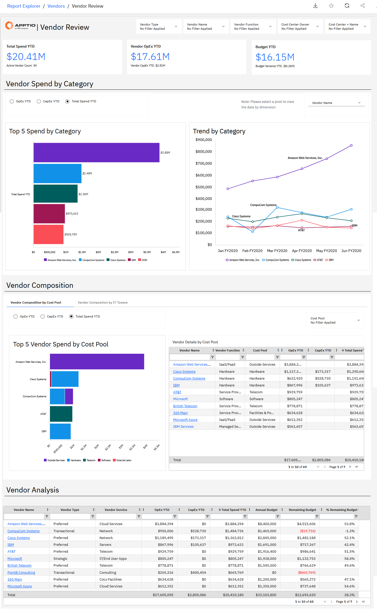
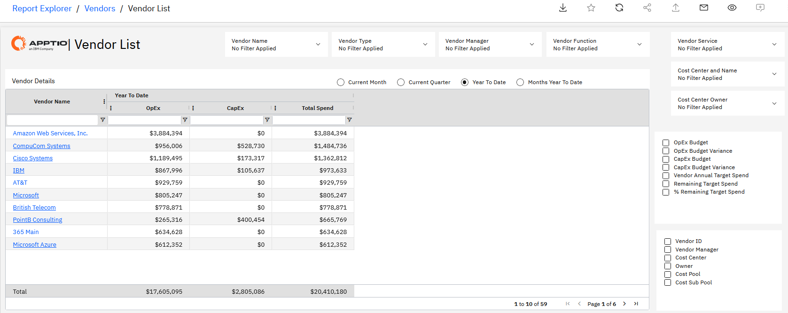
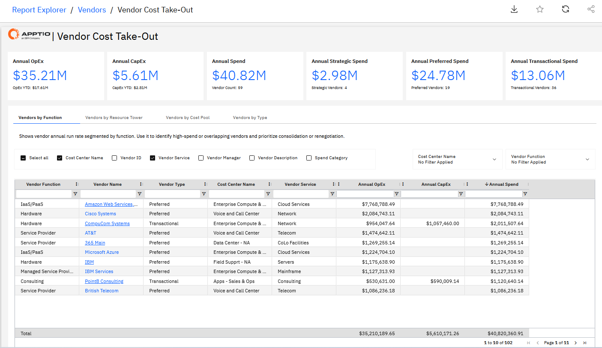

# Vendor NX Reports

The **Vendor report collection** provides visibility into IT vendor spend across the
organization, helping users understand spend distribution, concentration, and trends across
vendors, portfolios, and projects. These reports focus on vendor spend analysis to support cost
control, rationalization, and optimization decisions.

For deeper visibility into **contracts, purchase orders, or accounts payable**, refer to
the **Vendor Insights reports**, which extend vendor analysis with commercial and
transactional views.

This collection includes:

- Vendor Review
- Vendor List

Use these reports together to assess vendor concentration and fragmentation, identify top and
redundant vendors, understand vendor contribution to projects and services, and support
informed decisions to rebalance and optimize vendor spend.

## Vendor Review

The Vendor Review report provides visibility into vendor spend distribution and concentration
across the organization. It helps users understand how spend is allocated across vendors,
identify top-spending vendors, and detect changes or variances in vendor spend over time.

Use this report to assess vendor concentration, identify fragmentation or redundancy in the
vendor portfolio, and support decisions to rebalance or optimize vendor spend.

This report is designed for use by the following roles

- **IT Finance**
- **Vendor Managers**
- **Cost Center Owners**

**Insights Provided:**

- Analyze vendor spend distribution by category, including current and trending spend.
- Identify the top vendors by spend and understand their contribution to overall IT
  spend.
- Assess how concentrated or fragmented vendor spend is across the vendor portfolio.
- Identify potential vendor redundancies or opportunities for consolidation.
- Detect variances and changes in vendor spend that may require further investigation.
- Support decisions to rebalance vendor spend to improve cost efficiency and portfolio
  structure.

For more details on how to use the **Vendor Review** report, go [Vendor Review](https://www.ibm.com/docs/en/apptio-commercial/costing-standard/saas?topic=reports-vendor-review "(Opens in a new tab or window)")

## Vendor List

The Vendor List report provides a detailed, tabular view of all vendors and their
associated spend. It enables users to analyze vendor spend across multiple dimensions such
as vendor function, location, and service, while also reviewing OpEx, CapEx, and total spend
in one place.

Use this report to gain a holistic view of the vendor landscape, compare vendors
consistently, and support decisions related to spend rebalancing, consolidation, and
variance investigation.

This report is designed for use by the following roles

- **IT Finance**
- **Vendor Managers**
- **Cost Center Owners**

**Insights provided**

- Analyze vendor spend by function, location, and service to understand how vendors
  support different parts of the organization.
- Review a comprehensive list of vendors with OpEx, CapEx, total spend, and average target
  spend for comparison.
- Assess how fragmented or concentrated vendor spend is across the vendor portfolio.
- Identify potential redundant vendors or overlapping vendor services.
- Detect variances and changes in vendor spend that may require further analysis or
  corrective action.
- Support decisions to rebalance vendor spend and improve portfolio efficiency.

For more details on how to use the **Vendor List** report, go [vendor List](https://www.ibm.com/docs/en/apptio-commercial/costing-standard/saas?topic=reports-vendor-list "(Opens in a new tab or window)")

## Vendor Cost Take-Out

| Key Benefits | Details |
| --- | --- |
| - See total vendor spend across OpEx and CapEx ​ - Drill-down into the monthly spend for each vendor ​ - Identify high and low-cost vendors for each function or service - Identify areas of duplication to rationalize vendors by function, tower, or   cost pool   **Questions Answered**   - Should we shift work towards or away from any vendors? Are there any we can   consolidate? - Can we re-negotiate any contracts? - Are there any vendors we should not renew our contracts with? | **For** :  Business Unit Leaders, Vendor Managers, Procurement Managers  **How to Navigate**: Go to **Reports** > **Vendor Collections**  > **Vendor Cost Take-Out** |

**Insights**

The KPI’s tells the overall annual run rate for OpEx, CapEx & Total Spend.

**Vendor by Function**

This table provides visibility into the vendors associated with each cost center, along
with their corresponding spend. This helps in evaluating vendor costs and making informed
decisions, to decide whether to continue with a vendor or shift to an alternative.

**Vendors by Resource Tower**

This table provides visibility into the vendors associated with each IT Resource Tower
& IT Resource Sub-Tower, for each filtered Cost Center, along with the corresponding
Spend. This helps in evaluating vendor costs and making informed decisions, to decide
whether to continue with a vendor or shift to an alternative.

**Vendors by Pool**

This table is also similar to to the Vendors by Resource Towers & Vendors by Function
table.

**Vendors by Type**

This table shows different vendors and their associated spend for the same Cost Center.
This view helps to eliminate transactional vendors and drive spend to strategic and
preferred vendors leading to economies of scale, better pricing, and service levels.
