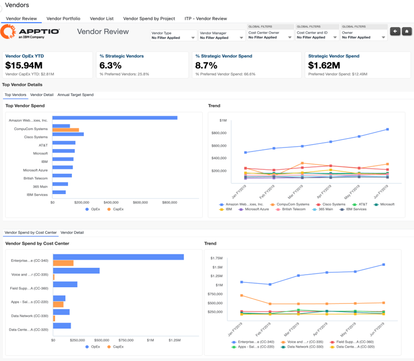
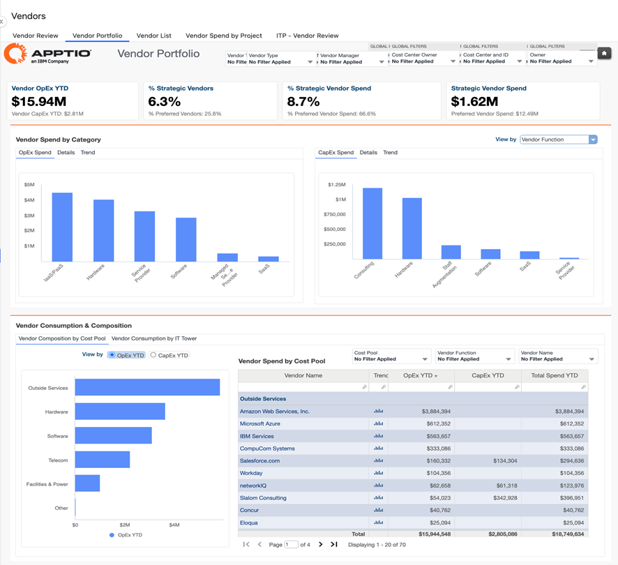
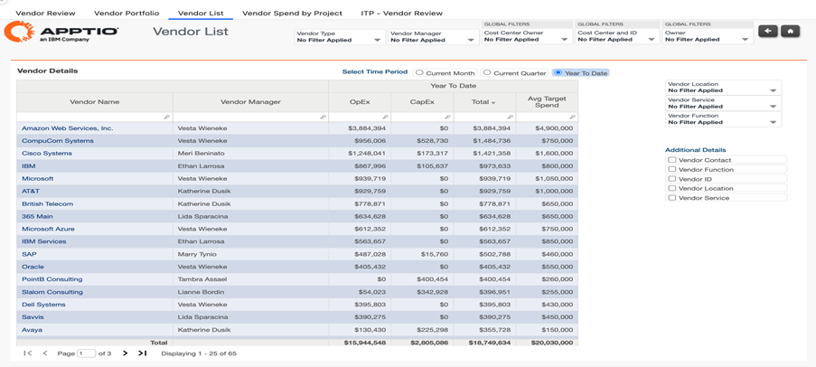
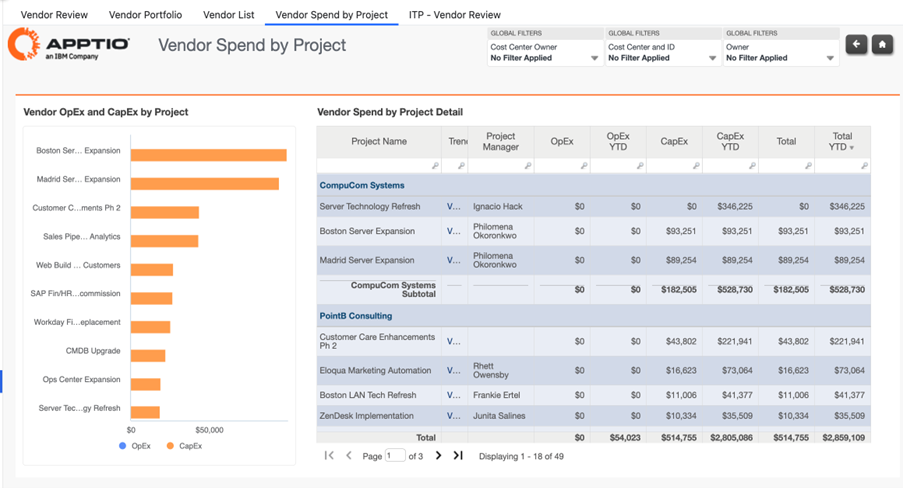

# Vendor Reports

The **Vendor report collection** provides visibility into IT vendor spend across the
organization, helping users understand spend distribution, concentration, and trends across
vendors, portfolios, and projects. These reports focus on vendor spend analysis to support cost
control, rationalization, and optimization decisions.

For deeper visibility into **contracts, purchase orders, or accounts payable**, refer to
the **Vendor Insights reports**, which extend vendor analysis with commercial and
transactional views.

This collection includes:

- **Vendor Review**
- **Vendor Portfolio**
- **Vendor List**
- **Vendor Spend by Project**

Use these reports together to assess vendor concentration and fragmentation, identify top and
redundant vendors, understand vendor contribution to projects and services, and support
informed decisions to rebalance and optimize vendor spend.

## Vendor Review

The Vendor Review report provides visibility into vendor spend distribution and concentration
across the organization. It helps users understand how spend is allocated across vendors,
identify top-spending vendors, and detect changes or variances in vendor spend over time.

Use this report to assess vendor concentration, identify fragmentation or redundancy in the
vendor portfolio, and support decisions to rebalance or optimize vendor spend.

This report is designed for use by the following roles

- **IT Finance**
- **Vendor Managers**
- **Cost Center Owners**

**Insights Provided:**

- Analyze vendor spend distribution by category, including current and trending spend.
- Identify the top vendors by spend and understand their contribution to overall IT
  spend.
- Assess how concentrated or fragmented vendor spend is across the vendor portfolio.
- Identify potential vendor redundancies or opportunities for consolidation.
- Detect variances and changes in vendor spend that may require further investigation.
- Support decisions to rebalance vendor spend to improve cost efficiency and portfolio
  structure.

For more details on how to use the **Vendor Review** report, go [here](https://www.ibm.com/docs/en/apptio-commercial/costing-standard/saas?topic=reports-vendor-review "(Opens in a new tab or window)")

## Vendor Portfolio

The Vendor Portfolio report provides a consolidated
view of vendor spend across the organization, enabling analysis of spend distribution,
concentration, and trends across vendors. It helps users evaluate how vendor spend is
allocated across IT resource towers and cost pools, and how that spend is split between OpEx
and CapEx.

Use this report to understand the overall vendor landscape, assess
portfolio balance, and identify opportunities to optimize or rationalize vendor
spend.

This report is designed for use by the following roles

- **IT Finance**
- **Vendor Managers**
- **Cost Center Owners**

**Insights Provided**

- Analyze vendor spend distribution by category, including current and trending OpEx and
  CapEx spend.
- Review vendor spend by IT resource tower and cost pool to understand where vendors
  contribute across the technology stack.
- Identify top vendors driving overall spend and assess their relative importance in the
  portfolio.
- Assess how concentrated or fragmented vendor spend is across the vendor landscape.
- Identify redundant vendors or overlapping capabilities that may indicate consolidation
  opportunities.

For more details on how to use the **Vendor Portfolio** report, go [here](https://www.ibm.com/docs/en/apptio-commercial/costing-standard/saas?topic=reports-vendor-portfolio "(Opens in a new tab or window)")

## Vendor List

The Vendor List report provides a detailed, tabular view of all vendors and their
associated spend. It enables users to analyze vendor spend across multiple dimensions such
as vendor function, location, and service, while also reviewing OpEx, CapEx, and total spend
in one place.

Use this report to gain a holistic view of the vendor landscape, compare vendors
consistently, and support decisions related to spend rebalancing, consolidation, and
variance investigation.

This report is designed for use by the following roles

- **IT Finance**
- **Vendor Managers**
- **Cost Center Owners**

**Insights provided**

- Analyze vendor spend by function, location, and service to understand how vendors
  support different parts of the organization.
- Review a comprehensive list of vendors with OpEx, CapEx, total spend, and average target
  spend for comparison.
- Assess how fragmented or concentrated vendor spend is across the vendor portfolio.
- Identify potential redundant vendors or overlapping vendor services.
- Detect variances and changes in vendor spend that may require further analysis or
  corrective action.
- Support decisions to rebalance vendor spend and improve portfolio efficiency.

For more details on how to use the **Vendor List** report, go [here](https://www.ibm.com/docs/en/apptio-commercial/costing-standard/saas?topic=reports-vendor-list "(Opens in a new tab or window)")

## Vendor Spend by Project

The Vendor Spend by Project report provides
visibility into vendor-related OpEx and CapEx at the project level. It helps users
understand how vendor spend is distributed across projects and how that spend rolls up by
cost center owner, cost center, and owner.

Use this report to analyze vendor
contribution to project costs, identify spend concentration across projects, and support
decisions to rebalance or optimize vendor spend within the project portfolio.

This
report is designed for use by the following roles

- **IT Finance**
- **Vendor Managers**
- **Project Management Office**

**Insights Provided**

- Analyze vendor spend by cost center owner, cost center, and owner to understand
  accountability for project-related vendor costs.
- Review vendor OpEx and CapEx spend by project to understand how vendors contribute to
  project investments.
- Identify projects with the highest vendor spend and assess opportunities to rebalance or
  optimize spend.
- Assess how fragmented or concentrated vendor spend is across projects and vendors.
- Identify potential redundant vendors supporting similar projects or initiatives.
- Detect variances in vendor spend across projects that may require further
  investigation.

For more details on how to use the **Vendor Spend by Project** report, go [here](https://www.ibm.com/docs/en/apptio-commercial/costing-standard/saas?topic=reports-vendor-spend-by-project "(Opens in a new tab or window)")

