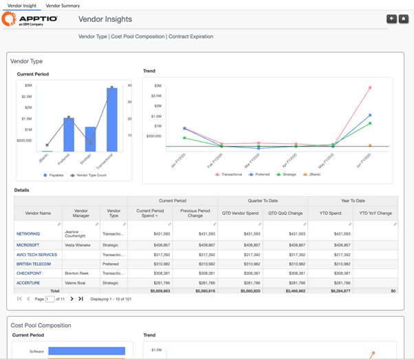
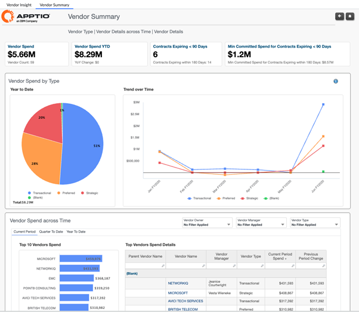
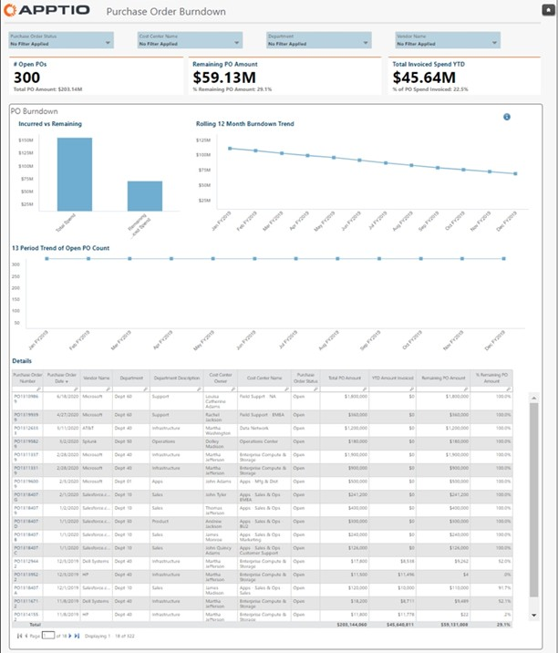
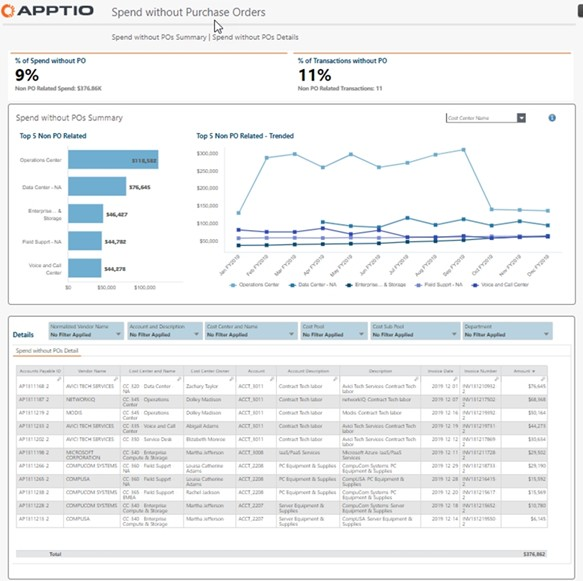
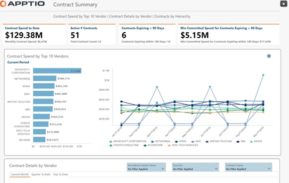
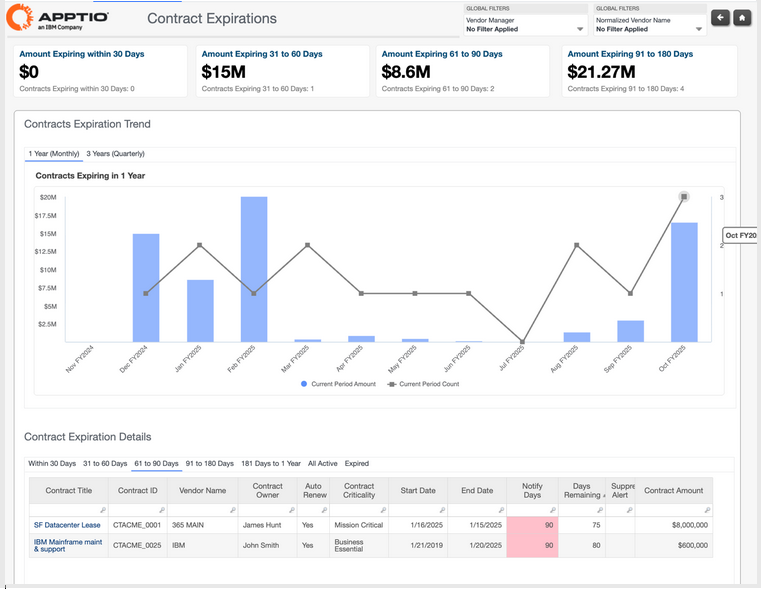
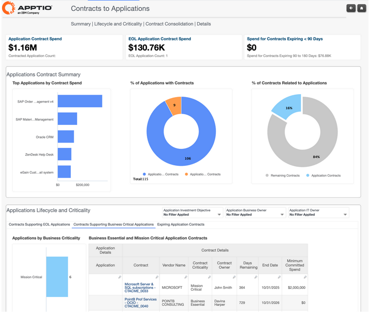
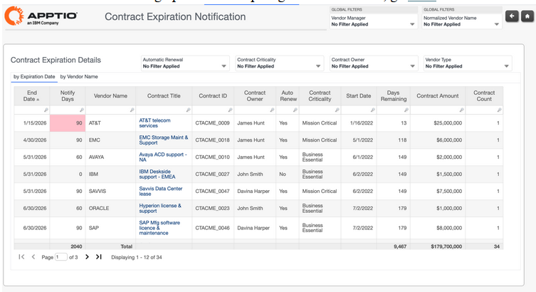
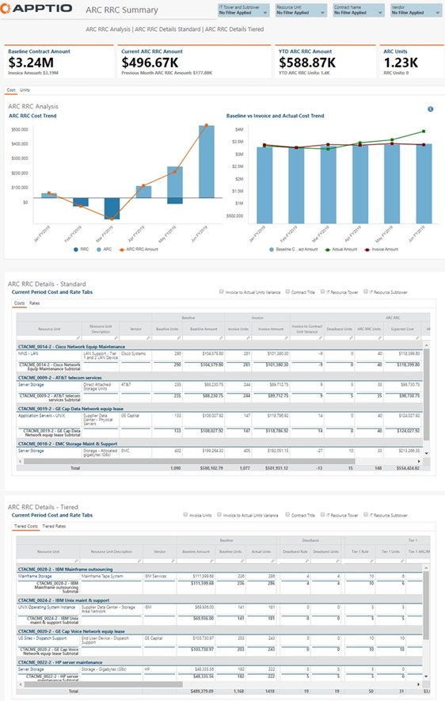
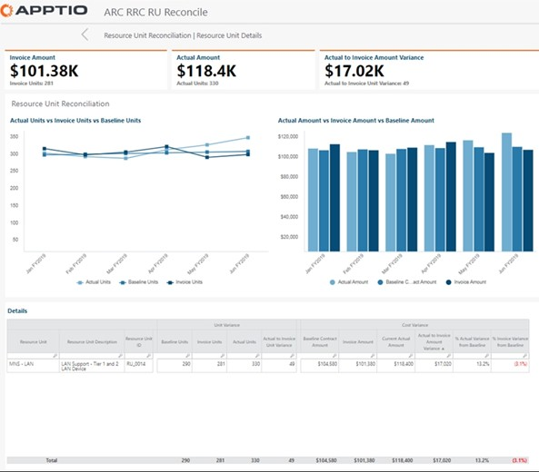

# Vendor Insights Reports

## Vendor Insights Dashboard

The **Vendor Insights** report provides a consolidated view of vendor portfolio spend
across vendor types, cost pools, and contracts. It enables organizations to analyze how
vendor spending is distributed, how it is trending over time, and where contractual risk or
optimization opportunities exist. By combining spend, cost pool composition, and contract
expiration data, this report supports informed vendor management and financial
oversight.

This report is designed for use by the following roles

- CIO and senior IT leadership
- IT Finance Managers
- Vendor Managers
- Application Owners
- Service Owners

**Insights Provided:**

- Analyze vendor distribution by category with current and trending spend to understand
  how spending is allocated across strategic, preferred, and transactional vendors.
- Review vendor spend trends by month, quarter, and year, including accountability by
  vendor manager.
- Identify the largest vendor spend drivers by cost pool and understand how those costs
  change over time.
- Understand the distribution of cost pool spend across vendors to highlight
  concentration, fragmentation, or dependency risks.
- Analyze contract spend and upcoming contract expirations to assess financial exposure
  and renewal priorities.
- Identify spend variances, redundant vendors, and opportunities to rebalance or
  rationalize the vendor portfolio.

For more details on how to use the Vendor Insights report, go [here](../../vendor-insights/vi_content/report-vendor-insights.html). To view
additional information for a specific vendor, select the vendor name in the table to open
the **Vendor Detail** report. For guidance on using the Vendor Detail report, click [here.](../vi_content/report-vendor-detail.html)

## Vendor Summary

The **Vendor Summary** report provides a high-level view of total vendor portfolio
spending across vendor types and over time. It helps organizations understand how vendor
spend is distributed, how it is trending, and whether actual spending aligns with the
defined vendor strategy. By combining spend, time-based trends, and contract expiration
indicators, this report supports executive-level oversight and vendor portfolio
governance.

This report is designed for use by the following roles

- CIO and senior IT leadership
- IT Finance Managers
- Vendor Managers
- Application Owners
- Service Owners

**Insights Provided:**

- Understand total vendor spend for the current period and year to date, including changes
  compared to the prior year.
- Analyze vendor spend by vendor type (Strategic, Preferred, Transactional) to assess
  alignment with vendor strategy.
- Track vendor spend trends over time to identify growth, consolidation, or emerging
  risks.
- Identify top-spending vendors and understand their contribution to overall vendor
  spend.
- Monitor upcoming contract expirations and minimum committed spend to assess renewal and
  financial exposure.
- Evaluate how fragmented or concentrated vendor spend is across the portfolio and
  identify opportunities to rebalance or rationalize vendors.

For more details on how to use the **Vendor Summary** report, go [here.](../vi_content/report-vendor-summary.dita "(Opens in a new tab or window)") To view additional information for a specific vendor, select the vendor name
in the table to open the **Vendor Detail** report. For guidance on using the Vendor
Detail report, click [here.](../vi_content/report-vendor-detail.dita "(Opens in a new tab or window)")

## Purchase Order Burndown

The **Purchase Order Burndown** report provides visibility into purchase order
consumption over time, helping organizations monitor how purchase orders are being utilized
against their authorized amounts. It enables early identification of purchase orders that
are nearing exhaustion or may no longer be required, supporting better spend control and
proactive decision-making.

This report is designed for use by the following roles

- CIO and senior IT leadership
- IT Finance Managers
- Vendor Managers

**Insights Provided:**

- Identify purchase orders that are approaching their authorized spend limits and may
  require action.
- Detect purchase orders with remaining balances that may be candidates for cancellation
  or adjustment.
- Monitor purchase order consumption trends to support ongoing spend oversight.
- Improve governance by highlighting purchase orders that require closer review or
  follow-up.

For more details on how to use the **Purchase Order Burndown** report, go [here.](../vi_content/report-po-burndown.dita "(Opens in a new tab or window)")

## Spend without POs

The **Spend without POs** report provides visibility into vendor payments that are not
associated with a purchase order. It helps organizations identify spend occurring outside
established procurement controls and supports improved oversight of vendor payments.

Use this report to understand where non-PO spend exists, assess compliance with purchasing
policies, and identify potential gaps in vendor governance.

This report is designed for use by the following roles

- CIO and senior IT leadership
- IT Finance Managers
- Vendor Managers

**Insights Provided:**

- Identify vendors receiving payments without an associated purchase order.
- Detect spend occurring outside approved procurement processes.
- Understand the scale and distribution of non-PO spend across vendors.
- Support improved purchasing controls by highlighting vendors not present in the vendor
  list.

For more details on how to use the **Spend without POs** report, go [here.](../vi_content/report-spend-without-po.dita "(Opens in a new tab or window)")

## Contract Summary

The **Contract Summary** report provides a consolidated view of vendor contract spend
and contract details over time. It enables organizations to analyze contract spend by
vendor, track progress against contractual commitments, and proactively manage renewals and
expirations. By combining spend, contract timelines, and performance indicators, this report
supports informed contract governance and risk management.

This report is designed for use by the following roles

- CIO and senior IT leadership
- IT Finance Managers
- Vendor Managers

**Insights Provided:**

- Review contract spend year to date and current-period spend to understand overall
  contract consumption.
- Identify the top vendors by contract spend and analyze how contract spend trends over
  time.
- Monitor active contracts and detect contracts nearing expiration to support timely
  renewal or renegotiation.
- Assess whether actual spend is aligned with minimum committed spend and contractual
  obligations.
- Analyze contract details, including business terms, renewal and expiration dates, and
  spend distribution.
- Evaluate contract performance indicators, including ARC/RRC-related metrics where
  applicable, to verify service delivery and cost alignment.

For more details on how to use the **Contract Summary** report, go [here.](../vi_content/report-contract-summary.dita "(Opens in a new tab or window)") To view additional information for a specific contract, select the contract
name in the table to open the **Contract Detail** report. For guidance on using the
Vendor Detail report, click [here.](../vi_content/report-contract-detail.dita "(Opens in a new tab or window)")

## Contract Expiration

The **Contract Expiration** report provides visibility into upcoming vendor contract
expirations to support proactive renewal planning and risk management. It helps
organizations identify which contracts are nearing expiration, understand the financial
impact of those expirations, and prioritize renewal or renegotiation activities.

By combining contract timelines, spend impact, and trend analysis, this report enables
better planning and coordination across finance, vendor management, and service owners.

This report is designed for use by the following roles

- Vendor Managers
- IT Finance Managers

**Insights Provided:**

- Identify contracts that are expiring in the near term and understand when renewals are
  required.
- Analyze the amount of spend associated with contracts expiring across different time
  horizons.
- Understand upcoming contract expiration trends to assess renewal workload and financial
  exposure.
- Review detailed information for expiring contracts, including vendor, contract amount,
  and remaining days.
- Identify critical contracts and the services or applications they support to prioritize
  renewal actions.
- Support proactive notification and alerting for contracts that are approaching or past
  expiration.

For more details on how to use the **Contract Expiration** report, go [here.](../vi_content/report-contract-expiration-12-6.dita "(Opens in a new tab or window)") To view additional information for a specific contract, select the contract
name in the table to open the **Contract Detail** report. For guidance on using the
Vendor Detail report, click [here.](../vi_content/report-contract-detail.dita "(Opens in a new tab or window)")

## Contract to Applications

The **Contract to Applications** report provides visibility into vendor contracts in the
context of the applications they support. It helps organizations evaluate contract renewals,
consolidation opportunities, and risk by understanding how contracts align to application
portfolios and lifecycle decisions.

Use this report to assess whether contracts continue to be required based on application
usage, business criticality, and planned retirements.

**This report is designed for use by the following roles:**

- CIO and senior IT leadership
- Application Owners
- Service Owners
- IT Finance Managers
- Vendor Managers

**Insights Provided:**

- Identify contracts associated with applications targeted for retirement or
  decommissioning.
- Understand which contracts support business-critical applications.
- Detect overlapping contracts supporting the same or similar applications that may be
  candidates for consolidation.
- Assess contract relevance and renewal priorities based on application lifecycle and
  dependency.
- Support informed contract renewal and rationalization decisions by aligning contracts to
  application strategy.

For more details on how to use the **Contract to Applications** report, go [here.](../vi_content/report-contract-applications.dita "(Opens in a new tab or window)") To view additional information for a specific contract, select the contract
name in the table to open the **Contract** **Detail** report. For guidance on using
the Vendor Detail report, click [here.](../vi_content/report-contract-detail.dita "(Opens in a new tab or window)")

## Contract Expiration Notification

The **Contract Expiration Notification** report helps organizations proactively manage
vendor contracts by providing timely visibility into upcoming contract expirations and
renewals. As vendor portfolios grow, this report reduces the risk of unintended
auto-renewals, missed renegotiation opportunities, and unexpected cost increases by ensuring
stakeholders are informed at the right time.

The report can be accessed directly or opened from automated email alerts triggered when
contract expiration thresholds are met, supporting coordinated decision-making across
finance, IT, and vendor management teams.

**This report is designed for use by the following roles:**

- Contract Owners
- Vendor Managers

**Insights Provided:**

- Identify which contracts are expiring and the remaining time before expiration.
- Highlight contracts that require immediate attention based on expiration date, renewal
  status, or criticality.
- Ensure stakeholders are informed of contract changes, renewals, or expirations through
  alert-driven notifications.
- Understand which contracts are mission-critical, business-essential, or strategic and
  the services they support.
- Support renewal, renegotiation, or exit decisions by providing clear ownership, vendor
  context, and timing visibility.

For more details on how to use the **Contract Expiration Notification** report, go [here.](../vi_content/report-contract-expiration-notification.dita "(Opens in a new tab or window)") For more information on setting up alerts for expiring
vendor contracts, go [here.](../vi_content/alerts.dita "(Opens in a new tab or window)")

## ARC RRC Summary

The ARC RRC Summary report provides visibility into Additional Resource Charge (ARC) and
Reduced Resource Credit (RRC) contract behavior by analyzing resource unit consumption
against contracted thresholds and pricing. It helps organizations understand whether changes
in service consumption are being billed or credited correctly and whether ARC/RRC contract
terms remain cost-effective over time. The report supports both standard and tiered ARC/RRC
structures, depending on how contracts are configured.

This report is designed for use by the following roles:

- CIO and senior IT leadership
- IT Finance Managers
- Vendor Managers

**Insights Provided:**

- Understand whether resource consumption is staying within defined ARC/RRC deadband
  thresholds.
- Verify that additional charges or credits are applied at the correct rates based on
  actual resource usage.
- Analyze resource unit consumption trends to assess efficiency and cost control.
- Evaluate whether ARC/RRC contracts continue to deliver value based on usage patterns and
  pricing.
- Identify changes in consumed resource quantities that may require contract review or
  renegotiation.
- Drill into resource unit–level details to reconcile billed usage using the ARC RRC RU
  Reconcile report.

For more details on how to use the ARC RRC Summary report, go [here.](../vi_content/report-arcrrc-summary.dita "(Opens in a new tab or window)")

## ARC RRC RU Reconcile

The ARC RRC RU Reconcile report provides a detailed, unit-level view of Additional Resource
Charge (ARC) and Reduced Resource Credit (RRC) contracts. It enables analysis of individual
resource units by comparing invoiced quantities and prices against baseline thresholds and
actual usage tracked in the environment.

This report is designed for use by the following roles:

- CIO and senior IT leadership
- Application Owners
- Service Owners
- IT Finance Managers
- Vendor Managers

**Insights Provided:**

- Analyze ARC/RRC contract terms at the individual resource unit level.
- Review resource unit quantities, pricing, and baseline thresholds defined in the
  contract.
- Compare vendor-invoiced resource units against actual usage tracked in the
  environment.
- Identify discrepancies between invoiced charges and actual consumption.
- Validate whether ARC/RRC charges or credits are being applied accurately.
- Support decisions on contract optimization, dispute resolution, and vendor performance
  review.

For more details on how to use the ARC RRC RU Reconcile report, go [here.](../vi_content/report-arcrrcru-reconcile.dita "(Opens in a new tab or window)")

