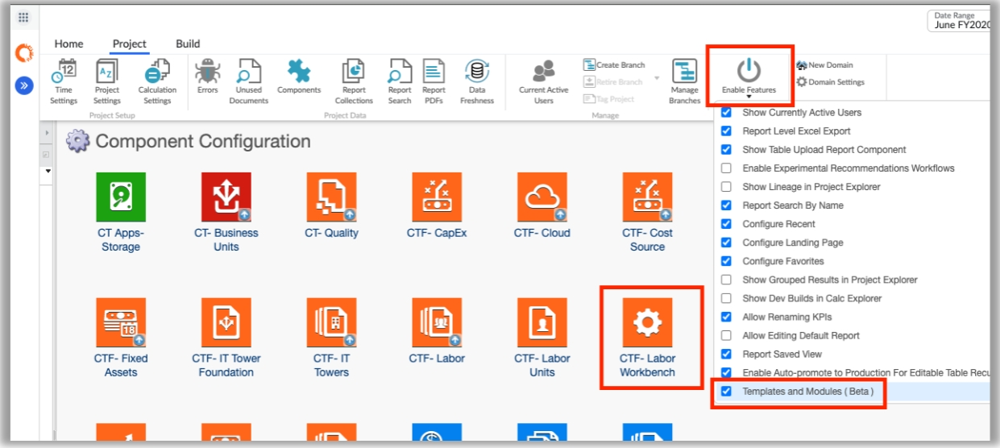
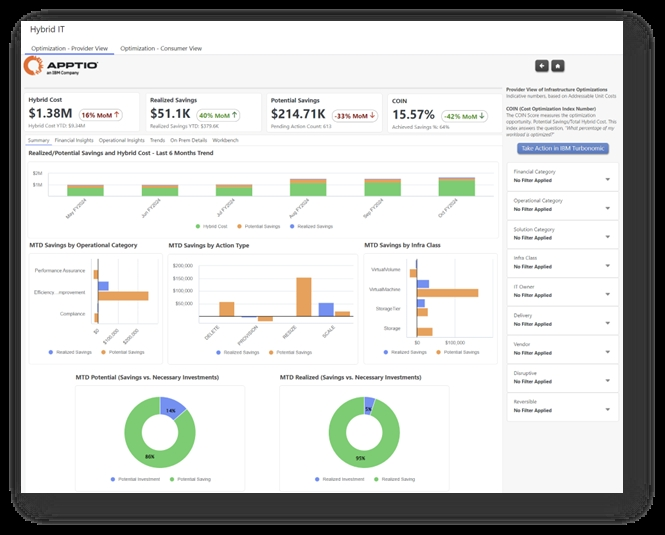
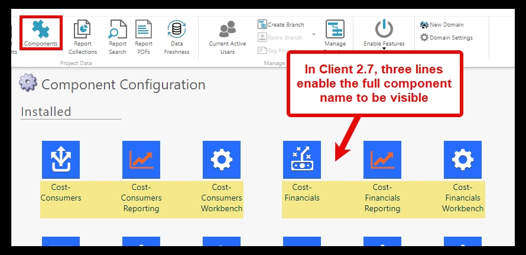
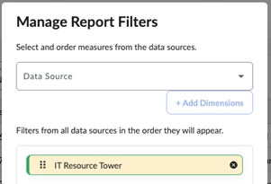
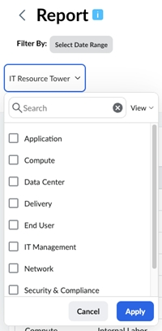
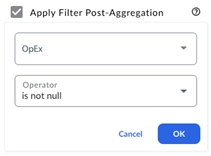

# 2024 Release Notes

This section describes all of the Costing Standard application content changes only. To learn
about the TBM Studio Server and Client release changes, see  [What’s New in TBM Studio](../../studio/whats-new.html)  .

## Server 12.11.10 & Application Template 8160 release - November 22, 2024

 **Labor Workbench for CT Configurations (BETA, v120)** 

This new feature enables
admins and business unit owners to easily map labor resources to IT Towers using editable tables,
and optionally to Applications. To get started, admins can install the "CTF- Labor Workbench"
Component, which includes the Labor Workbench report and editable tables. End users can then modify
labor to IT Towers mapping within Apptio reports and use it in conjunction with Time Tracking. A
configuration guide is available to provide step-by-step setup instructions.

To know more, see [Costing Standard Workbench](../workbench/introduction.html)  .

## Apptio Community Transition to IBM TechXchange - November 1, 2024

Today, Apptio Community has fully transitioned to IBM TechXchange.

Use and bookmark  [this new homepage](https://community.ibm.com/community/user/apptio/home "(Opens in a new tab or window)")  for the Apptio topic groups.

- Access the topic group that is relevant to your needs; Some of the topic groups with which you
  are familiar have been combined into new topic groups.

The following topic groups are available:

- [Apptio](https://community.ibm.com/community/user/apptio/communities/community-home?communitykey=4100dfb8-fc23-4203-83c7-019253cf7c0b "(Opens in a new tab or window)")  : Costing Essentials, Costing Standard (CT-Foundation), Apptio Planning (ITP/ITFMF), Billing (Billing Standard), Benchmarking (Benchmarking), ServiceNow Integration

  - [Planning Release Notes](https://community.ibm.com/community/user/apptio/viewdocument/apptio-planning-whats-new-cumula?communitykey=4100dfb8-fc23-4203-83c7-019253cf7c0b&tab=librarydocuments "(Opens in a new tab or window)")
  - [TBM Studio and Applications Release Notes](https://community.ibm.com/community/user/apptio/viewdocument/tbm-studio-and-applications-r12-rel?communitykey=44bcb0d2-5ce6-4504-89eb-019253d3b5d8&tab=librarydocuments "(Opens in a new tab or window)")
- [Cloudability](https://community.ibm.com/community/user/apptio/communities/community-home?communitykey=15c0e07d-35c0-49de-a84b-019253d13376 "(Opens in a new tab or window)")  : Cloudability Financial Planning, Cloudability TotalCost,
  Apptio Turbonomic Integration
- [Targetprocess](https://community.ibm.com/community/user/apptio/communities/community-home?CommunityKey=55a3712d-1835-4ec2-bcd7-603e88cd9dd2 "(Opens in a new tab or window)")
- [Platform](https://community.ibm.com/community/user/apptio/communities/community-home?communitykey=44bcb0d2-5ce6-4504-89eb-019253d3b5d8 "(Opens in a new tab or window)")  : Apptio BI, ATUM, Automated Data Management, DataLink,
  Frontdoor, TBM Studio
- [Apptio for All](https://community.ibm.com/community/user/apptio/communities/community-home?communitykey=2e85ed45-9b8a-486c-bd55-019253d466eb "(Opens in a new tab or window)")

- Once you are in your topic group, read and contribute to all the usual content such as quick
  links, discussions, questions, and blogs.
- Check out  [these
  resources](https://community.ibm.com/community/user/participate/resources "(Opens in a new tab or window)")  on how to navigate and utilize community.
- Start submitting Requests for Enhancements on  [IBM Ideas](https://login.ibm.com/idaas/mtfim/sps/idaas/login?client_id=nwnjmzc5njetmzlkyi00&target=https%3a%2f%2flogin.ibm.com%2foidc%2fendpoint%2fdefault%2fauthorize%3fqsid%3dc75ff073-50e8-4426-8979-7e4b6b992e80%26client_id%3dnwnjmzc5njetmzlkyi00 "(Opens in a new tab or window)")  .

  - IBM uses a unified ideas portal at   [ideas.ibm.com](https://ideas.ibm.com/ "(Opens in a new tab or window)")   for you to raise ideas against all products. As of today,
    that list has expanded to include the products recently acquired from Apptio. Ideas submitted prior
    to the acquisition will be made available to product teams and may be added to the portal at a
    future date to ensure continuity.

Contact the community team at our new email,   [support@communitysite.ibm.com](mailto:support@communitysite.ibm.com "(Opens in a new tab or window)") 
with any questions or needs.

## Server 12.11.9 & Application Template - 8111 release - October 11, 2024

**New Application features**

**IBM Apptio Costing Standard + IBM Turbonomic Integration EA**

Today, we launched the first native integration between IBM Turbonomic and IBM Apptio, available
via Early Access, with release 8.13.6 and release R12.11.9 respectively.

End users of IBM Apptio Costing, including IT Finance, Service and Application Owners, now are
able to expand their Hybrid IT costing perspective to include aggregated optimization views of their
Hybrid IT. Through a prescriptive integration, IBM Turbonomic’s optimization opportunities (Pending
and Executed Actions) are sent into Apptio, where the recommendations are quantified, visualized and
aligned to the TBM Solutions framework.

- **Prescriptive integration between Turbonomic and Apptio, powered by new components** : A new IBM Apptio Target Type is available in Turbonomic facilitating the prescriptive
  integration, by pushing - granular On Prem and aggregated Cloud - Pending & Executed actions
  into Apptio.

  

  Turbonomic’s new Apptio Target Type

  Three new TBM Studio Content Components
  (v120 template) are available in IBM Apptio created to standardize, quantify and provide reporting
  on the Hybrid IT optimization opportunities.

  

  Apptio’s new content
  components

  - **IBM Turbonomic – Actions**  : Enables the integration of IBM Turbonomic’s
    Action data into Apptio. Installs various datasets that automate the ingestion and normalization of
    the Pending and Executed Action data, across both On Prem and Cloud.
  - **Hybrid IT Optimization**  : Creates a new, parallel Hybrid IT model
    framework. Installs various master data sets, models and metrics facilitating the quantification
    & allocation of the Hybrid IT optimization opportunities.
  - **Hybrid IT Optimization - Reporting**  : Empowers end users with 2 new Hybrid
    IT Optimization reports. A provider view report, targeted for IT Finance and Technical Service
    Owners and a consumer view report for Application Owners.

  With these components, your Optimization Insights from Turbonomic can be seamlessly imported
  to Apptio, quantified and visualized to empower your IT Finance, Service and Application owners with
  actionable insights directly in Apptio. For more information, see the  [configuration](../technology-integration/configuations.html)  guide.
- **Hybrid IT Optimization visibility with quantified Potential and Realized Savings**  :
  Leveraging the Apptio cost model, the integration facilitates the ingestion, modelling and
  quantification of potential and realized savings of the optimization opportunities. The optimization
  insights are presented through the TBM framework, allowing users such as Application Owners to
  assess the recommendations in the context of their own portfolios, ensuring savings are easily tied
  to the organization's reporting structure and key dimensions. The Cost Optimization Index (COIN) is
  used to drive accountability to ensure workloads are being optimized.

  Users can see the savings
  achieved in terms of the direct savings, delayed savings, and costs avoidance. Via the link back to
  IBM Turbonomic, stakeholders can further collaborate to drive continuous financial & operational
  excellence. For more information, see the  [configuration](../technology-integration/configuations.html)  guide.

  

  Apptio’s
  new Hybrid IT Optimization reporting, incl. Provider and Consumer views

## Server 12.11.8 & Application Template v120 - 8038 release - August 16, 2024

**New Application features**

No new application content features.

## Server 12.11.7 & Application Template v120 - 8008 release - July 5, 2024

**New Application features** 

**Component name displays 3 lines of text**

The Components feature has been upgraded to display three lines of text, ensuring that the full
names of components are visible. This enhancement offers several benefits: Facilitates the ability
to utilize existing components as part of the Costing Standard solution. Simplifies the transition
to future report content in the New Report Designer. Allows to differentiate between components with
longer names, such as Cost Consumers, Cost Consumers – Reporting, and Cost Consumers – Workbench.

Previously, the component names appeared in two lines and were creating confusion with longer
names.

## Server 12.11.6 & Application Template v120 - 7985 release - May 24, 2024

**New Application features**

No new application content features.

## Server 12.11.5 & Application Template v120 -7974 release - April 12, 2024

**New Application features**

No new application content features.

## Server 12.11.4 & Application Template v110 - 7969 release - March 1, 2024

**New Application features**

**SaaS Insights deprecated (v110)**

In Template v110, the SaaS Insights components are moved behind beta and should no longer be
used. Existing SaaS Insights customers will be able to continue to use the Salesforce, ServiceNow,
and Office365 analytics. Support and enhancements will not be available.

## CT release 12.11.4 - March 1, 2024

**Filtering enhancements for Costing Standard customers using Apptio BI**

Starting today, users can quickly and easily filter out data to get to the most important
information. Before this release, Costing Standard users were not able to filter out information in
such an effective way.

**Enhancements** 

- Report-level filters
- Compound filtering with pre and post aggregation options
- Null value filtering.

**Feature 1: Report-level filters**

This enhancement allows users to configure filters on the report level and apply them to all the
visualizations belonging to this report. Once created the report level filters are visible at the
top of the report.

Steps to create a report-level filter:

1. In the top right corner of a report, select and go to  **Mange Report Filters**.
2. From the  **Data Source**  list, select the required data source.
3. Select  **Add Dimensions**  and then select the dimension you want the filter
   to be based on.
4. Select  **Apply** .

   

   

   For more information, see  [Report-level filters](../../apptio_bi/self-service-reporting_user_guide/bi-create-and-manage-report-filters.html)  .

**Feature 2: Compound filtering with pre and post aggregation options**

This enhancement allows users to create complex queries to filter out the most important
information. It is available in edit mode and allows users to define statements with multiple AND
and OR operations which can be applied pre or post aggregation. Pre-aggregation will apply the
filter to each individual line of the dataset, while post-aggregation will apply the filter after
the data has been aggregated.

Steps to create a report-level filter:

1. In edit mode scroll down through the left side navigation panel till you get to **Filters**  .
2. Select if the filter should be applied pre or post aggregation.
3. Define the query which you want to be processed by selecting appropriate measures, operators and
   values.
4. Combine the queries using AND and OR junctions if required.

   

**Feature 3: Null value filtering**

This enhancement allows users to easily filter out null values and focus on the most relevant
information.

Steps to apply null value filtering:

- In edit mode scroll down through the left side navigation panel till you get to Filters.
- Select if the filter should be applied pre or post aggregation.
- Choose the measure you want to filter.
- As the  **Operator**  select: “is null” or “is not null” depending on the
  information you want to see.
- Select  **OK**  .

  

## Server 12.11.3 & Application Template v110 -7952 release - January 19, 2024

**New Application features**

No new application content features.
