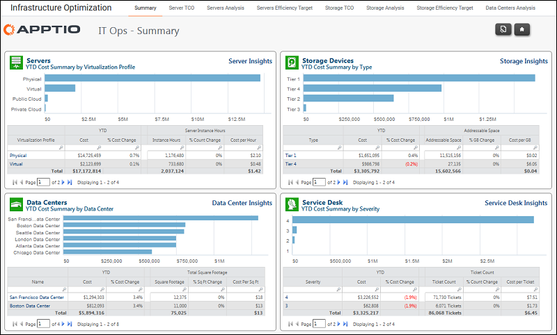

# About the IT Infrastructure and Operations reports

Applies to: Costing Standard 11.8.x running on either TBM Studio v12
or TBM Studio v11.

The IT Infrastructure and Operations reports focus on server, storage, and data center spend and
use, and service desk activity.

Use the IT Infrastructure and Operations reports to analyze spend and use for servers, storage,
and data centers, and service desk activity.

The reports present information on:

- Servers efficiency targets: allocated costs vs. corporate targets for memory and CPUs.
- Storage efficiency targets: allocated and utilization costs vs. corporate targets.
- Storage: cost, volume count, available space, and percent used.
- Data centers: cost per RU, square foot, and kwh, RU availability, power capacity.
- Service desk: ticket costs and counts.

To access the IT Operations reports, click IT Infra & Operations on the Home page. The IT
Operations Summary report is displayed as shown below. Use the tabs across the top of the report to
navigate to the other reports.

