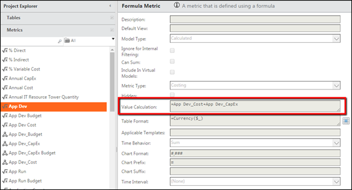
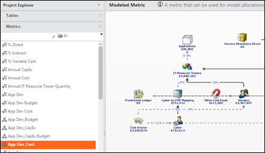
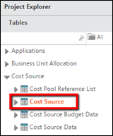
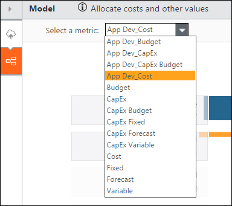
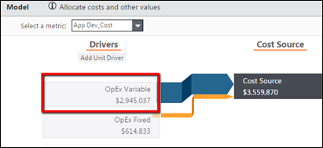
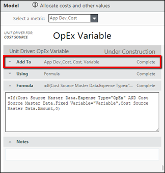
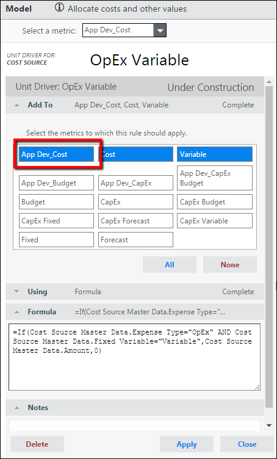
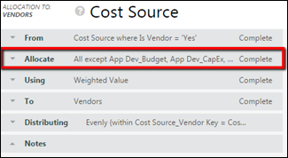
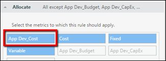
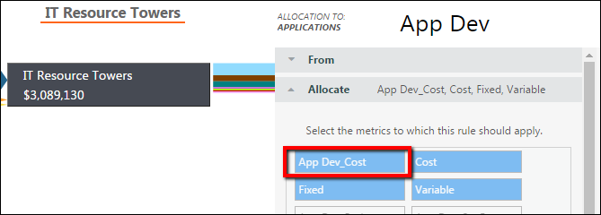

# App Dev Reporting and Allocations

Applies to: v12+

## Overview

Trying to figure out why your App Dev costs are:

- Not looking correct?
- Too low?
- Not populating?

Are you asking the questions:

- How are the App Dev costs calculated?
- What is App Dev\_Cost and App Dev\_CapEx?
- How do I get dollars into the App Dev\_Cost Model?
- How do I ensure that App Dev costs are flowing through the model?
- How do I directly affect the amount displayed in the App Dev reporting?

The following information walks you through how App Dev Costs are set up in TBM Studio v12 and
how you can edit these costs.

## How are App Dev costs created?

The App Dev costs are created from the App Dev metric, which is calculated by adding the App
Dev\_Cost and the App Dev\_CapEx values.

## What is App Dev\_Cost and App Dev\_CapEx?

Both App Dev\_Cost and App Dev\_CapEx are out-of-the-box models that run in parallel to the
out-of-the-box Cost model.

## How do I get dollars into the App Dev\_Cost model?

There are a few steps that have to follow to ensure that there are values populating in the App
Dev\_Cost model:

1. Click the **Cost Source** table.

   
2. Select the **App Dev\_Cost** metric in the **Model** dropdown menu.

   
3. Click on the **OpEx Variable** driver.

   
4. Click on the **Add To** dropdown menu.

   
5. Make sure that the **App Dev\_Cost** button is selected.

   

You will need to add the App Dev\_Cost button to all of the drivers utilized in your Cost model.
The drivers are: OpEx Variable, OpEx Fixed, CapEx Variable, and CapEx Fixed.

## How do I ensure that App Dev costs are flowing through the model?

To ensure that the App Dev\_Cost Model is functioning correctly, and flowing dollars, you will
have to enable the App Dev\_Cost allocation. To do this, select the App Dev\_Cost button in the
allocation line "Allocate" dropdown window. This selection will have to be made in all allocation
lines leading up to IT Resource Towers.

## How do I directly affect the amount displayed in the App Dev reporting?

To affect the dollar amount that is tied to the App Dev reporting, you will have to select the
App Dev\_Cost button for allocation lines flowing out of IT Resource Towers dealing with App Dev
costs. For example, if you want to have all costs from the IT Resource Sub Tower of App Dev
displayed in the App Dev reporting, then select the App Dev\_Cost button for the allocation line
between IT Resource Towers and Applications.

The App Dev reports will only display cost from Allocation Lines that have the App Dev\_Cost
button selected. Apptio will not
align any costs to App Dev if the App Dev\_Cost button is not selected in the allocation line flowing
into the Applications Object.

## Key Takeaways

- Any allocation lines below IT Resource Towers will have to have the App Dev\_Cost button
  selected.
- Only the allocation lines that are flowing directly into the Applications object, and have the
  App Dev\_Cost button selected, will be displayed as App Dev costs in the reporting.
- The amount displayed in the App Dev reports is the sum total of all Allocation lines flowing
  directly to the Applications object with the App Dev\_Cost button selected.
