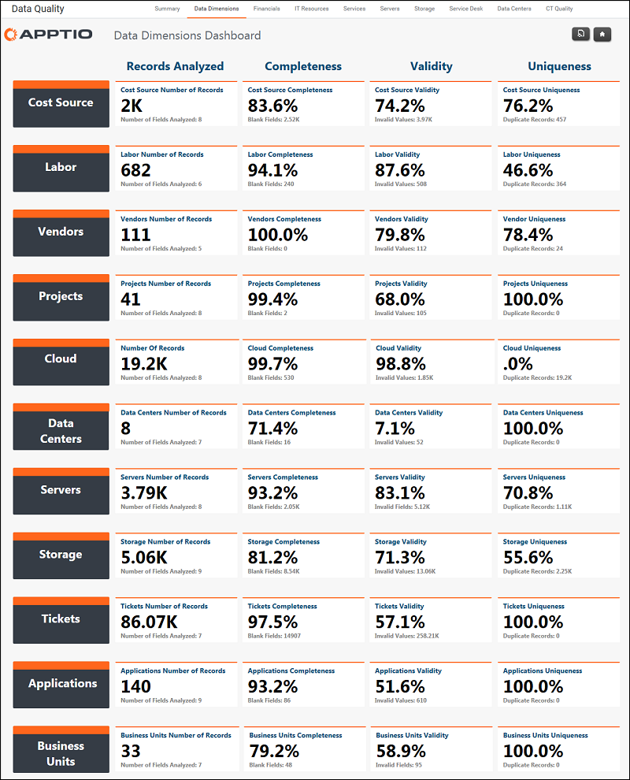

# Data Quality - Data Dimensions

Applies to: Costing Standard 11.8.x running on either TBM Studio v12
or TBM Studio v11.

## Introduction

Use this report to assess the completeness, validity, and uniqueness of the data for cost
sources, labor, vendors, projects, data centers, servers, storage, tickets, applications, and
business units. Click a dimension to see a detailed report for the dimension.

## Navigation

Data Quality > Data Dimensions

## Roles

This report is designed for TBM administrators.

## Objectives

Use this report to:

- Assess the completeness of data. Completeness is measured as the number of cells in the
  supporting data sets that have values. For example, a completeness score of 80% indicates that 80%
  of the cells have values.
- Assess the validity of the data. Validity is determined by comparing the values in the data
  to a list of acceptable values you uploaded into the application.
- Assess the uniqueness of the data. Uniqueness indicates if the values in the key column of a
  table are unique, or if there are duplicates. Duplicates are not necessarily bad depending on the
  nature of the data in the table.

## Questions answered

The information presented on this report can be used to answer the following questions:

- Is my data complete enough to make informed decisions?
- Is the data correct?

## Next actions

- Click a data source (e.g.: Cost Source, Labor, etc.) to see Completeness, Validity, and
  Uniqueness reports.
- For areas that do not have enough data, look for ways to gather more complete data.
- If there is incorrect data, check the data sources and determine the cause for the incorrect
  data.
