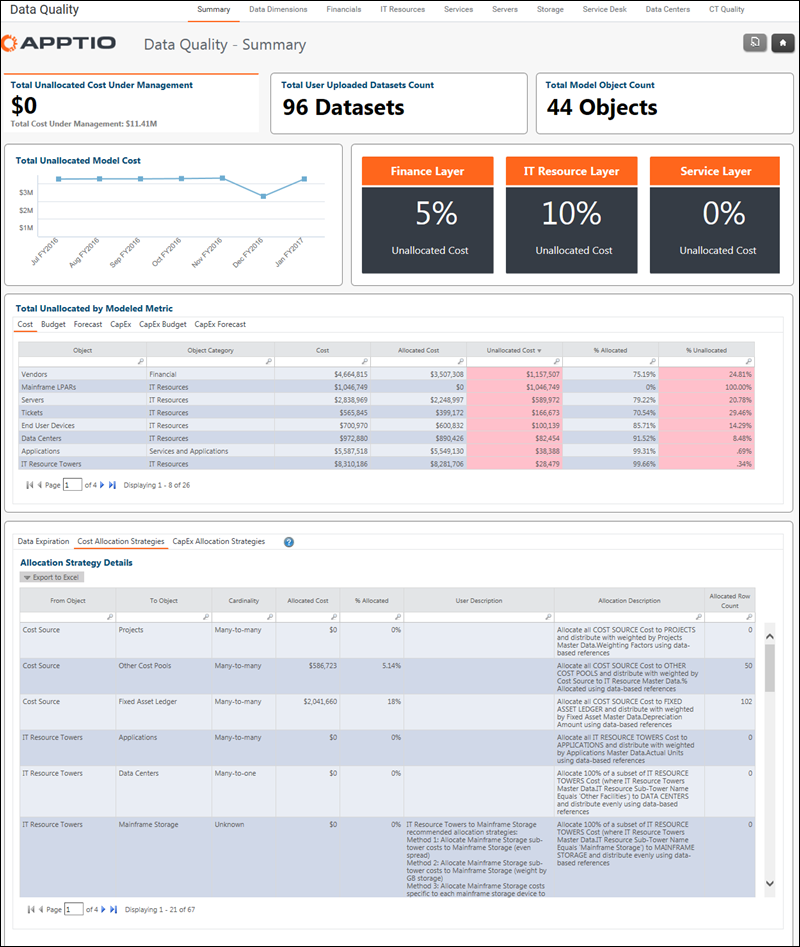

# Data Quality - Summary report

Applies to: Costing Standard 11.8.x running on either TBM Studio v12
or TBM Studio v11.

## Introduction

The Summary report focuses on unallocated cost trends over time.

## Navigation

Data Quality > Summary

## Roles

This report is designed for TBM administrators.

## Objectives

Use the top part of the report to:

- Analyze unallocated cost trends over time.
- Understand percent of costs allocated up the model layers: Finance to IT Towers, IT Towers to
  Apps & Services, and Apps & Services to Business Units.

Use the bottom part of the report to:

- Review allocation strategies for specific Objects in the model (e.g. Cost Source to Labor, Cost
  Source to Fixed Assets, etc.).
- Identify unallocated costs by allocation.
- View "user friendly description" of allocation strategies.
- Verify timeliness of uploaded data.

## Questions answered

Use the information presented in the top part of the report to answer the following
questions:

- Are all my costs from the Cost Source flowing up the cost model?
- Are my unallocated costs getting smaller over time as I improve data and refine the
  allocations?
- Where should I focus attention to correct any major gaps?

Use the information presented in the bottom part of the report to answer the following
questions:

- Which of my allocation strategies have unallocated costs?
- What are my largest gaps so I can prioritize and focus on those areas?
- What is the allocation strategy trying to accomplish in business terms?

## Next actions

- If variance is immaterial, no concern or action is needed.
- Click on a specific account to see transaction level details.
- Click on a specific cost center to see transaction level details.
- Go to Studio to improve allocations through model and data set changes.
- Refresh "stale" data sets with new data.

## Related information

- [Send feedback about
  Help Center](productfeedback@apptio.com "(Opens in a new tab or window)")
