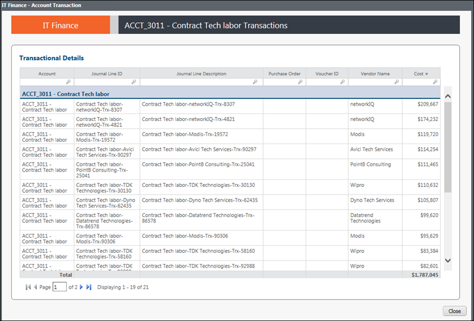

# IT Finance - Account Variance - Transaction Details report (v103)

Applies to: Costing Standard 11.8.x running on either TBM Studio v12
or TBM Studio v11.

## Introduction

Use this report to identify specific transactions that were incurred for the current period for a
specific account.

## Navigation

IT Finance > Account Variance > Account

## Roles

This report is designed for IT Finance personnel.

## Objectives

Use this report to identify specific transactions that were incurred for the current period for a
specific account.

## Questions answered

You can use the information presented on this report to answer the following questions:

- Do I recognize what these transactions are for?
- Does the amount for a particular transaction seem abnormal?
- Were any transactions entered incorrectly? Do they belong to a different account?
- Do any transactions look like they should have been incurred in a previous period and were
  processed late?

## Next actions

- If a transaction has been entered incorrectly, contact the Account owner to correct or document with an explanation.
- Pull further transaction details from the Accounts Payable sub-ledger or financial system of record.
