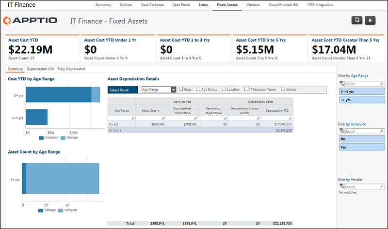

# IT Finance - Fixed Assets - Summary report (v103)

Applies to: Costing Standard 11.8.x running on either [TBM Studio v12](https://community.apptio.com/community/apptio/product-central/tbm-studio/studio-v12 "(Opens in a new tab or window)") or [TBM Studio v11](https://community.apptio.com/community/apptio/product-central/tbm-studio/studio-v11 "(Opens in a new tab or window)").

## Introduction

Use this report to identify the current and projected depreciation of fixed assets.

## Navigation

IT Finance > Fixed Assets > Summary

## Roles

This report is designed for:

- IT Finance personnel
- Cost Center Owner

## Objectives

Use this report to identify the current and projected depreciation of fixed assets.

## Questions answered

You can use the information presented on this report to answer the following questions:

- What is the current depreciation of assets?
- When will assets be fully depreciated?
- Where will my greatest spend be to replace depreciated assets?

## Next actions

- Review the remaining life of assets by clicking the Depreciation LIM tab.
- Review assets that are fully depreciated by clicking the Fully Depreciated tab.

## Related information

- [Send feedback about
  Help Center](productfeedback@apptio.com "(Opens in a new tab or window)")
