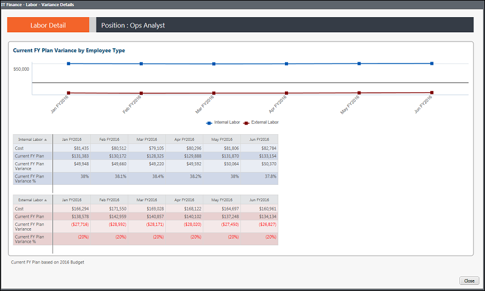

# IT Finance - Labor Details - Budget Variance - 13-month Trend report (v103)

Applies to: Costing Standard 11.8.x running on either TBM Studio v12
or TBM Studio v11.

## Introduction

This report shows the budget variance by month for the past 13 months.

## Navigation

IT Finance > Labor > Trend View

## Roles

This report is designed for:

- IT Finance personnel
- Cost Center Owner

## Objectives

Use this report to:

- View the labor budget variance by month for the past 13 months using the chart.
- Review the budget variance and percent variance by month data using the data table.

## Questions answered

You can use the information presented on this report to answer the following questions:

- How is my labor variance fluctuating over time?
- Is the variance trending up, down, or remaining near zero?
- Is my labor spend tracking to the planned budget or am I seeing over/under spikes in the budget variance?
- Is action required to mitigate budget risk?

## Next actions

- View account transactions for the current or previous months (from the Labor Details report).
- Investigate Staffing and Rates (from the Labor Details report).

## Related information

- [Send feedback about
  Help Center](productfeedback@apptio.com "(Opens in a new tab or window)")
