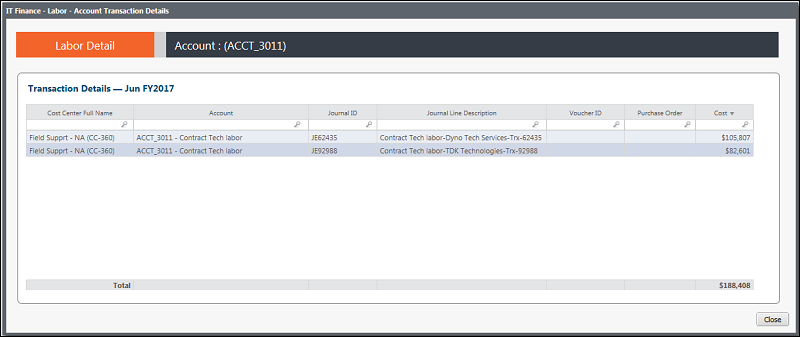

# IT Finance - Labor Details - Composition - Transaction report (v103)

Applies to: Costing Standard 11.8.x running on either TBM Studio v12
or TBM Studio v11.

## Introduction

Use this report to view account transactions for the current month for a specific account.

## Navigation

IT Management > Labor > Cost Center > Account Composition > Tx View

## Roles

This report is designed for:

- IT Finance personnel
- Cost Center Owner

## Objectives

Use this report to view the account transactions for the current month.

## Questions answered

You can use the information presented on this report to answer the following questions:

- What are the transactions for the current month?
- Are any of the transactions unexpected? If so, do they require follow up to check for incorrect
  charges, pricing changes, or a coding error (e.g.: wrong cost center)?

## Next actions

- Contact IT Finance to get the supporting documents for a specific transaction in question.
- Determine if the transaction in question is a one-time event, a trend that will have ongoing
  impact, or a coding error that might need to be corrected.

## Related information

- [Send feedback about
  Help Center](productfeedback@apptio.com "(Opens in a new tab or window)")
