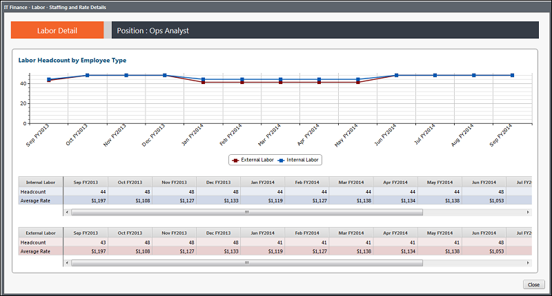

# IT Finance - Labor Details - Staffing Rate - Trend report (v103)

Applies to: Costing Standard 11.8.x running on either TBM Studio v12
or TBM Studio v11.

## Introduction

Use this report to see the headcount for internal and external personnel by month for the past 13
months.

## Navigation

IT Finance > Labor > Cost Center > Staffing & Rate > Trend View

## Roles

This report is designed for:

- IT Finance personnel
- Cost Center Owner

## Objectives

Use this report to:

- See the headcount for internal and external personnel by month for the past 13 months using the
  chart.
- Review the headcount and the average rate by month using the tables.

## Questions answered

You can use the information presented on this report to answer the following questions:

- How has my staffing fluctuated over time?
- Are changes in resource/role capacity being handled by external labor?
- Are my average rates for external labor staying flat or changing over time?
- If this role is critical to the business, are we retaining enough internal personnel?

## Next actions

For external labor, investigate the account composition to review the transactions (IT Labor
report).

## Related information

- [Send feedback about
  Help Center](productfeedback@apptio.com "(Opens in a new tab or window)")
