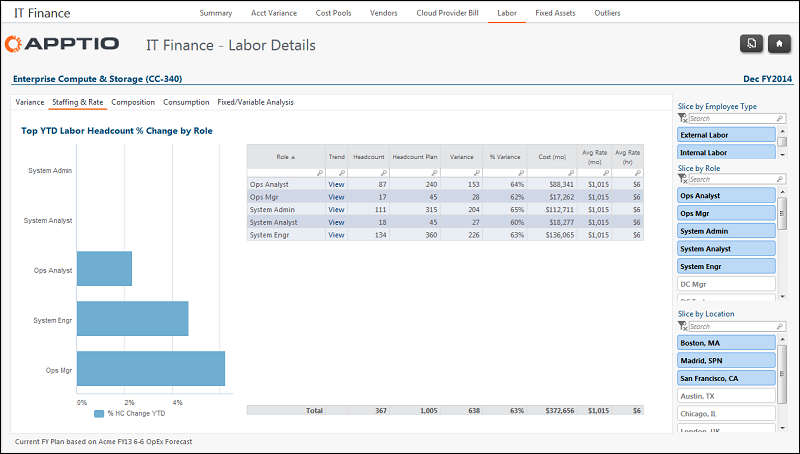

# IT Finance - Labor Details - Staffing and Rate report (v103)

Applies to: Costing Standard 11.8.x running on either TBM Studio v12
or TBM Studio v11.

## Introduction

Use this report to view headcount, headcount plan, variance, spend, and average rate
information.

## Navigation

IT Finance > Labor > Cost Center > Staffing & Rate

## Roles

This report is designed for:

- IT Finance personnel
- Cost Center Owner

## Objectives

Use this report to:

- View the largest changes in staffing since the beginning of the year by role using the Slice by
  Role filter.
- See headcount, headcount plan, variance, spend and average rate by role for the current
  period.
- Review headcount, plan, and average cost by location using the Slice by Location filter.

## Questions answered

You can use the information presented on this report to answer the following questions:

- What is the headcount and average rate by role?
- How is my staffing comparing to plan? Am I over or under staffed in key roles?
- How do the average rates vary by internal/external personnel using the Slice by Employee Type
  filter?
- How do headcounts and average rates vary by location?

## Next actions

- View the 13-month headcount and average rate for a role to identify trends by clicking View in the Trend column.
- Investigate consumption to understand where labor resources are working by clicking the Consumption tab.

## Related information

- [Send feedback about
  Help Center](productfeedback@apptio.com "(Opens in a new tab or window)")
